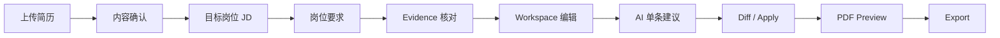

# CV Role

基于真实简历证据的岗位定向简历优化系统。

CV Role 接收用户已有简历和目标岗位 JD，将岗位要求与简历中的真实材料建立可追溯关系，在不编造经历、技能、数字或成果的前提下，完成岗位版本编辑、AI 单条建议、PDF 预览与导出。

## 核心流程



完成的岗位任务会进入“最近优化”，用户可以重新打开历史岗位版本继续工作。

## 为什么不是全文 AI 简历生成器

- **全文生成 → 单 Bullet Suggest**：建议限定在用户明确选择的一条内容。
- **直接覆盖 → Diff + Explicit Apply**：用户先审阅变化，再明确采纳。
- **只靠 Prompt 约束 → 代码 Fact Validator**：候选内容还要通过事实闭包校验。
- **修改原简历 → SOURCE / TARGETED 分离**：岗位版本不会静默污染来源简历。
- **前端草稿直接导出 → Saved Revision + Preview Receipt**：预览和导出只消费服务端已保存版本。
- **简单生成 PDF → PDF Quality Gate**：导出前检查联系方式、排版边界、页结构和可读性。

## 当前能力

- 注册、登录、JWT 鉴权与用户资源隔离
- PDF / DOC / DOCX 简历上传、内容准备与必要的人工确认
- 岗位要求与冻结简历材料之间的 Evidence / Gap 分析
- Resume Review、SOURCE / TARGETED 版本、岗位任务与冻结输入快照
- 工作区结构化编辑、自动保存、Undo / Redo 与 CAS 并发冲突处理
- 单 Bullet AI 建议、Diff、Apply / Reject / Regenerate 与事实闭包校验
- 最近优化列表：可继续已完成任务，或重新分析失败任务
- Typst PDF Preview、导出前检查、私有导出物生命周期与历史记录


## 技术栈

| 层 | 当前技术 |
|---|---|
| 后端 | Java 21、Spring Boot 3.5、Spring Security、MyBatis-Plus、Flyway |
| 前端 | Vue 3、TypeScript、Vite、Pinia、Vue Router、Element Plus |
| 数据与存储 | PostgreSQL + pgvector、Redis、MinIO / 本地文件 |
| AI | OpenAI-compatible Chat API、OpenAI-compatible Embedding API |
| 渲染 | Typst CLI（PDF Preview / Export，镜像内置） |
| 部署 | Docker Compose、Nginx、Let's Encrypt、Shell 运维脚本 |


## 仓库结构

```text
backend/    Spring Boot 后端、Flyway、测试
web/        Vue 3 前端
docs/      产品原则、架构与运维文档
deploy/     Nginx 配置
scripts/    运维脚本
```

后端业务代码位于 `backend/src/main/java/com/winter/airesumeoptimizer/module/`；基础设施适配位于 `infra/`；前端页面位于 `web/src/views/`。

## 本地运行

### 1. 环境要求

- Java 21
- Node.js `^20.19.0` 或 `>=22.12.0`
- Docker Compose
- Typst CLI（PDF 预览 / 导出需要；本地开发需自行安装并保证 `typst` 在 PATH，容器镜像已内置）

### 2. 配置并启动依赖

```bash
cp .env.example .env
# 本地无 AI 也可运行简历页面；需要测试生成式 AI 时，配置并启用你自己的 BYOK Credential。Embedding 仍按需配置。

docker compose up -d postgres redis minio
```

示例配置将 PostgreSQL 映射到宿主机 `5433`；后端使用 `.env` 中的 `DB_URL` 连接。

### 3. 启动后端

```bash
cd backend
./mvnw spring-boot:run
```

后端默认地址为 `http://localhost:8080`。Swagger UI：`http://localhost:8080/swagger-ui/index.html`。

> 注意：直接执行 `./mvnw spring-boot:run` 时，仓库里的 `.env` 文件不会自动变成当前 fish 进程的环境变量。请使用 shell export / `set -gx`，或由你自己的启动工具加载 `.env`。

#### Fedora + fish：BYOK 本地密钥与 DNS

下面的密钥是 **CV-Role 保存用户 API Key 时使用的本地加密主密钥**，不是 DeepSeek API Key。它必须是 32 bytes；不要把真实值写进仓库：

```fish
set local_cv_key (openssl rand -base64 32 | tr '+/' '-_' | tr -d '=\\n')
set -gx AI_CREDENTIALS_ENABLED true
set -gx AI_CREDENTIALS_ACTIVE_KEY_ID v1
set -gx AI_CREDENTIALS_KEY_RING "v1=$local_cv_key"

cd backend
./mvnw spring-boot:run
```

不要每次启动后端都重新生成 key。保存过 BYOK Credential 后，后续重启必须继续使用同一个 key，否则历史加密密钥无法解密。建议把开发 key 保存到仓库外的 `~/.config/cv-role/` 私有文件中，并执行 `chmod 600`；该文件和 key 都不要提交。

排查 Fedora DNS 时可先运行：

```fish
getent ahosts api.deepseek.com
```

也可以在 JVM 启动日志 / 调试信息中检查 JVM 实际解析到的地址。若看到 `198.18.x.x`、`198.19.x.x`、私网或 loopback 地址，这是本地 DNS / proxy 环境问题，不要修改 SSRF policy 来绕过；业务运行时会继续 fail closed。

#### Typst 字体一致性

production 使用固定的 Noto Sans CJK static Regular / Bold 字体。若本地 `APP_RENDER_FONT_PATH` 为空，Typst 会使用系统 font discovery，本地 Preview 可能与 production 不一致。Fedora 可用以下命令确认 Regular / Bold 解析：

```fish
fc-match 'Noto Sans CJK SC:style=Regular'
fc-match 'Noto Sans CJK SC:style=Bold'
```

如需设置 `APP_RENDER_FONT_PATH`，目录只应包含审核过的 Regular / Bold static files。不要把字体文件提交到仓库。

### 4. 启动前端

```bash
cd web
npm ci
npm run dev
```

前端默认地址为 `http://localhost:5173`。

## 检查命令

```bash
cd backend && ./mvnw test
cd web && npm run build
```

后端测试使用 PostgreSQL/Flyway 与独立 MinIO lifecycle profile；CI 还运行 deterministic fake Provider 的 Chromium E2E。部署、备份和运行约束见 [docs/OPERATIONS.md](docs/OPERATIONS.md)。

## 生产部署

生产生成式 Chat AI 为 BYOK-only：服务器不提供平台 Chat API Key，用户必须在 AI 设置中测试、保存并启用自己的 OpenAI-compatible Credential。生产必须提供 Credential 加密 master key ring；缺失时后端 / Compose fail fast。Embedding 是独立的内部语义检索基础设施。

```bash
cp .env.production.example .env
# 替换全部生产密码、域名、JWT、Embedding Key 和 AI_CREDENTIALS_ACTIVE_KEY_ID / KEY_RING。

docker compose -f docker-compose.prod.yml --env-file .env config
docker compose -f docker-compose.prod.yml --env-file .env up -d --build
```

部署、HTTPS、更新、备份和排障见 [docs/OPERATIONS.md](docs/OPERATIONS.md)。

## 文档

| 文档 | 用途 |
|---|---|
| [docs/PRD.md](docs/PRD.md) | 产品目标与核心原则 |
| [docs/ARCHITECTURE.md](docs/ARCHITECTURE.md) | 当前系统架构与关键设计 |
| [docs/OPERATIONS.md](docs/OPERATIONS.md) | 部署、HTTPS、备份与运维 |

执行规则见 [AGENTS.md](AGENTS.md)。文档冲突时，产品决策以 `docs/PRD.md` 为准，当前实现事实以代码与测试为准。
