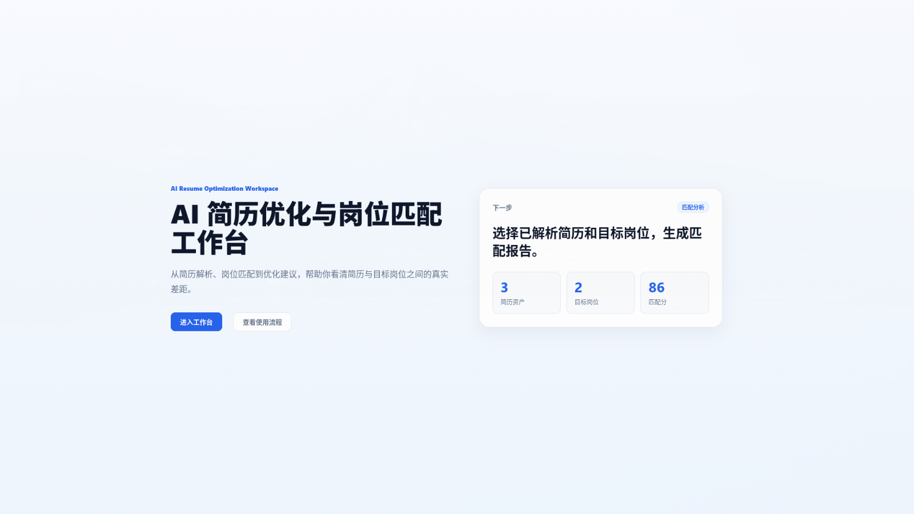

# CV-Role / AI Resume Optimizer

面向真实求职场景的岗位定向简历优化系统。当前版本已经打通“简历 + 目标岗位 JD”的分析链路；下一阶段将依据 [V2 产品与架构重构基线](docs/PRD.md)，把现有功能集合收敛为“上传简历 → 粘贴 JD → 分析 → 可控修改 → 导出 PDF”的简单主流程。

> 当前仓库仍是 V1 实现，V2 目标能力并非都已完成。真实现状与差距见 [docs/CONTEXT.md](docs/CONTEXT.md)。



## 当前已实现

- 注册、登录、JWT 鉴权和用户资源隔离
- PDF / DOC / DOCX 上传、文本提取、清洗、结构化解析和质量提示
- 目标岗位 JD 保存与结构化解析
- 简历诊断、岗位匹配、优化建议、局部改写和聚合报告
- AI 结果历史回看、异步任务状态查询
- OpenAI-compatible Chat / Embedding 接入，pgvector 语义检索
- PostgreSQL、Redis、MinIO、本地文件存储和 Flyway 迁移
- Vue 3 前端、Docker Compose、Nginx、HTTPS 和运维脚本

当前真实用户链路仍包含若干手动步骤：

```text
注册 / 登录
→ 上传简历 → 手动触发解析 / 诊断
→ 新增目标岗位 → 手动触发岗位解析
→ 匹配分析 → 优化建议 → 局部改写
→ 优化报告 / AI 历史
```

V2 冻结目标链路见 [docs/PRD.md](docs/PRD.md)，本轮仓库整理不实现 V2 功能。

## 技术栈

| 层 | 当前技术 |
|---|---|
| 后端 | Java 21、Spring Boot 3.5、Spring Security、MyBatis-Plus、Flyway |
| 前端 | Vue 3、TypeScript、Vite、Pinia、Vue Router、Element Plus |
| 数据与存储 | PostgreSQL + pgvector、Redis、MinIO / 本地文件 |
| AI | OpenAI-compatible Chat API、OpenAI-compatible Embedding API |
| 部署 | Docker Compose、Nginx、Let's Encrypt、Shell 运维脚本 |


## 仓库结构

```text
backend/    Spring Boot 后端、Flyway、测试
web/        Vue 3 前端
docs/       V2 基线、架构、计划、上下文、运维与评估资产
deploy/     Nginx 配置
scripts/    运维脚本
```

后端业务代码位于 `backend/src/main/java/com/winter/airesumeoptimizer/module/`；基础设施适配位于 `infra/`；前端页面位于 `web/src/views/`。

## 本地运行

### 1. 环境要求

- Java 21
- Node.js `^20.19.0` 或 `>=22.12.0`
- Docker Compose

### 2. 配置并启动依赖

```bash
cp .env.example .env
# 按需填写 AI_API_KEY / EMBEDDING_API_KEY，并检查本地密码

docker compose up -d postgres redis minio
```

示例配置将 PostgreSQL 映射到宿主机 `5433`；后端使用 `.env` 中的 `DB_URL` 连接。

### 3. 启动后端

```bash
cd backend
./mvnw spring-boot:run
```

后端默认地址为 `http://localhost:8080`。Swagger UI：`http://localhost:8080/swagger-ui/index.html`。

### 4. 启动前端

```bash
cd web
npm ci
npm run dev
```

前端默认地址为 `http://localhost:5173`。

## 检查命令

```bash
cd backend && ./mvnw test
cd web && npm run build
```

后端测试使用 PostgreSQL test profile；CI 定义见 `.github/workflows/ci.yml`。

## 生产部署

```bash
cp .env.production.example .env.production
# 替换全部生产密码、域名、JWT 和 API Key

docker compose -f docker-compose.prod.yml --env-file .env.production up -d --build
```

部署、HTTPS、更新、备份和排障见 [docs/OPERATIONS.md](docs/OPERATIONS.md)。

## 文档

| 文档 | 唯一职责 |
|---|---|
| [docs/PRD.md](docs/PRD.md) | V2 最高层产品与架构决策基线 |
| [docs/ARCHITECTURE.md](docs/ARCHITECTURE.md) | 当前实现架构、边界和 V2 演进约束 |
| [docs/PLAN.md](docs/PLAN.md) | V2 阶段顺序、门禁和非目标 |
| [docs/CONTEXT.md](docs/CONTEXT.md) | 当前能力、历史决策、已知差距和仓库状态 |
| [docs/OPERATIONS.md](docs/OPERATIONS.md) | 当前生产部署与运维 |

执行规则见 [AGENTS.md](AGENTS.md)。文档冲突时，V2 产品决策以 `docs/PRD.md` 为准，当前实现事实以代码和 `docs/CONTEXT.md` 为准。
