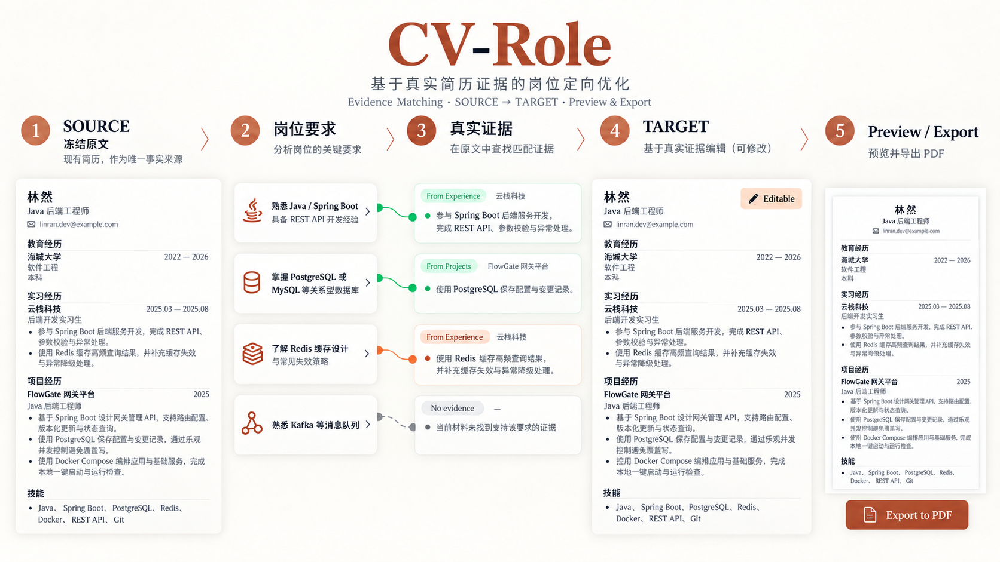
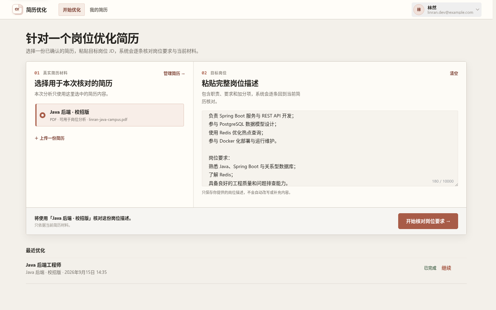
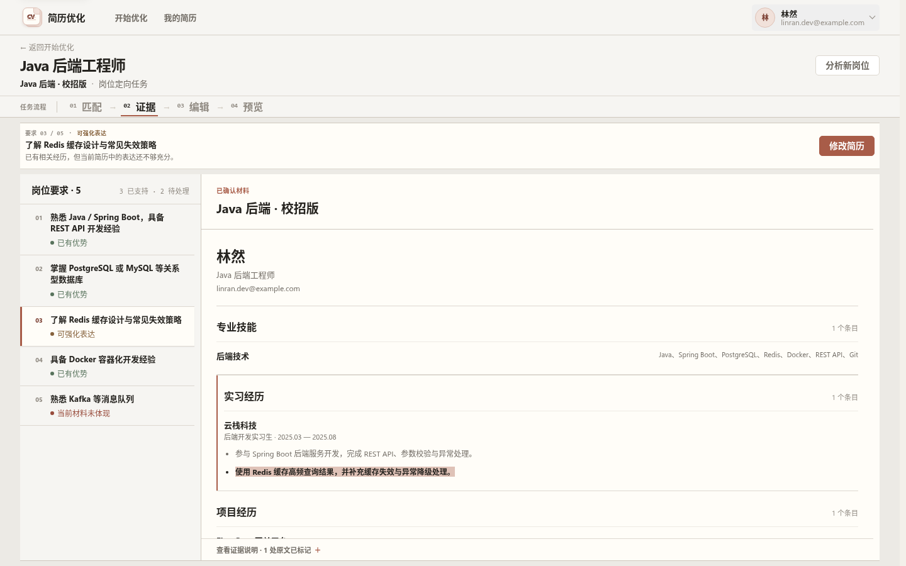
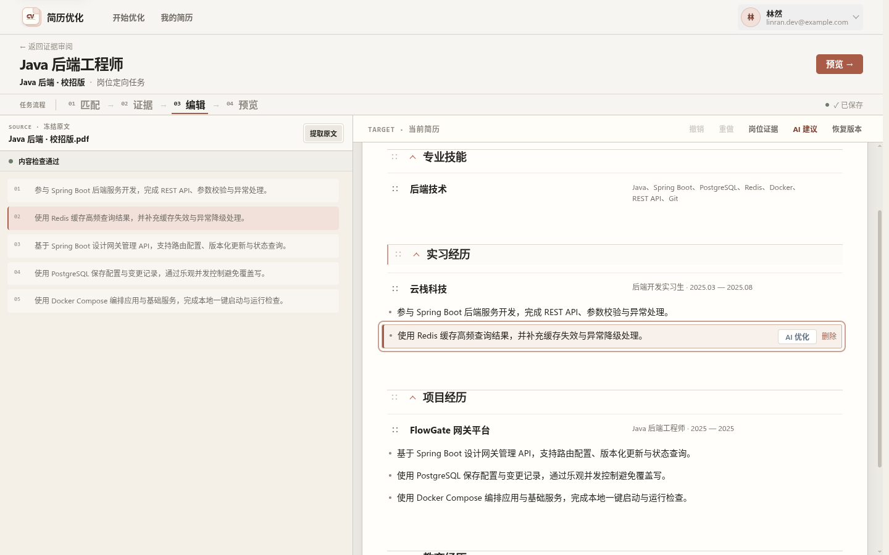
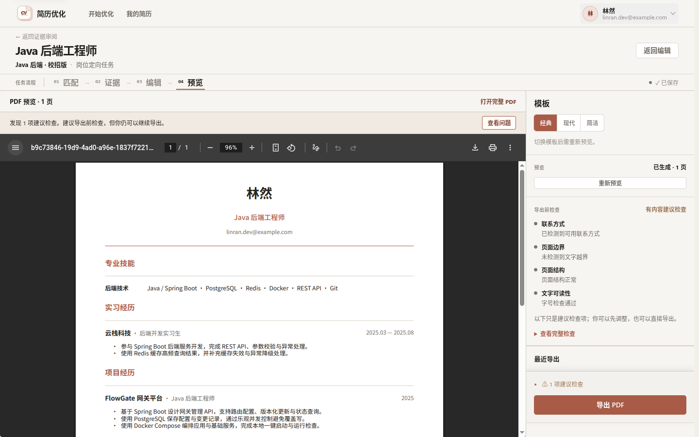
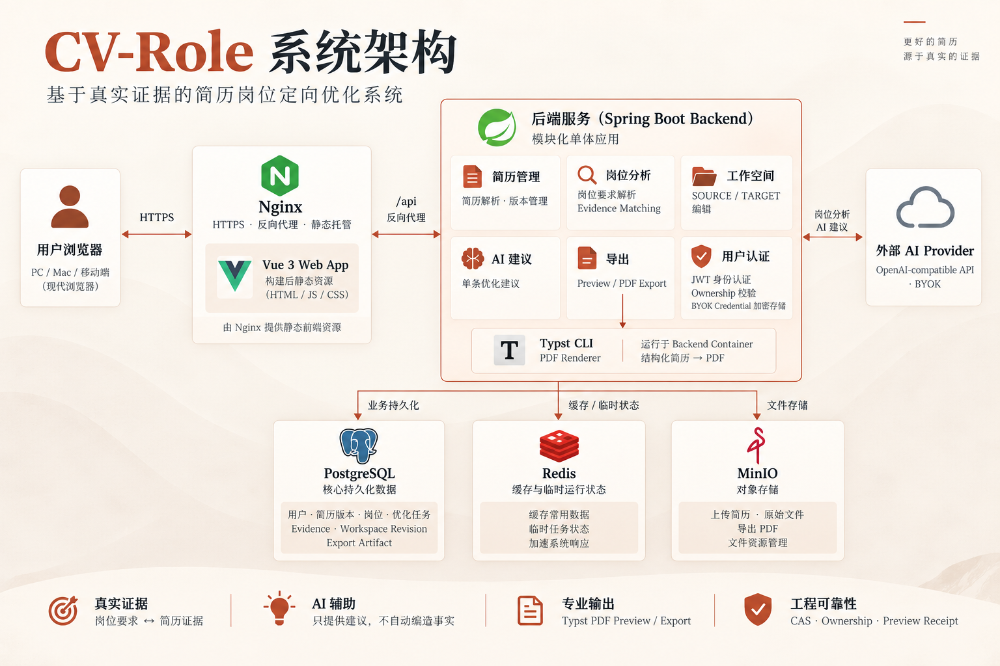

<div align="center">

# CV-Role

**基于真实简历证据的岗位定向优化系统**

从已有简历出发，将岗位要求映射到真实经历，<br>
在不编造事实的前提下完成 Evidence Matching、SOURCE → TARGET 编辑、AI 单条建议以及 PDF Preview / Export。

[](https://github.com/Jasmine-wind/CV-Role/actions/workflows/ci.yml)


</div>

## 为什么是 CV-Role

很多 AI 简历工具从“生成内容”开始，CV-Role 从用户已有的真实材料开始。

- SOURCE 是冻结的原始事实来源
- 岗位要求必须回到已有简历 Evidence
- 没有证据就明确显示没有，不自动补经历
- TARGET 是面向当前岗位的可编辑版本
- AI Suggest 只提供候选，由用户显式 Apply
- 内容质量问题以 advisory 为主，不阻塞正常分析、编辑、Preview 和 Export
- 只有技术上无法完成操作才 hard fail

<p align="center">
  
</p>

从冻结 SOURCE 出发，把岗位要求映射到真实证据，再在 TARGET 中编辑并完成 PDF 交付。

## 核心流程

**上传简历 → 岗位要求分析 → Evidence Matching → TARGET 编辑 → AI Suggest → Preview / Export**

内容确认只在解析结果确实需要用户判断时出现，不是所有简历进入岗位分析前的强制 Gate。完成的岗位任务会进入“最近优化”，可以随时重新打开继续工作。

## 真实产品界面

以下均为当前 Vue 应用的真实 Playwright 页面，而非概念 UI。

### 1. 针对一个岗位开始优化

用户选择已有简历并粘贴目标岗位 JD，系统围绕该岗位创建独立优化任务。

<p align="center">
  
</p>

### 2. 岗位要求与真实证据

岗位要求被拆成 `MATCHED`、`PARTIAL_EVIDENCE` 和 `NO_EVIDENCE`，每个结论都可以回到已有简历内容；没有证据的要求会明确显示“当前材料未体现”。

<p align="center">
  
</p>

### 3. SOURCE → TARGET 编辑工作区

- SOURCE 冻结，不被岗位优化静默修改
- TARGET 是当前岗位的结构化可编辑版本
- 来源定位、恢复、AI Suggest 等操作基于服务端权威数据

<p align="center">
  
</p>

### 4. Preview / Export

- 使用 Typst 渲染真实 PDF，并支持模板切换
- 导出前检查以 advisory 为主，有建议项也可以继续导出
- revision stale、renderer failure 等真实技术失败才会阻止操作

<p align="center">
  
</p>

## 为什么不是全文 AI 简历生成器

| 常见做法 | CV-Role |
|---|---|
| 直接全文生成 | 从冻结 SOURCE 与真实 Evidence 出发 |
| AI 自动写入 | 单 Bullet Suggest + 用户显式 Apply |
| 用匹配分代替解释 | Requirement ↔ Evidence 可追溯 |
| 内容问题阻断流程 | Advisory 优先，技术失败才 hard fail |

没有真实证据的岗位要求不会被自动写成用户经历。

## 工程设计亮点

| 设计 | 解决的问题 |
|---|---|
| SOURCE / TARGET + Server-authoritative Provenance | 原简历不被静默污染，修改可回到来源 |
| CAS Revision | 避免多端或异步写入静默覆盖 |
| Evidence Matching | 岗位要求与真实简历证据可解释关联 |
| AI Suggest + Stale Guard + Explicit Apply | AI 只提供候选，不直接写入用户事实 |
| Preview Receipt + Checksum | Preview 与正式 Export 绑定同一版本和模板 |
| Production-shaped CI | PostgreSQL / Flyway / MinIO / Chromium / Compose / Restart 都经过验证 |

## 系统架构

<p align="center">
  
</p>

CV-Role 使用 Spring Boot 模块化单体。Nginx 提供 Vue 3 静态资源并代理 `/api`。

PostgreSQL 是核心持久化事实来源，Redis 用于辅助缓存与临时运行状态，MinIO 保存上传文件与导出物，Typst CLI 在 Backend Container 内完成 PDF 渲染。外部 AI Provider 使用 OpenAI-compatible API / BYOK。

## 技术栈

| Area | Stack |
|---|---|
| Backend | Java 21 · Spring Boot · Spring Security · MyBatis-Plus · Flyway |
| Frontend | Vue 3 · TypeScript · Vite · Pinia · Element Plus |
| Data | PostgreSQL / pgvector · Redis |
| Storage | MinIO |
| AI | OpenAI-compatible API · BYOK |
| PDF | Typst CLI |
| Delivery | Docker Compose · Nginx · Let's Encrypt |

## 仓库结构

```text
backend/   Spring Boot 后端、Flyway、测试
web/       Vue 3 前端
docs/      产品、架构、运维与展示资产
deploy/    部署配置
scripts/   运维脚本
```

## 快速开始

### Requirements

- Java 21
- Node.js 20+
- Docker Compose

### 1. 启动基础设施

```bash
cp .env.example .env
docker compose up -d postgres redis minio
```

### 2. 启动后端

```bash
cd backend
./mvnw spring-boot:run
```

### 3. 启动前端

```bash
cd web
npm ci
npm run dev
```

| Service | URL |
|---|---|
| Frontend | <http://localhost:5173> |
| Backend | <http://localhost:8080> |
| Swagger | <http://localhost:8080/swagger-ui/index.html> |

PDF Preview / Export 需要 Typst；生产容器已内置。本地直接运行后端时的 Typst 与字体配置见 [docs/OPERATIONS.md](docs/OPERATIONS.md)。

## AI / BYOK

生成式 AI 使用 BYOK。用户可以在 AI Settings 中配置自己的 OpenAI-compatible Credential；没有配置生成式 AI 时，基础简历管理和非生成式页面仍然可以运行。

密钥管理、Provider 配置与生产安全要求见 [docs/OPERATIONS.md](docs/OPERATIONS.md)。

## 测试与 CI

CI 持续验证以下能力：

- Backend Tests — PostgreSQL / Flyway / MinIO
- Resume Structure Recovery deterministic corpus
- Frontend Unit / Lint / Type / Build
- Chromium Browser E2E
- Production Compose validation 与 Production runtime restart validation

## 生产部署

```bash
cp .env.production.example .env
docker compose -f docker-compose.prod.yml --env-file .env config
docker compose -f docker-compose.prod.yml --env-file .env up -d --build
```

生产 Compose 包含 Nginx、Spring Boot、PostgreSQL、Redis、MinIO 与 Certbot，并配置 healthcheck、persistent volume、backup / restore 和 restart validation。

详细部署、HTTPS、备份与恢复步骤见 [docs/OPERATIONS.md](docs/OPERATIONS.md)。

## 文档

| 文档 | 用途 |
|---|---|
| [docs/PRD.md](docs/PRD.md) | 产品目标与核心原则 |
| [docs/ARCHITECTURE.md](docs/ARCHITECTURE.md) | 当前架构与关键工程设计 |
| [docs/OPERATIONS.md](docs/OPERATIONS.md) | 部署、HTTPS、备份和运维 |
