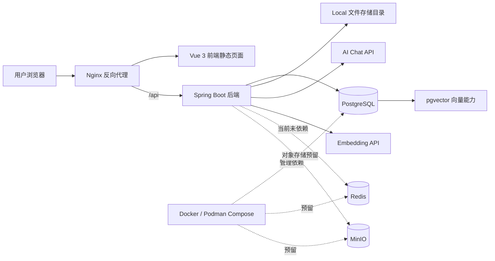
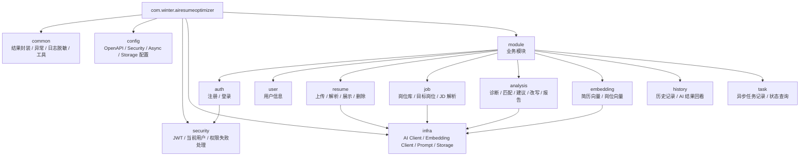
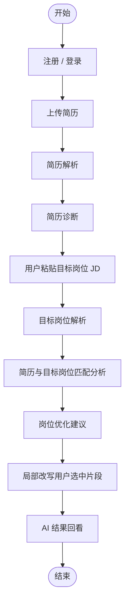
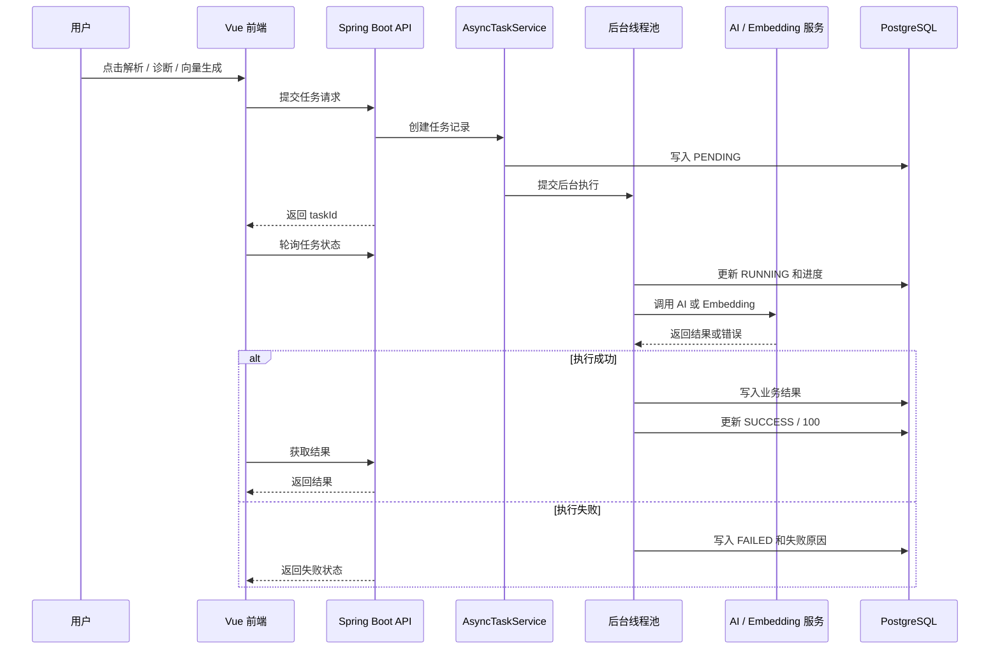
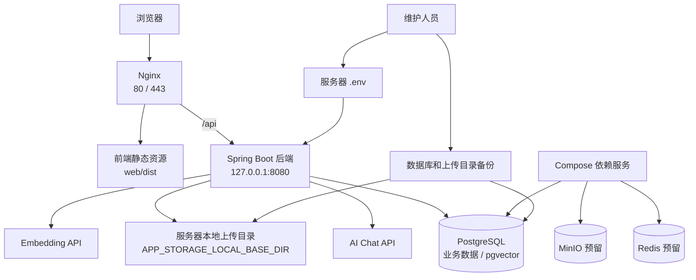

# AI 简历优化与岗位匹配系统架构图

本文档用于沉淀 Phase 4 收口后的架构图、模块图、主流程图、异步任务流程图和部署图。当前图表以 Mermaid 作为源格式，方便在 Markdown、README、答辩文档和后续项目包装中复用。

说明：

- 图中只展示当前项目已经实现或明确预留的能力。
- Redis、MinIO 在当前阶段是部署依赖和配置预留，不表示后端主流程已经依赖 Redis 或上传链路已经切换到 MinIO。
- 当前部署图表达单机部署准备形态，不表示已经完成生产级高可用、HTTPS 或应用容器化。

## 1. 系统总体架构图

要点：

- 前端通过 Nginx 托管静态文件。
- `/api/` 请求由 Nginx 反向代理到后端。
- 当前后端主流程依赖 PostgreSQL、本地文件存储和外部 AI / Embedding 服务。
- Redis 和 MinIO 当前为部署预留，不作为已完成业务依赖夸大描述。

## 2. 后端模块图

要点：

- 业务代码集中在 `module/` 下。
- `infra/` 只承接外部服务适配，不承载业务主流程规则。
- `common/`、`config/`、`security/` 保持基础能力边界。

## 3. 主业务流程图

业务边界：

- 简历诊断只分析简历自身质量。
- 目标岗位解析只解析用户粘贴 JD。
- 匹配分析只判断简历与目标岗位是否匹配。
- 岗位优化建议只给策略建议和修改方向。
- 局部改写只改写用户选中的简历片段。
- AI 结果回看只查询历史结果，不触发新的 AI 生成。

## 4. 异步任务流程图

要点：

- 当前异步化仍在单体应用内完成，不引入消息队列。
- 前端通过轮询任务状态展示进度和错误原因。
- 失败信息应脱敏，不向前端暴露密钥、请求头或服务端内部路径。

## 5. 部署图

部署边界：

- 后端端口不建议直接暴露公网。
- 前端生产构建建议使用 `VITE_API_BASE_URL=/api`。
- 上传文件目录必须持久化并纳入备份。
- 当前 Compose 不包含后端 / 前端应用镜像。

