# 项目展示指南

本文档用于把项目本地体验方式、公开示例数据、展示流程、架构讲解。仓库不提交真实个人简历附件，也不提交页面截图或架构图图片；涉及简历上传的步骤只作为本地体验说明。

---

## 1. 展示目标

用一份公开示例 Java 后端简历文本和一份公开示例 Java 后端岗位 JD，说明系统如何完成：

```text
注册登录 -> 上传简历 -> 简历解析 -> 简历诊断
-> 目标岗位解析 -> 匹配分析 -> 岗位优化建议
-> 局部改写 -> 优化报告 -> AI 历史回看
```

展示重点不是“AI 自动替用户写简历”，而是说明系统如何把岗位要求、简历内容、AI 建议和用户确认串成可回看的优化流程。

---

## 2. 本地体验环境

本地运行：

```text
前端：http://localhost:5173
后端：http://localhost:8080
数据库：PostgreSQL + pgvector
缓存：Redis
文件存储：local 或 MinIO
AI：OpenAI-compatible Chat API
Embedding：SiliconFlow OpenAI-compatible Embeddings API
```

线上展示：

```text
正式地址：https://resume.dawn04.xyz
部署方式：Docker Compose 单机部署
服务组成：Nginx、backend、PostgreSQL + pgvector、Redis、MinIO、certbot
```

线上部署、更新、日志和备份统一查看 [部署与运维文档](ai-resume-deployment-ops-guide.md)。

---

## 3. 本地体验账号

当前项目不预置固定账号。本地体验时通过注册页创建临时账号即可。

注意：

- 不要在截图中展示真实邮箱、真实手机号、真实 API Key 或真实服务器密钥。
- 线上展示账号如需长期保留，应避免使用个人真实信息。

---

## 4. 公开示例数据

已准备公开示例文本：

- [Java 后端公开示例简历文本](demo/demo-resume-java-backend.md)
- [Java 后端公开示例岗位 JD](demo/demo-job-java-backend.md)

数据要求：

- 简历、岗位、公司、邮箱和手机号均使用公开示例内容。
- 不使用真实身份证、真实住址、真实隐私信息。
- 局部改写时只改写样例里已有经历，不新增不存在的项目、证书、奖项或量化结果。
- 真实个人简历附件不提交到 GitHub；如需本地上传测试，请自行在本地生成 PDF / DOC / DOCX，并放入 gitignore 覆盖的私有目录。

---

## 5. 展示流程


| 顺序 | 页面 | 操作 | 讲解重点 |
|---|---|---|---|
| 1 | 登录 / 注册 | 创建本地体验账号并登录 | JWT 鉴权、受保护路由和蓝白 SaaS 登录入口 |
| 2 | 工作台 | 查看推荐动作、当前状态和最近结果 | 工作台引导用户进入下一步，不做传统后台大屏 |
| 3 | 我的简历 | 本地上传由公开示例文本制作的 PDF / DOC / DOCX | 简历资产、文件存储、解析入口和后续诊断入口集中管理 |
| 4 | 简历解析结果 | 查看概览、基础信息和结构化结果 | 文本提取、清洗和结构化展示，避免直接暴露原始 JSON |
| 5 | 完整原文 | 查看清洗后的简历全文 | 用户可以核对解析是否遗漏原文内容 |
| 6 | 简历诊断 | 生成 AI 简历诊断 | 展示优势、问题和下一步建议，AI 不编造经历 |
| 7 | 目标岗位解析 | 新增目标岗位并解析公开示例 JD | 岗位画像、核心技能、职责和经验信号服务于后续匹配 |
| 8 | 匹配分析 | 选择简历和目标岗位，运行匹配分析 | 匹配分数、强弱匹配、缺失技能、风险提醒和依据 |
| 9 | 岗位优化建议 | 生成岗位优化建议 | 按优先级处理真实差距，并标记相关改写状态，避免重复处理 |
| 10 | 局部改写 | 基于某条建议改写一段真实简历片段 | 展示原文、优化后表达、改写理由、风险提醒和采纳状态 |
| 11 | 优化报告 | 查看岗位优化报告 | 聚合已有匹配、建议和改写结果，不重新调用 AI |
| 12 | AI 历史 | 回看历史 AI 结果 | 历史详情是用户可读报告，不展示接口字段 |

### 5.1 登录 / 注册

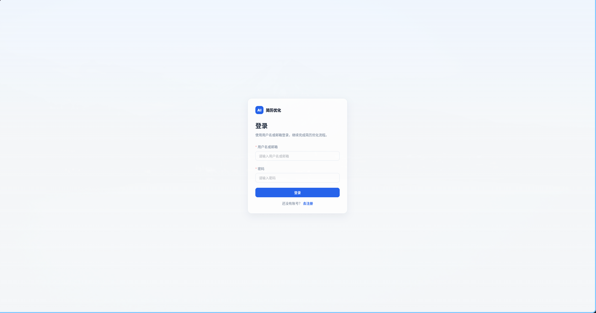

### 5.2 工作台

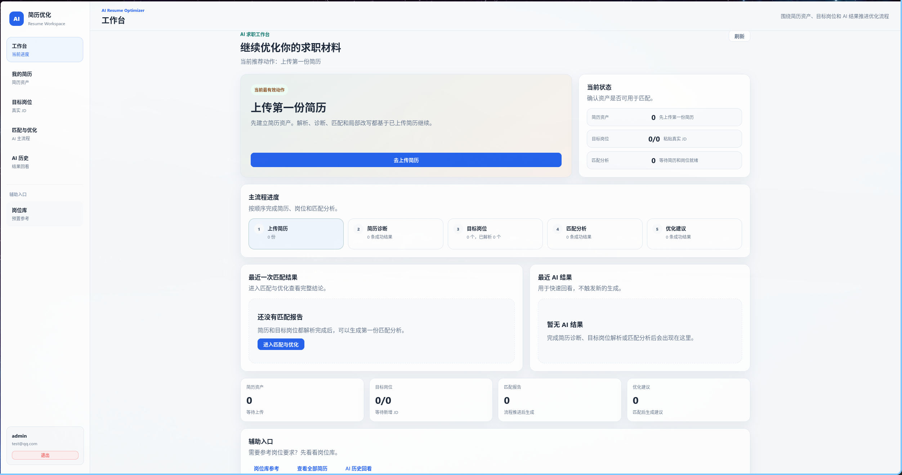

### 5.3 我的简历

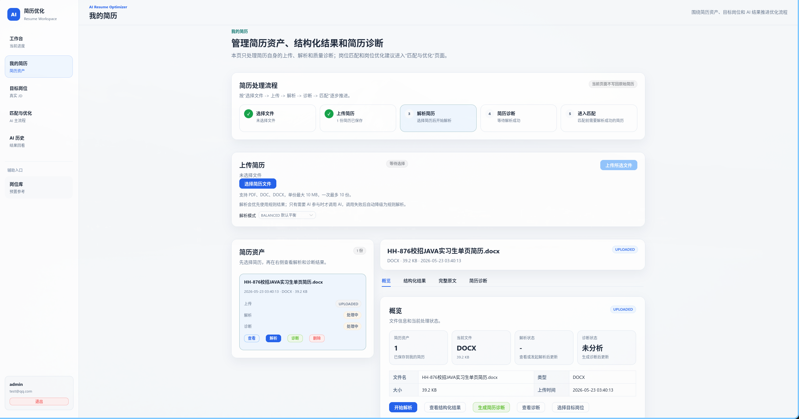

### 5.4 简历解析结果

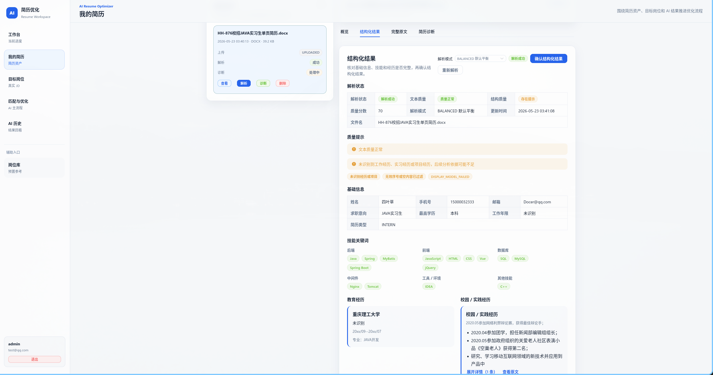

### 5.5 完整原文

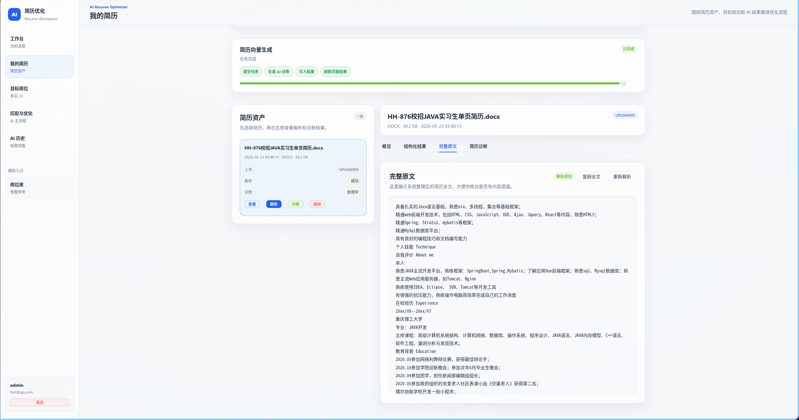

### 5.6 简历诊断

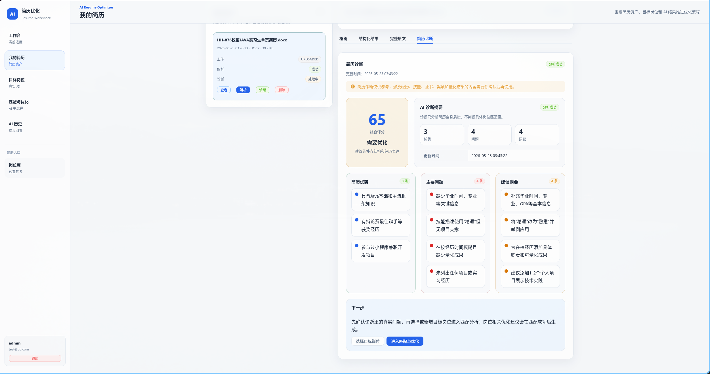

### 5.7 目标岗位解析

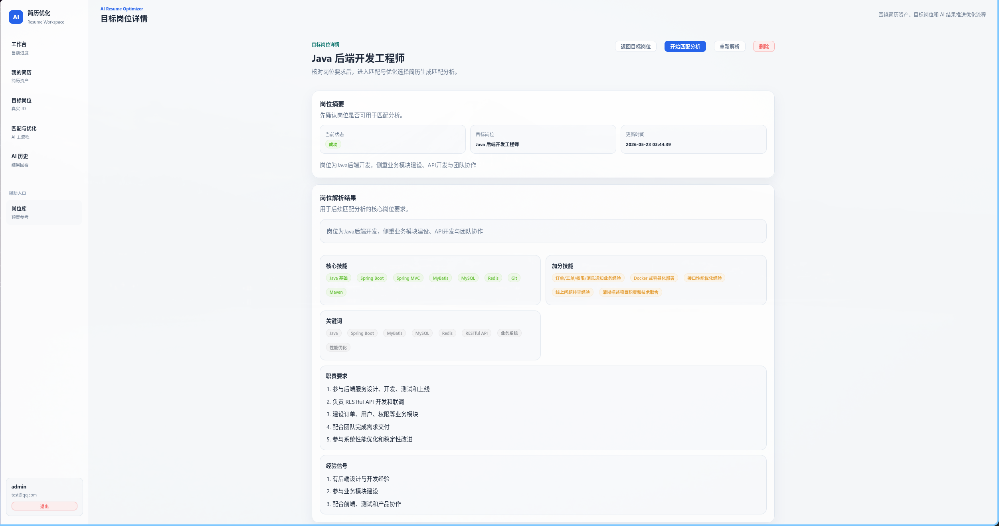

### 5.8 匹配分析

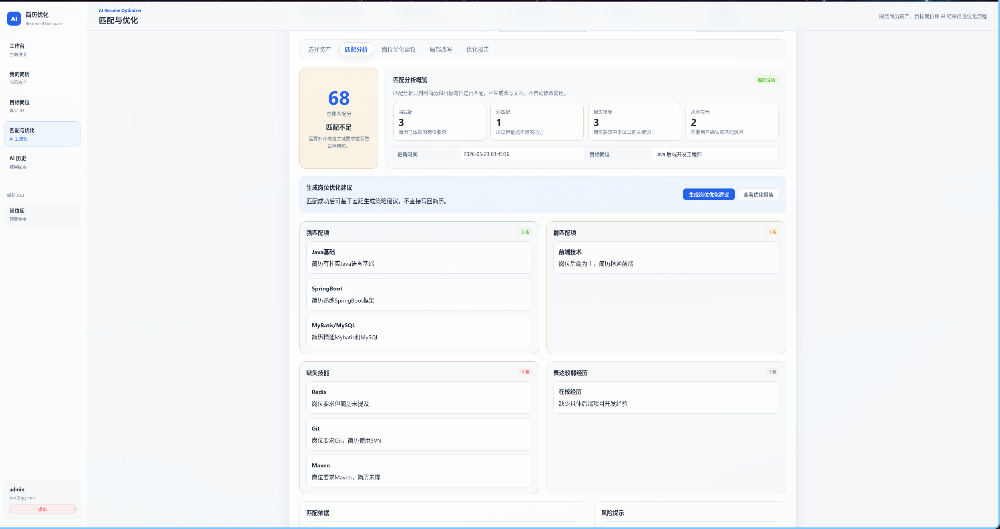

### 5.9 岗位优化建议

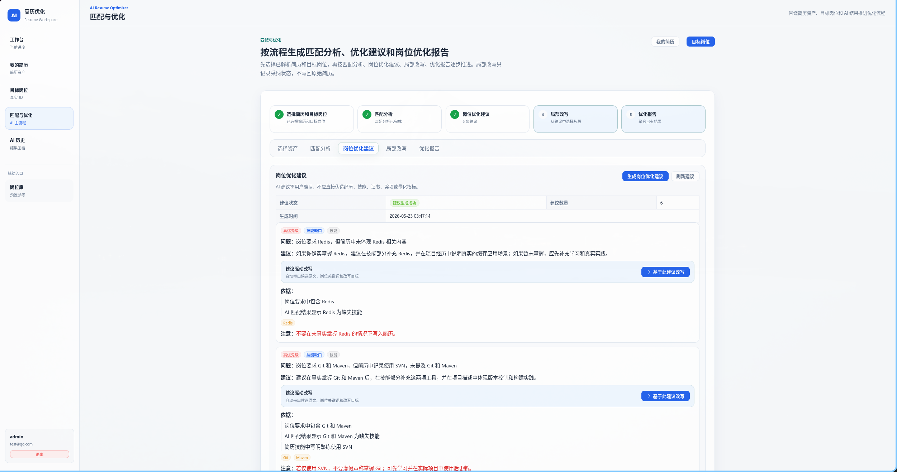

### 5.10 局部改写

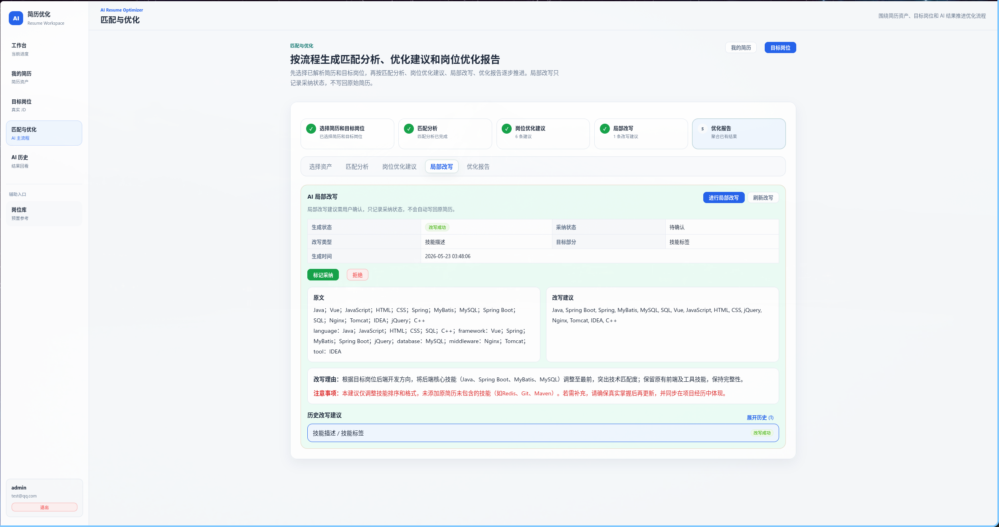

### 5.11 优化报告

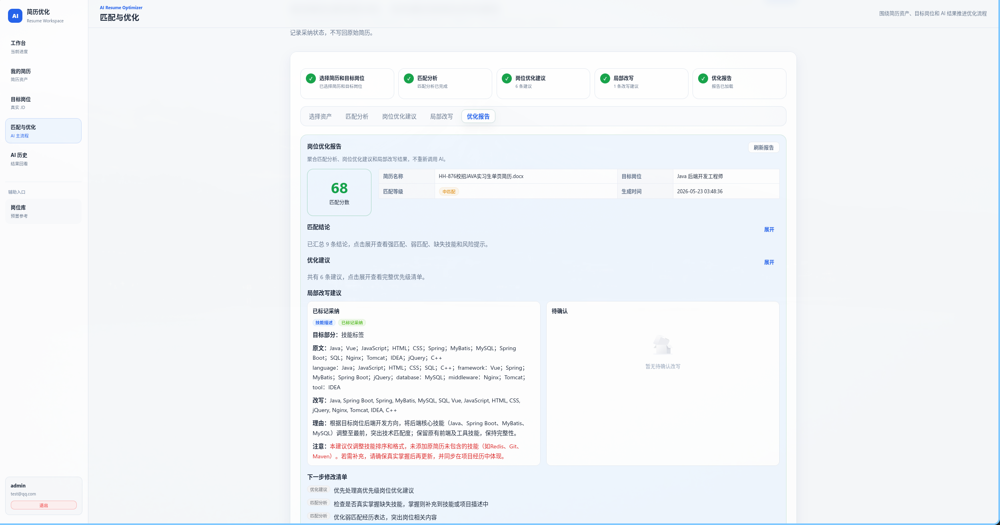

### 5.12 AI 历史

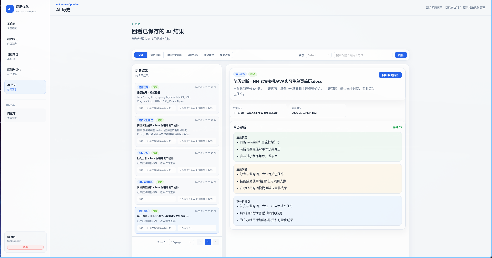

---

## 6. 架构讲解

### 6.1 系统总体架构


- 浏览器访问 Vue 3 前端，生产环境由 Nginx 托管静态资源并反向代理 `/api`。
- Spring Boot 后端承接鉴权、简历、岗位、AI 分析、Embedding、历史和任务状态。
- PostgreSQL 保存业务数据，pgvector 支撑向量检索能力。
- Redis 只缓存可重新生成内容，不保存唯一核心业务结果。
- MinIO 用于生产文件对象存储，文件访问仍经过后端权限校验。
- AI Chat API 和 Embedding API 统一由后端适配，前端不接触真实密钥。

### 6.2 后端分层

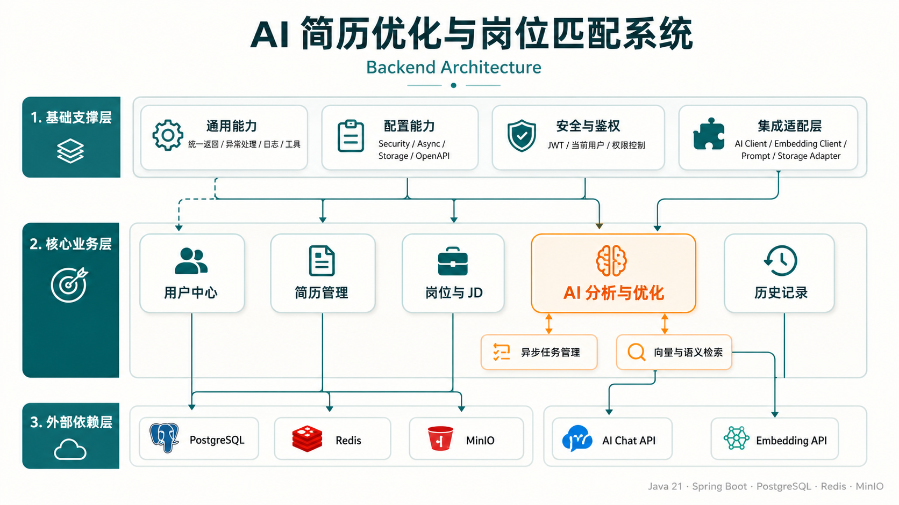

- `module/` 放业务模块，包括 auth、user、resume、job、analysis、history。
- `infra/` 放 AI Client、Embedding Client、Prompt、Storage 等外部服务适配。
- `security/` 负责 JWT、当前用户识别、认证失败和权限失败处理。
- `common/` 承载统一响应、异常、日志脱敏和通用工具。

### 6.3 主业务流程

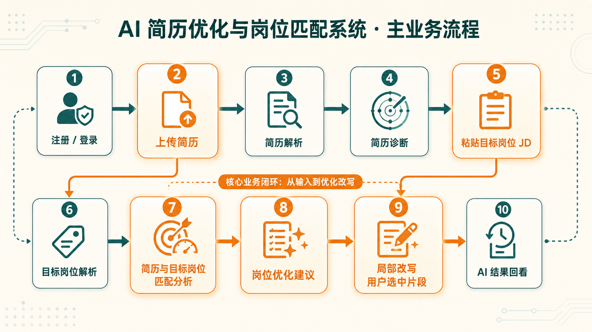

- 简历诊断只分析简历自身质量。
- 目标岗位解析只解析用户粘贴的 JD。
- 匹配分析判断简历与目标岗位之间的强匹配、弱匹配、缺失技能和风险点。
- 岗位优化建议只给修改方向，不直接改写用户原始简历。
- 局部改写只优化用户选中的真实片段，并保留采纳状态。
- AI 历史只回看历史结果，不触发新的 AI 生成。

### 6.4 部署结构

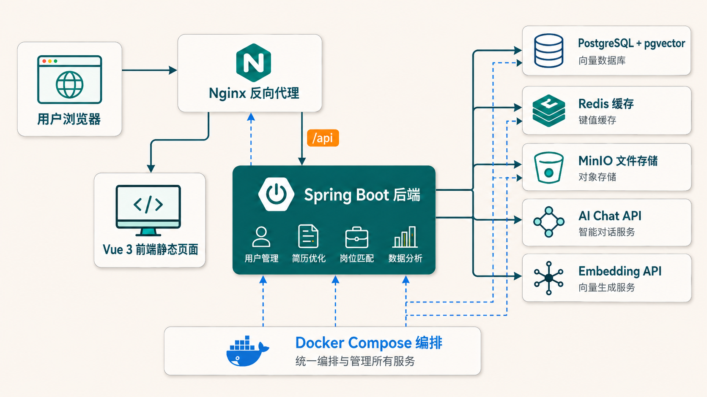

- 生产部署通过 `docker-compose.prod.yml` 编排 Nginx、backend、PostgreSQL + pgvector、Redis、MinIO 和 certbot。
- Nginx 暴露 80 / 443，后端端口不建议直接暴露公网。
- 前端生产环境通过同域 `/api` 请求后端。
- PostgreSQL、Redis、MinIO、日志和证书通过 Docker volume 持久化。
- 真实密钥只放服务器 `.env`，不写入 Git。

### 6.5 异步任务

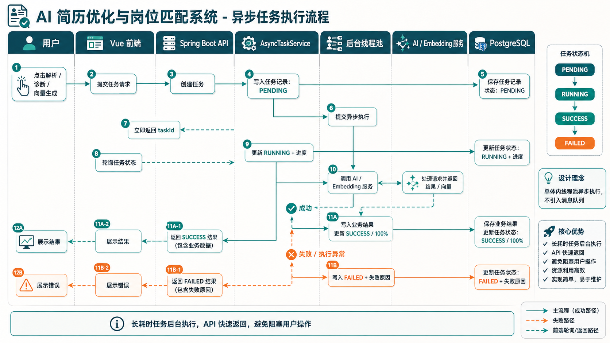

- 简历解析、AI 生成和 Embedding 生成等耗时操作通过任务记录承接。
- 前端提交任务后拿到任务 ID，并轮询任务状态。
- 后台线程池执行任务，更新 `PENDING`、`RUNNING`、`SUCCESS`、`FAILED` 等状态。
- 失败信息需要脱敏，不向前端暴露 API Key、请求头、服务端路径或外部服务完整响应。

---

