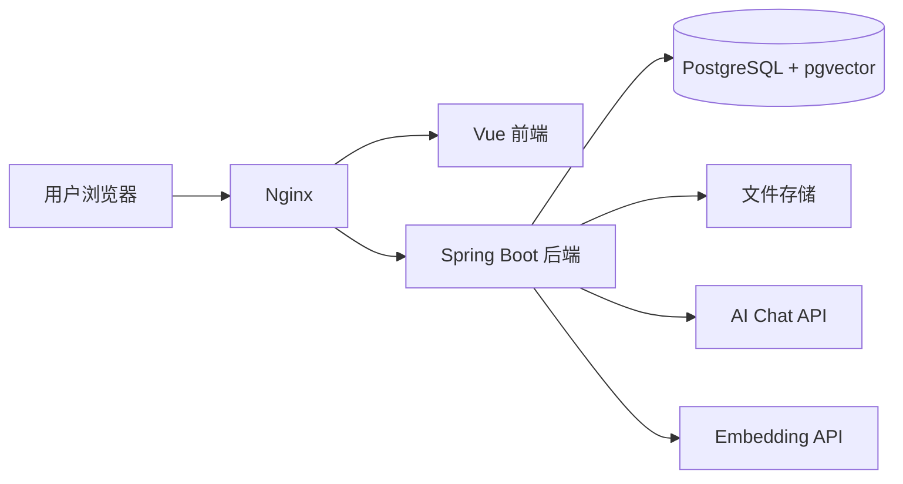

# Phase 4 Task List - 架构演进阶段

## 0. 文件用途

本文件用于拆解 Phase 4 的具体开发任务。

`docs/phase-4-architecture.md` 负责说明第四阶段的总体目标、范围、架构方向和退出标准。  
本文件负责说明 Phase 4 每个版本下具体怎么拆小任务、怎么验收、哪些内容不能提前做。

使用原则：

1. 每次只做一个小任务。
2. 当前正在开发的 v3.x 版本详细展开。
3. 已完成版本压缩成总结。
4. 未开始版本先保留任务大纲，进入对应版本前再继续细分。
5. 完成一个 v3.x 版本后，更新对应迭代日志。
6. 不允许跳过当前任务直接实现后续版本功能。
7. Phase 4 的重点是架构演进、稳定性、异步化、安全和部署准备，不是继续堆 AI 功能。
8. Phase 4 不做微服务拆分，除非后续已经有明确瓶颈和必要性。

前置边界状态：

- v2.11 已完成进入 Phase 4 前的主流程与边界收敛。
- Phase 4 默认沿用“简历资产 + 用户粘贴目标岗位 JD”的主线。
- 岗位优化报告只聚合已有结果，不作为新的 AI 生成功能。

---

## 1. Phase 4 总版本划分

| 版本 | 主题 | 状态 |
|---|---|---|
| v3.1 | 架构现状审查与领域边界收敛 | 已完成 |
| v3.2 | 面向领域的包结构整理 | 已完成 |
| v3.3 | 文件存储抽象与存储策略演进 | 已完成 |
| v3.4 | 长耗时任务异步化设计 | 当前版本 |
| v3.5 | 解析与 AI 任务状态机落地 | 未开始 |
| v3.6 | 安全加固与敏感信息治理 | 未开始 |
| v3.7 | 可部署配置与环境隔离 | 未开始 |
| v3.8 | 运维文档、架构复盘与阶段收口 | 未开始 |


---

## 2. Phase 4 总目标

将项目从“功能可用的应用”演进为“结构清晰、边界稳定、可维护、可部署、可排查”的系统。

Phase 4 完成后应满足：

- 核心模块具备稳定边界。
- 业务代码按领域职责组织，而不是随功能堆叠。
- 文件存储通过接口访问，便于本地存储和对象存储切换。
- 长耗时解析和 AI 任务具备明确执行模型。
- 解析、AI 分析、匹配、优化、改写、向量生成等任务具备状态追踪能力。
- 安全假设已经记录，并在代码中落实。
- 本地环境、开发环境和部署环境配置边界清晰。
- 敏感配置不硬编码、不提交。
- 运维和部署文档清晰。
- 不引入没有明确必要性的微服务和分布式复杂度。

---

## 3. Phase 4 禁止提前实现内容

在 Phase 4 中不允许提前实现：

- Spring Cloud 微服务拆分。
- Nacos 服务注册与发现。
- OpenFeign 服务间调用。
- Spring Cloud Gateway。
- Kubernetes。
- 复杂服务治理。
- 复杂多租户 SaaS。
- 商业化支付系统。
- 没有瓶颈依据的消息队列强行改造。
- 全量重写已有稳定功能。
- 为了“架构高级”而牺牲项目稳定性。

说明：

- Phase 4 可以为未来微服务预留边界。
- Phase 4 不直接拆微服务。
- 如果需要引入 RabbitMQ，也必须先证明同步任务已经影响体验或可靠性。
- 默认优先使用单体内异步任务，而不是上来就引入消息队列。

---

# v3.1 - 架构现状审查与领域边界收敛

状态：已完成

## v3.1 目标

在正式进行架构演进前，先审查当前项目的模块结构、包结构、领域边界、任务执行方式、存储方式、安全假设和部署配置，形成清晰的架构问题清单与后续调整优先级。

v3.1 不做大规模代码重构，不改数据库结构，不新增业务功能，主要完成架构现状审查和演进方案确认。

## v3.1 总结

v3.1 已完成架构现状审查与领域边界收敛：

- 已梳理后端 `common / config / security / infra / module` 顶层职责，确认业务代码集中在 `module/` 下。
- 已确认当前后端主要问题不是包结构错位，而是 `ResumeServiceImpl`、简历解析 / 展示相关 Service、`ResumeAnalysisController` 等类体量偏大。
- 已梳理前端页面、路由、API、Store 和组件结构，确认 `ResumeView.vue` 与 `AiJobMatchView.vue` 是后续前端组件化拆分重点。
- 已梳理简历解析、简历诊断、目标岗位解析、匹配分析、优化建议、局部改写和 Embedding 的执行方式。
- 已确认当前长耗时任务仍以同步请求内执行为主，后续优先采用单体内异步线程池 + 状态轮询，不直接引入 RabbitMQ。
- 已审查文件存储、上传限制、用户文件访问权限、JWT、AI Key、Embedding Key、数据库密码、日志脱敏、CORS 和部署配置。
- 已确认系统已有 `FileStorageService` 抽象、本地存储实现、基础上传限制、JWT 认证、BCrypt 和日志脱敏基础。
- 已记录后续高优先级问题：默认授权策略偏宽、缺少生产 Profile、CORS 未环境化、MinIO 配置与实现不一致、文件删除一致性需要优化。
- 已形成 Phase 4 后续调整顺序：v3.2 先做低风险结构整理，v3.3 完善存储，v3.4 / v3.5 处理异步任务和状态机，v3.6 进行安全加固，v3.7 / v3.8 完成部署与运维收口。
- 已明确 Phase 4 继续保持单体架构，不做微服务拆分。
- 详细审查结果已记录到 `docs/architecture-review.md`。
- 迭代日志已更新：`docs/iteration-log/v3.1-architecture-review.md`。

说明：

- v3.1 只做审查和边界确认。
- v3.1 不修改后端业务代码、前端代码或数据库结构。
- v3.1 不新增 AI 能力，不改接口路径，不做微服务拆分。

## v3.1 小任务完成情况

| 小任务 | 状态 |
|---|---|
| v3.1.1 当前后端模块结构审查 | 已完成 |
| v3.1.2 当前前端模块结构审查 | 已完成 |
| v3.1.3 长耗时任务现状审查 | 已完成 |
| v3.1.4 存储、安全与部署现状审查 | 已完成 |
| v3.1.5 v3.1 架构审查日志 | 已完成 |

---

# v3.2 - 面向领域的包结构整理

状态：已完成

## v3.2 目标

在不改变核心业务行为的前提下，整理后端代码包结构，使用户、简历、解析、岗位、AI、历史、存储、安全等职责边界更加清晰。

v3.2 是小步代码结构整理版本，不做功能重写，不改接口语义，不改数据库结构。

---

## v3.2 总结

v3.2 已完成面向领域的包结构整理：

- 已扫描当前后端包结构，确认 `common / config / security / infra / module` 顶层边界保持不变。
- 已确认业务模块继续集中在 `module/auth`、`module/user`、`module/resume`、`module/job`、`module/analysis`、`module/history`、`module/embedding`。
- 已将 AI 输出解析实现类按子领域移动到 `module/analysis/diagnosis`、`match`、`suggestion`、`rewrite` 下，接口和业务入口保持不变。
- 已新增 `AnalysisVoAssembler`，将分析模块 Entity / JSON 到 VO 的转换从 Controller 中移出。
- 已复用 `AnalysisVoAssembler` 消除局部改写采纳状态接口中的重复 VO 组装逻辑。
- 已将 Embedding Client 接口、配置和 OpenAI-compatible 实现从 `infra.ai` 移动到 `infra.embedding`。
- 已确认报告接口只聚合已有结果，不重新调用 AI。
- 已确认历史接口只查询已有结果，不触发新的 AI 生成。
- 已更新 `docs/project-structure.md`，补充 `infra.embedding` 的基础设施边界。
- 已完成相关单元测试和后端编译检查。
- 迭代日志已更新：`docs/iteration-log/v3.2-package-structure.md`。

说明：

- v3.2 不改接口路径。
- v3.2 不改数据库结构。
- v3.2 不新增 AI 能力。
- v3.2 不拆微服务。
- 本轮未修改前端页面、路由或 API 调用，前端主流程由用户手动验收。
- 高风险大类如 `ResumeServiceImpl`、简历解析 / 展示相关实现类仍保留原位，后续继续小步整理。

## v3.2 小任务完成情况

| 小任务 | 状态 |
|---|---|
| v3.2.1 目标包结构确认 | 已完成 |
| v3.2.2 领域模块边界整理 | 已完成 |
| v3.2.3 Controller / Service 职责整理 | 已完成 |
| v3.2.4 基础设施层职责整理 | 已完成 |
| v3.2.5 v3.2 联调、审查与日志 | 已完成 |

---

# v3.3 - 文件存储抽象与存储策略演进

状态：已完成

## v3.3 目标

完善文件存储抽象，使简历文件访问不依赖具体本地路径，便于后续从本地存储切换到 MinIO 或其他对象存储。

v3.3 不要求立刻正式接入 MinIO，也不迁移历史文件。本版本重点是把“文件怎么存、怎么读、怎么删除、怎么生成访问引用”抽象清楚，避免业务代码直接依赖本地磁盘路径。

---

## v3.3 总结

v3.3 已完成文件存储抽象与存储策略演进：

- 已审查简历上传、读取、解析、删除、配置、数据库字段和 MinIO 预留状态。
- 已将 `FileStorageService` 统一为 `StoreFileCommand` 输入、`storageKey` 语义、文件流读取、存在性判断、元信息读取和删除能力。
- 已保持数据库 `objectKey` 字段兼容历史数据，但业务语义收敛为内部 `storageKey`，不作为前端可见字段。
- 已拆出 `LocalStoragePathResolver` 和 `SafeFilenameGenerator`，本地实现集中处理路径生成、安全文件名和路径穿越防护。
- 已支持 `app.storage.type=local`、`app.storage.local.base-dir`、`APP_STORAGE_LOCAL_BASE_DIR`，并兼容旧的 `LOCAL_STORAGE_BASE_DIR`。
- 已预留 MinIO 配置属性和切换方案，当前不引入 MinIO SDK、不默认启用对象存储。
- 已移除上传响应中的内部 `objectKey`，前端不再接收服务器真实路径或内部存储引用。
- 已补充 PDF / DOC / DOCX 扩展名与 content-type 一致性校验。
- 已确认 Controller 不直接操作文件系统，简历解析通过 `FileStorageService.loadAsStream` 读取文件流。
- 已确认用户只能访问自己的简历，越权解析和越权删除不会读取或删除文件。
- 已修复删除链路遗漏的 AI 优化建议和局部改写建议清理问题，避免生成过建议的简历因外键引用删除失败。
- 已完成后端测试、后端编译、前端构建和用户手动验收。
- 已更新 `docs/phase-4-architecture.md` 和 `docs/iteration-log/v3.3-file-storage.md`。

说明：

- v3.3 不改接口路径。
- v3.3 不改数据库结构。
- v3.3 不新增 AI 能力。
- v3.3 不拆微服务。
- MinIO 当前只是配置和设计预留，不代表已经可用。
- 文件物理删除失败后的补偿清理仍保留为后续一致性任务。

## v3.3 小任务完成情况

| 小任务 | 状态 |
|---|---|
| v3.3.1 当前文件存储实现审查 | 已完成 |
| v3.3.2 FileStorageService 接口规范 | 已完成 |
| v3.3.3 本地文件存储实现整理 | 已完成 |
| v3.3.4 MinIO 预留配置与实现方案 | 已完成 |
| v3.3.5 文件访问安全校验 | 已完成 |
| v3.3.6 v3.3 联调、审查与日志 | 已完成 |

---

# v3.4 - 长耗时任务异步化设计

状态：当前版本

## v3.4 目标

为解析、AI 分析、匹配、优化建议、向量生成等长耗时任务建立异步执行模型，避免用户长时间等待同步接口返回。

v3.4 重点是建立单体应用内的异步任务基础能力，不做复杂分布式任务调度，不引入 MQ，不拆微服务。当前阶段优先解决“接口等待时间过长、前端体验卡顿、任务失败难追踪”的问题。

---

## v3.4 范围

### 范围内

- 识别当前长耗时任务。
- 设计单体内异步任务执行模型。
- 配置 Spring 线程池。
- 设计任务状态字段和状态流转。
- 设计前端轮询策略。
- 设计异步任务错误处理和重试边界。
- 为后续解析、AI、Embedding、RAG 等能力提供统一任务基础。
- 更新文档和迭代日志。

### 范围外

- 不引入 RabbitMQ / Kafka / Redis Stream。
- 不做分布式任务调度。
- 不做微服务拆分。
- 不做复杂任务编排平台。
- 不做后台任务管理后台。
- 不改 AI 业务输出内容。
- 不改数据库核心业务语义。
- 不强制一次性把所有接口改成异步。
- 不影响已有同步接口的兼容性。

---

## v3.4 总原则

- 先设计任务模型，再改具体接口。
- 优先单体内线程池，不引入复杂中间件。
- 异步接口只负责提交任务。
- 查询接口负责查询任务状态和结果。
- 前端通过轮询查看进度。
- 任务失败要可追踪。
- AI 和解析失败不能让用户看到空白页面。
- 长耗时任务要记录开始时间、结束时间、耗时、错误信息。
- 不强行异步化所有功能，只处理确实耗时的任务。
- 报告聚合、历史查询这类只读查询不做异步化。

---

# v3.4.1 长耗时任务异步化方案设计

状态：当前任务

## 目标

梳理当前系统中的长耗时任务，明确哪些任务适合异步化，设计整体异步任务模型。

## 当前可能的长耗时任务

| 任务 | 可能耗时原因 | 是否建议异步 |
|---|---|---|
| 简历文件解析 | PDF / DOCX 提取、清洗、结构化解析 | 建议异步 |
| AI 简历诊断 | 调用大模型、JSON 解析 | 建议异步 |
| 目标岗位解析 | 调用大模型解析 JD | 建议异步 |
| AI 匹配分析 | 简历 + 岗位对比、RAG 检索、模型调用 | 建议异步 |
| 岗位优化建议 | 调用大模型生成建议 | 建议异步 |
| 局部改写 | 通常较短，但仍依赖模型 | 可先保留同步，后续异步 |
| Embedding 生成 | 调用本地或远程 Embedding 模型 | 建议异步 |
| RAG 检索 | 通常较快 | 可同步 |
| 报告聚合 | 只查已有结果 | 不建议异步 |
| AI 历史查询 | 只查询已有结果 | 不建议异步 |

## 推荐异步模型

采用“提交任务 + 查询状态 + 获取结果”的模式。

```text
前端点击触发
↓
POST 提交任务
↓
后端立即返回 taskId
↓
后台线程池执行任务
↓
前端轮询 taskId 状态
↓
任务成功后返回 resultId / resultData
↓
前端展示结果
```

## 推荐接口形态

### 提交任务

```http
POST /api/resumes/{resumeId}/parse/tasks
```

返回：

```json
{
  "taskId": 1001,
  "taskType": "RESUME_PARSE",
  "status": "PENDING"
}
```

### 查询任务状态

```http
GET /api/tasks/{taskId}
```

返回：

```json
{
  "taskId": 1001,
  "taskType": "RESUME_PARSE",
  "status": "RUNNING",
  "progress": 40,
  "message": "正在解析简历文本",
  "resultId": null,
  "errorMessage": null
}
```

### 查询业务结果

任务成功后继续使用原业务接口：

```http
GET /api/resumes/{resumeId}/parse-result
GET /api/resumes/{resumeId}/analysis
GET /api/job-descriptions/{id}/parse-result
GET /api/resumes/{resumeId}/job-matches/{matchId}
```

## 任务类型建议

```text
RESUME_PARSE
RESUME_DIAGNOSIS
TARGET_JOB_PARSE
MATCH_ANALYSIS
JOB_SUGGESTION
LOCAL_REWRITE
RESUME_EMBEDDING
JOB_DESCRIPTION_EMBEDDING
RAG_INDEX_BUILD
```

## 任务状态建议

```text
PENDING
RUNNING
SUCCESS
FAILED
CANCELLED
```

当前阶段可以先不实现取消能力，但预留状态。

## 任务结果关联

任务执行完成后，不建议把完整业务结果都塞进任务表。

任务表只保存：

```text
resultType
resultId
resultSummary
```

完整结果仍由对应业务表保存。

例如：

```text
RESUME_PARSE -> resume_parse_result.id
RESUME_DIAGNOSIS -> resume_analysis.id
TARGET_JOB_PARSE -> job_description_parse_result.id
MATCH_ANALYSIS -> ai_job_match.id
JOB_SUGGESTION -> ai_resume_suggestion.id
LOCAL_REWRITE -> ai_rewrite_suggestion.id
```

## 任务

- [ ] 梳理当前所有耗时接口。
- [ ] 判断哪些接口需要异步化。
- [ ] 判断哪些接口暂时保留同步。
- [ ] 明确统一任务模型。
- [ ] 明确任务类型枚举。
- [ ] 明确任务状态枚举。
- [ ] 明确任务结果关联方式。
- [ ] 明确异步接口命名规范。
- [ ] 明确前端轮询方式。
- [ ] 明确哪些旧同步接口暂时保留。
- [ ] 新增或更新 `docs/iteration-log/v3.4-async-task.md`。

## 输出要求

输出：

```text
## v3.4.1 长耗时任务审查结果

### 1. 当前长耗时接口
| 接口 | 任务类型 | 当前同步/异步 | 是否建议改造 | 原因 |
|---|---|---|---|---|

### 2. 推荐异步化优先级
| 优先级 | 任务 | 原因 |
|---|---|---|

### 3. 暂不异步化的功能
| 功能 | 原因 |
|---|---|

### 4. 是否可以进入 v3.4.2
- 是 / 否
```

## 验收标准

- 已明确哪些任务需要异步化。
- 已明确统一任务模型。
- 已明确任务类型和状态枚举。
- 已明确旧同步接口兼容策略。
- 本小任务可以不修改代码。
- 不影响现有业务。

---

# v3.4.2 单体内线程池配置

状态：未开始

## 目标

在单体 Spring Boot 应用内配置可控线程池，作为长耗时任务的执行基础，避免直接使用无界线程或阻塞 Web 请求线程。

## 推荐设计

使用 Spring `ThreadPoolTaskExecutor`。

推荐配置类：

```text
config/async/AsyncTaskConfig.java
```

推荐线程池：

```text
applicationTaskExecutor
```

或按任务区分：

```text
resumeTaskExecutor
aiTaskExecutor
embeddingTaskExecutor
```

当前阶段为了简单，可以先使用一个统一线程池。

## 推荐配置项

```yaml
app:
  async:
    core-pool-size: 4
    max-pool-size: 8
    queue-capacity: 100
    thread-name-prefix: ai-resume-task-
    await-termination-seconds: 30
```

`.env.example` 可选：

```env
APP_ASYNC_CORE_POOL_SIZE=4
APP_ASYNC_MAX_POOL_SIZE=8
APP_ASYNC_QUEUE_CAPACITY=100
```

## 线程池职责

线程池用于：

- 简历解析。
- AI 诊断。
- 岗位解析。
- 匹配分析。
- 优化建议。
- Embedding 生成。

不用于：

- 普通查询接口。
- 报告聚合查询。
- AI 历史查询。
- Controller 中临时开线程。

## 拒绝策略建议

当前阶段建议使用：

```text
CallerRunsPolicy 或 AbortPolicy
```

如果使用 `AbortPolicy`，需要捕获任务提交失败并返回“系统繁忙”。

推荐：

```text
任务队列满时返回业务错误：系统任务繁忙，请稍后重试。
```

## 任务

- [ ] 检查当前项目是否已有异步线程池配置。
- [ ] 如果没有，新增异步线程池配置。
- [ ] 增加 `@EnableAsync`，如当前未配置。
- [ ] 通过配置文件管理线程池参数。
- [ ] 设置合理线程名前缀。
- [ ] 设置队列容量。
- [ ] 设置拒绝策略。
- [ ] 确保线程池不会无限创建线程。
- [ ] 不在 Controller 中手动 new Thread。
- [ ] 更新文档说明线程池用途。
- [ ] 后端编译通过。

## 验收标准

- 存在可配置的异步线程池。
- 线程池参数可通过配置修改。
- 线程名称可识别。
- 不使用无界线程创建。
- 任务提交失败时有明确错误处理方向。
- 后端编译通过。
- 不改变现有接口行为。

---

# v3.4.3 任务状态字段与状态流转设计

状态：未开始

## 目标

设计统一异步任务记录模型，记录任务类型、状态、进度、结果关联、错误信息、耗时等数据，使前端可以查询任务状态，后端可以追踪失败原因。

## 推荐表设计

如果当前项目已有任务表，优先复用。

如果没有，可以新增：

```text
ai_tasks
```

或：

```text
async_tasks
```

推荐字段：

```sql
id BIGSERIAL PRIMARY KEY,
user_id BIGINT NOT NULL,
task_type VARCHAR(50) NOT NULL,
biz_type VARCHAR(50),
biz_id BIGINT,
status VARCHAR(20) NOT NULL,
progress INT DEFAULT 0,
message VARCHAR(255),
result_type VARCHAR(50),
result_id BIGINT,
result_summary VARCHAR(500),
error_code VARCHAR(100),
error_message TEXT,
started_at TIMESTAMP,
finished_at TIMESTAMP,
created_at TIMESTAMP DEFAULT CURRENT_TIMESTAMP,
updated_at TIMESTAMP DEFAULT CURRENT_TIMESTAMP
```

## 字段说明

| 字段 | 说明 |
|---|---|
| `user_id` | 任务所属用户 |
| `task_type` | 任务类型，如 RESUME_PARSE |
| `biz_type` | 业务对象类型，如 RESUME / JOB_DESCRIPTION |
| `biz_id` | 业务对象 ID，如 resumeId |
| `status` | PENDING / RUNNING / SUCCESS / FAILED / CANCELLED |
| `progress` | 进度，0 到 100 |
| `message` | 当前阶段提示 |
| `result_type` | 结果类型 |
| `result_id` | 结果记录 ID |
| `error_code` | 错误码 |
| `error_message` | 错误信息 |
| `started_at` | 开始时间 |
| `finished_at` | 结束时间 |

## 任务状态流转

```text
PENDING
  ↓
RUNNING
  ↓
SUCCESS

PENDING
  ↓
RUNNING
  ↓
FAILED

PENDING
  ↓
CANCELLED
```

当前阶段可以不实现取消，但状态保留。

## 进度建议

不要追求非常准确的百分比，当前阶段使用粗粒度进度即可。

### 简历解析示例

```text
PENDING 0%：任务已创建
RUNNING 10%：读取文件
RUNNING 30%：提取文本
RUNNING 50%：清洗文本
RUNNING 70%：结构化解析
RUNNING 90%：保存解析结果
SUCCESS 100%：解析完成
```

### AI 任务示例

```text
PENDING 0%：任务已创建
RUNNING 20%：准备上下文
RUNNING 50%：调用 AI 模型
RUNNING 80%：解析 AI 结果
RUNNING 90%：保存结果
SUCCESS 100%：完成
```

## 任务权限

任务查询必须校验：

```text
task.userId == currentUserId
```

禁止用户查询他人的任务状态。

## 任务

- [ ] 检查当前是否已有任务表或任务状态字段。
- [ ] 设计任务表或复用现有表。
- [ ] 新增任务 Entity。
- [ ] 新增任务 Mapper。
- [ ] 新增任务 Service。
- [ ] 新增任务状态枚举。
- [ ] 新增任务类型枚举。
- [ ] 新增创建任务方法。
- [ ] 新增更新任务状态方法。
- [ ] 新增任务成功方法。
- [ ] 新增任务失败方法。
- [ ] 新增任务查询接口。
- [ ] 任务查询必须校验用户归属。
- [ ] 如果需要新增表，使用 Flyway migration。
- [ ] 后端编译通过。

## 推荐 Service 方法

```java
Long createTask(Long userId, TaskType taskType, String bizType, Long bizId);

void markRunning(Long taskId, String message);

void updateProgress(Long taskId, int progress, String message);

void markSuccess(Long taskId, String resultType, Long resultId, String resultSummary);

void markFailed(Long taskId, String errorCode, String errorMessage);

AsyncTaskVO getTask(Long taskId, Long currentUserId);
```

## 验收标准

- 可以创建任务记录。
- 可以更新任务状态。
- 可以记录失败原因。
- 可以记录结果 ID。
- 可以查询任务状态。
- 用户不能查询他人的任务。
- 新增表通过 Flyway 管理。
- 后端编译通过。
- 不破坏已有业务。

---

# v3.4.4 前端轮询策略设计

状态：未开始

## 目标

设计前端提交异步任务后的轮询策略，让用户能看到任务状态、进度、错误信息和完成结果，避免页面无响应或重复点击。

## 前端基本流程

```text
用户点击按钮
↓
前端调用提交任务接口
↓
后端返回 taskId
↓
前端显示任务进度
↓
前端定时 GET /api/tasks/{taskId}
↓
状态 SUCCESS：停止轮询，拉取业务结果
↓
状态 FAILED：停止轮询，显示错误信息
```

## 推荐轮询间隔

```text
初始：1 秒
持续：2 秒
最长：3 秒
```

当前阶段可以简单使用固定 2 秒轮询。

## 推荐轮询超时

不同任务设置不同最大等待时间：

| 任务 | 最大等待 |
|---|---|
| 简历解析 | 2-5 分钟 |
| AI 简历诊断 | 2-3 分钟 |
| 岗位解析 | 2 分钟 |
| 匹配分析 | 3 分钟 |
| 优化建议 | 3 分钟 |
| Embedding 生成 | 3-5 分钟 |

超过最大等待时间时，前端停止轮询并提示：

```text
任务仍在后台执行，请稍后刷新查看结果。
```

## 前端状态展示

建议展示：

- 任务状态。
- 当前进度。
- 当前提示语。
- 错误信息。
- 重试按钮，可选。
- 查看结果按钮。

## 防重复提交

同一个业务对象正在执行相同任务时，应避免重复提交。

建议前端：

- 提交后禁用按钮。
- 显示“正在解析 / 正在生成”。
- 如果刷新页面，可以通过业务对象查询最近任务状态，可选。

建议后端：

- 如果同一用户同一业务对象存在 RUNNING 任务，可以返回已有 taskId。
- 或者拒绝重复提交，提示“任务正在执行”。

当前阶段优先前端禁用按钮即可。

## 任务

- [ ] 新增前端任务状态 API。
- [ ] 新增 `getTaskStatus(taskId)`。
- [ ] 新增任务轮询工具函数。
- [ ] 在一个优先级最高的任务页面接入轮询，例如简历解析。
- [ ] 提交任务后禁用按钮。
- [ ] 显示进度和提示语。
- [ ] SUCCESS 后拉取业务结果。
- [ ] FAILED 后展示错误信息。
- [ ] 组件卸载时停止轮询。
- [ ] 超时后停止轮询。
- [ ] 不影响已有同步流程。
- [ ] 前端构建通过。

## 推荐前端 API

```ts
export interface AsyncTaskVO {
  taskId: number
  taskType: string
  status: 'PENDING' | 'RUNNING' | 'SUCCESS' | 'FAILED' | 'CANCELLED'
  progress: number
  message?: string
  resultType?: string
  resultId?: number
  resultSummary?: string
  errorMessage?: string
}

export function getTaskStatus(taskId: number): Promise<ApiResult<AsyncTaskVO>>
```

## 验收标准

- 前端能提交任务并拿到 taskId。
- 前端能轮询任务状态。
- 任务运行时按钮不可重复点击。
- 任务成功后能自动拉取结果。
- 任务失败后能展示错误信息。
- 页面离开后轮询停止。
- 前端构建通过。

---

# v3.4.5 异步任务错误处理策略

状态：未开始

## 目标

建立异步任务错误处理策略，确保文件解析失败、AI 调用失败、JSON 解析失败、Embedding 失败等情况可记录、可展示、可恢复。

## 常见错误类型

| 错误类型 | 示例 |
|---|---|
| FILE_NOT_FOUND | 文件不存在 |
| FILE_READ_FAILED | 文件读取失败 |
| FILE_PARSE_FAILED | PDF / DOCX 解析失败 |
| AI_TIMEOUT | AI 调用超时 |
| AI_RESPONSE_INVALID | AI 输出格式错误 |
| AI_JSON_PARSE_FAILED | AI JSON 解析失败 |
| AI_SERVICE_UNAVAILABLE | 模型服务不可用 |
| EMBEDDING_FAILED | 向量生成失败 |
| DATABASE_ERROR | 保存结果失败 |
| PERMISSION_DENIED | 用户无权限 |
| TASK_REJECTED | 任务队列已满 |

## 错误信息原则

前端展示：

```text
简洁、可理解、不给服务器内部细节。
```

日志记录：

```text
详细、包含异常堆栈、便于排查。
```

例如：

前端：

```text
AI 服务暂时不可用，请稍后重试。
```

后端日志：

```text
AI_SERVICE_UNAVAILABLE: connect timeout to localhost:8000
```

## 失败任务展示

任务失败后，任务状态应为：

```text
FAILED
```

同时记录：

```text
errorCode
errorMessage
finishedAt
```

前端显示：

```text
任务失败：AI 服务暂时不可用，请稍后重试。
```

## 是否重试

当前阶段不建议自动复杂重试。

可以预留：

```text
retryCount
maxRetryCount
```

但当前只提供用户手动重试。

## 幂等性建议

如果用户重复提交同一任务：

- 如果已有 RUNNING 任务，返回已有任务。
- 如果最近 SUCCESS 且输入未变化，可以直接返回已有结果。
- 如果 FAILED，可以允许重新提交。

当前阶段可以先实现简单策略：

```text
前端禁用重复提交 + 后端记录任务状态。
```

## 任务

- [ ] 设计统一错误码枚举。
- [ ] 任务失败时记录 errorCode。
- [ ] 任务失败时记录 errorMessage。
- [ ] 后端日志记录详细异常。
- [ ] 前端展示友好错误信息。
- [ ] AI 超时要标记任务失败。
- [ ] AI JSON 解析失败要标记任务失败。
- [ ] 文件解析失败要标记任务失败。
- [ ] 任务队列满要返回系统繁忙。
- [ ] 不把异常堆栈返回前端。
- [ ] 预留手动重试入口，可选。
- [ ] 更新文档。

## 验收标准

- 任务失败后状态为 FAILED。
- 任务失败原因可查询。
- 前端错误信息可读。
- 后端日志可排查。
- 不泄露敏感路径、Token、堆栈到前端。
- AI 失败不会导致页面一直 loading。
- 文件解析失败不会导致任务卡死。

---

# v3.4.6 v3.4 文档与验证

状态：未开始

## 目标

完成 v3.4 异步任务设计和初步落地后的文档更新、接口验证、前端轮询验证和手动主流程测试。

## 后端验证

建议执行：

```bash
cd backend
./mvnw test
```

如果测试不完整，至少执行：

```bash
cd backend
./mvnw -q -DskipTests package
```

如果没有 `mvnw`：

```bash
cd backend
mvn test
mvn -q -DskipTests package
```

## 前端验证

如果改了前端轮询或 API：

```bash
cd web
npm run build
```

如有 lint：

```bash
cd web
npm run lint
```

## 手动验证流程

优先验证一个异步任务闭环，例如简历解析：

- [ ] 登录。
- [ ] 上传简历。
- [ ] 点击“开始解析”。
- [ ] 后端返回 taskId。
- [ ] 前端显示任务状态。
- [ ] 前端轮询任务状态。
- [ ] 任务状态从 PENDING 到 RUNNING。
- [ ] 最终状态 SUCCESS。
- [ ] 前端自动拉取解析结果。
- [ ] 故意制造失败场景，例如关闭 AI 服务或传入异常文件。
- [ ] 任务状态变为 FAILED。
- [ ] 前端显示错误信息。
- [ ] 页面不会一直 loading。

## 架构边界验收

| 验收项 | 是否通过 |
|---|---|
| 长耗时任务可以异步提交 |  |
| 后端立即返回 taskId |  |
| 任务状态可查询 |  |
| 任务失败可记录错误 |  |
| 前端可以轮询 |  |
| 前端离开页面后停止轮询 |  |
| 报告聚合不异步化 |  |
| 历史查询不异步化 |  |
| 未引入 MQ |  |
| 未拆微服务 |  |

## 文档更新

- [ ] 新增或更新 `docs/iteration-log/v3.4-async-task.md`。
- [ ] 如有必要，更新 `docs/project-structure.md`。
- [ ] 如有必要，更新 `docs/api.md` 或接口说明。
- [ ] 记录异步任务类型。
- [ ] 记录任务状态流转。
- [ ] 记录线程池配置。
- [ ] 记录前端轮询策略。
- [ ] 记录错误处理策略。
- [ ] 记录验证命令和结果。
- [ ] 记录后续待异步化的任务。

## v3.4 完成标准

v3.4 完成时，应满足：

- 已明确长耗时任务范围。
- 已建立单体内异步执行模型。
- 已配置可控线程池。
- 已设计或实现任务状态记录。
- 至少一个长耗时任务完成异步闭环，建议优先简历解析。
- 前端具备任务轮询基础能力。
- 任务失败可记录、可展示。
- 不引入 MQ。
- 不拆微服务。
- 不改变 AI 结果语义。
- 不破坏已有同步接口兼容。
- 后端构建通过。
- 前端构建通过，如改动前端。
- 迭代日志已更新。


# v3.5 - 解析与 AI 任务状态机落地

状态：未开始

## v3.5 目标

将前面设计的任务状态模型落地到解析、AI 分析、匹配、优化建议、局部改写或向量生成等任务中，优先选择最容易超时的任务进行改造。

v3.5 是 v3.4 异步任务设计之后的落地版本，重点不是继续设计，而是选择首批高价值任务完成“提交任务 -> 后台执行 -> 状态查询 -> 成功展示结果 / 失败展示原因”的闭环。

---

## v3.5 范围

### 范围内

- 选择首批需要异步化的任务。
- 将简历解析任务接入任务状态机。
- 将部分 AI 分析任务接入任务状态机。
- 将向量生成任务接入任务状态机。
- 前端展示任务状态、进度、错误和结果入口。
- 完成至少一个完整异步闭环。
- 更新架构文档、接口说明和迭代日志。

### 范围外

- 不引入 RabbitMQ / Kafka / Redis Stream。
- 不做分布式任务调度。
- 不做微服务拆分。
- 不做复杂任务编排平台。
- 不做后台任务管理后台。
- 不一次性改造所有 AI 接口。
- 不改变 AI 输出内容语义。
- 不重写简历解析核心逻辑。
- 不重写岗位匹配和优化建议算法。
- 不破坏已有同步接口兼容性。

---

## v3.5 总原则

- 优先改造真正耗时、容易超时、用户等待感强的任务。
- 每个任务必须有状态记录。
- 异步提交接口立即返回 taskId。
- 后台执行失败必须写入 FAILED 状态。
- 前端不能无限 loading。
- 成功后仍然从原业务结果接口读取最终结果。
- 任务表只保存状态和结果引用，不保存完整大结果。
- 保留旧同步接口一段时间，避免一次性破坏现有流程。
- 每完成一个任务改造，都要可手动验收。

---

# v3.5.1 选择首批异步化任务

状态：未开始

## 目标

从当前系统的解析、AI、匹配、优化建议、局部改写、向量生成任务中，选择首批最适合异步化的任务，避免一次性改造过大。

## 推荐首批任务

建议优先选择：

| 优先级 | 任务 | 原因 |
|---|---|---|
| P0 | 简历解析 `RESUME_PARSE` | PDF / DOCX 提取、AI display、项目抽取等都可能耗时，用户等待明显 |
| P1 | AI 简历诊断 `RESUME_DIAGNOSIS` | 调用大模型，容易超时 |
| P1 | 目标岗位解析 `TARGET_JOB_PARSE` | 用户粘贴 JD 后通常希望看到解析进度 |
| P1 | AI 匹配分析 `MATCH_ANALYSIS` | 后续可能结合 RAG，耗时增加 |
| P2 | 岗位优化建议 `JOB_SUGGESTION` | 模型调用耗时，但可在匹配后异步生成 |
| P2 | 简历向量生成 `RESUME_EMBEDDING` | 适合后台执行，不应阻塞用户 |
| P2 | 岗位向量生成 `JOB_DESCRIPTION_EMBEDDING` | 适合后台执行，不应阻塞用户 |
| P3 | 局部改写 `LOCAL_REWRITE` | 通常短文本，可先保留同步，后续再异步 |

## 当前建议落地顺序

第一批只做：

```text
1. 简历解析任务状态化
2. AI 简历诊断任务状态化
3. 简历向量生成任务状态化
```

第二批再做：

```text
1. 目标岗位解析任务状态化
2. AI 匹配分析任务状态化
3. 岗位优化建议任务状态化
4. 岗位向量生成任务状态化
```

局部改写可暂时保留同步。

## 任务

- [ ] 扫描当前解析、AI、向量相关接口。
- [ ] 标记当前最慢或最容易超时的接口。
- [ ] 记录当前同步调用链。
- [ ] 确认首批异步化任务。
- [ ] 确认哪些接口暂时保留同步。
- [ ] 确认是否需要保留旧同步接口。
- [ ] 确认前端优先接入哪个页面。
- [ ] 确认任务状态表是否已经存在。
- [ ] 确认线程池是否已经可用。
- [ ] 更新 `docs/iteration-log/v3.5-task-state-machine.md`。

## 输出要求

```text
## v3.5.1 首批异步化任务选择结果

### 1. 当前耗时任务清单
| 任务 | 当前接口 | 当前耗时风险 | 是否首批改造 | 原因 |
|---|---|---|---|---|

### 2. 首批改造任务
- RESUME_PARSE
- RESUME_DIAGNOSIS
- RESUME_EMBEDDING

### 3. 暂缓改造任务
| 任务 | 原因 |
|---|---|

### 4. 下一步
- 是否进入 v3.5.2：是 / 否
```

## 验收标准

- 已明确首批异步任务。
- 已明确暂缓异步任务。
- 已明确旧同步接口兼容策略。
- 已明确前端优先接入页面。
- 本小任务可以只更新文档，不改代码。

---

# v3.5.2 简历解析任务状态化

状态：未开始

## 目标

将简历解析从“前端点击后长时间等待同步返回”改为“提交解析任务、后台执行、前端轮询状态、成功后展示解析结果”的异步闭环。

## 推荐接口

### 提交简历解析任务

```http
POST /api/resumes/{resumeId}/parse/tasks
```

返回：

```json
{
  "taskId": 1001,
  "taskType": "RESUME_PARSE",
  "status": "PENDING",
  "message": "简历解析任务已提交"
}
```

### 查询任务状态

复用统一任务接口：

```http
GET /api/tasks/{taskId}
```

### 获取解析结果

任务成功后继续使用原解析结果接口：

```http
GET /api/resumes/{resumeId}/parse-result
```

如果项目当前接口不同，以现有接口为准，不强行改路径。

## 后端状态流转

简历解析建议进度：

```text
PENDING 0%：任务已创建
RUNNING 10%：正在读取简历文件
RUNNING 25%：正在提取文本
RUNNING 40%：正在清洗和分块
RUNNING 60%：正在识别章节
RUNNING 75%：正在生成结构化结果
RUNNING 90%：正在保存解析结果
SUCCESS 100%：解析完成
FAILED：解析失败
```

## 后端执行要求

- 提交任务接口只创建任务并提交线程池。
- 后台线程执行真实解析逻辑。
- 后台线程必须捕获异常。
- 成功时记录 resultType 和 resultId。
- 失败时记录 errorCode 和 errorMessage。
- 任务状态必须最终进入 SUCCESS 或 FAILED。
- 不允许异常导致任务永久 RUNNING。
- 当前用户只能提交自己简历的解析任务。
- 当前用户只能查询自己的任务状态。

## 重复提交策略

推荐策略：

- 如果同一用户同一 resumeId 已有 RUNNING 的 RESUME_PARSE 任务，直接返回已有 taskId。
- 如果已有 SUCCESS 且简历文件未变化，可提示已有解析结果。
- 如果已有 FAILED，允许重新提交。
- 当前阶段可先实现“前端禁用按钮 + 后端防重复 RUNNING”。

## 任务

- [ ] 新增简历解析任务提交接口。
- [ ] 创建 `RESUME_PARSE` 类型任务。
- [ ] 提交线程池后台执行。
- [ ] 在任务开始时标记 RUNNING。
- [ ] 解析不同阶段更新 progress 和 message。
- [ ] 解析成功后保存解析结果。
- [ ] 解析成功后标记 SUCCESS。
- [ ] 解析失败后标记 FAILED。
- [ ] 解析失败记录错误码和错误信息。
- [ ] 防止任务永久 RUNNING。
- [ ] 校验 resumeId 属于当前用户。
- [ ] 防止重复提交 RUNNING 任务。
- [ ] 保留原同步解析接口，可选标记后续废弃。
- [ ] 补充必要测试或手动验证。
- [ ] 更新文档和迭代日志。

## 推荐错误码

```text
RESUME_NOT_FOUND
PERMISSION_DENIED
FILE_NOT_FOUND
FILE_READ_FAILED
FILE_PARSE_FAILED
PARSE_RESULT_SAVE_FAILED
TASK_EXECUTION_FAILED
```

## 验收标准

- 可以提交简历解析任务。
- 接口立即返回 taskId。
- 前端或接口可以查询任务状态。
- 任务成功后能查看解析结果。
- 任务失败后能看到失败原因。
- 任务不会永久 RUNNING。
- 用户不能解析他人简历。
- 后端编译通过。
- 旧流程不被破坏。

---

# v3.5.3 AI 分析任务状态化

状态：未开始

## 目标

将至少一个 AI 分析任务接入任务状态机，优先选择“简历诊断”或“目标岗位解析”，使 AI 调用不再阻塞前端请求。

## 推荐首个 AI 任务

建议优先改造：

```text
RESUME_DIAGNOSIS
```

原因：

- 简历诊断依赖模型调用。
- 用户等待时间明显。
- 与岗位 JD 无强依赖，改造风险较低。

也可以根据项目实际情况选择：

```text
TARGET_JOB_PARSE
```

## 推荐接口

### 提交简历诊断任务

```http
POST /api/resumes/{resumeId}/diagnosis/tasks
```

返回：

```json
{
  "taskId": 1002,
  "taskType": "RESUME_DIAGNOSIS",
  "status": "PENDING",
  "message": "简历诊断任务已提交"
}
```

### 查询任务状态

```http
GET /api/tasks/{taskId}
```

### 获取诊断结果

任务成功后继续使用原结果接口：

```http
GET /api/resumes/{resumeId}/analysis
```

## AI 任务进度建议

```text
PENDING 0%：任务已创建
RUNNING 10%：正在准备简历上下文
RUNNING 30%：正在构造 Prompt
RUNNING 50%：正在调用 AI 模型
RUNNING 75%：正在解析 AI 输出
RUNNING 90%：正在保存诊断结果
SUCCESS 100%：诊断完成
FAILED：诊断失败
```

## AI 失败处理

必须处理：

- AI 调用超时。
- AI 服务不可用。
- AI 输出为空。
- AI JSON 解析失败。
- AI 输出校验失败。
- 保存结果失败。

失败后：

- 任务状态 = FAILED。
- errorCode 有明确值。
- errorMessage 对前端友好。
- 日志记录详细异常。

## 任务

- [ ] 选择首个 AI 任务：RESUME_DIAGNOSIS 或 TARGET_JOB_PARSE。
- [ ] 新增任务提交接口。
- [ ] 创建对应任务类型。
- [ ] 后台线程执行原 AI 分析逻辑。
- [ ] AI 调用前更新任务进度。
- [ ] AI 调用后更新任务进度。
- [ ] AI 结果解析失败时标记 FAILED。
- [ ] AI 成功后保存结果。
- [ ] AI 成功后标记 SUCCESS。
- [ ] 记录 resultType 和 resultId。
- [ ] 防止重复提交 RUNNING 任务。
- [ ] 校验用户权限。
- [ ] 保留原同步接口，可选。
- [ ] 更新文档和日志。

## 推荐错误码

```text
RESUME_NOT_FOUND
PERMISSION_DENIED
AI_TIMEOUT
AI_SERVICE_UNAVAILABLE
AI_RESPONSE_EMPTY
AI_JSON_PARSE_FAILED
AI_OUTPUT_INVALID
AI_RESULT_SAVE_FAILED
TASK_EXECUTION_FAILED
```

## 验收标准

- 可以提交 AI 分析任务。
- 后端立即返回 taskId。
- 任务状态可以轮询。
- AI 成功后能查询结果。
- AI 失败后能看到错误信息。
- AI 失败不会导致页面一直 loading。
- 用户不能触发他人简历的 AI 分析。
- 后端编译通过。

---

# v3.5.4 向量生成任务状态化

状态：未开始

## 目标

将简历向量生成或岗位描述向量生成接入任务状态机，使 Embedding 生成成为可追踪的后台任务，为后续 RAG 和语义匹配打基础。

## 推荐首个向量任务

建议优先改造：

```text
RESUME_EMBEDDING
```

原因：

- 简历解析完成后可以后台生成向量。
- Embedding 服务可能较慢或不可用。
- 向量生成失败不应阻塞用户查看解析结果。

## 推荐触发方式

可以有两种方式：

### 方式 A：用户手动触发

```http
POST /api/resumes/{resumeId}/embeddings/tasks
```

适合开发调试。

### 方式 B：解析成功后自动触发

```text
RESUME_PARSE SUCCESS
↓
后台提交 RESUME_EMBEDDING
```

当前阶段推荐先做方式 A，再考虑方式 B。

## 向量任务进度建议

```text
PENDING 0%：任务已创建
RUNNING 10%：正在读取解析结果
RUNNING 25%：正在生成文本片段
RUNNING 50%：正在调用 Embedding 模型
RUNNING 75%：正在保存向量
RUNNING 90%：正在校验向量结果
SUCCESS 100%：向量生成完成
FAILED：向量生成失败
```

## 向量任务要求

- 必须校验 resumeId 属于当前用户。
- 必须确认简历已有解析结果。
- chunk 生成失败要标记 FAILED。
- Embedding 调用失败要标记 FAILED。
- 向量维度不一致要标记 FAILED。
- 保存向量失败要标记 FAILED。
- 向量生成失败不影响简历解析结果。
- 重复生成时可以覆盖旧向量或生成新版本，需要记录策略。

## 推荐策略

当前阶段推荐：

```text
同一 resumeId + modelName + chunkHash 已存在向量时跳过或更新。
```

不要复杂版本化。

## 任务

- [ ] 新增简历向量生成任务提交接口。
- [ ] 创建 `RESUME_EMBEDDING` 类型任务。
- [ ] 校验简历归属。
- [ ] 校验解析结果存在。
- [ ] 从 structuredData / sourceRef 生成 chunks。
- [ ] 调用 EmbeddingClientService。
- [ ] 保存向量。
- [ ] 更新任务进度。
- [ ] 成功后标记 SUCCESS。
- [ ] 失败后标记 FAILED。
- [ ] 记录 errorCode 和 errorMessage。
- [ ] 防止重复 RUNNING 任务。
- [ ] 更新文档和日志。

## 推荐错误码

```text
RESUME_NOT_FOUND
PERMISSION_DENIED
PARSE_RESULT_NOT_FOUND
CHUNK_BUILD_FAILED
EMBEDDING_SERVICE_UNAVAILABLE
EMBEDDING_DIMENSION_MISMATCH
EMBEDDING_SAVE_FAILED
TASK_EXECUTION_FAILED
```

## 验收标准

- 可以提交简历向量生成任务。
- 任务状态可查询。
- 向量生成成功后状态为 SUCCESS。
- 向量生成失败后状态为 FAILED。
- 失败不影响简历解析结果。
- 用户不能生成他人简历向量。
- 后端编译通过。

---

# v3.5.5 前端任务状态展示

状态：未开始

## 目标

在前端至少一个页面完成任务状态展示，使用户提交耗时任务后能看到“任务已提交、运行中、成功、失败”的完整反馈。

## 推荐优先页面

优先选择：

```text
简历详情 / 简历解析结果页面
```

原因：

- 简历解析是首批异步任务。
- 用户等待感最明显。
- 状态展示最容易验证。

## 展示内容

任务运行时展示：

- 任务类型。
- 当前状态。
- 进度百分比。
- 当前提示语。
- 已等待时间，可选。
- 禁用重复提交按钮。

任务成功时展示：

- 完成提示。
- 自动拉取结果。
- “查看结果”按钮，可选。

任务失败时展示：

- 失败提示。
- 失败原因。
- “重新提交”按钮。
- 不要一直 loading。

## 推荐前端行为

```text
点击开始解析
↓
按钮禁用
↓
显示任务进度条
↓
轮询 GET /api/tasks/{taskId}
↓
SUCCESS：停止轮询，刷新解析结果
FAILED：停止轮询，显示错误
页面卸载：停止轮询
```

## 防重复提交

前端：

- 任务运行中禁用按钮。
- 显示“解析中...”。
- 防止用户连续点击。

后端：

- 如果已有 RUNNING 任务，返回已有 taskId 或提示任务正在运行。

## 任务

- [ ] 新增前端 task API。
- [ ] 新增 task 类型定义。
- [ ] 新增轮询工具函数。
- [ ] 在简历解析页面接入任务提交接口。
- [ ] 显示进度条和状态提示。
- [ ] SUCCESS 后刷新解析结果。
- [ ] FAILED 后显示错误信息。
- [ ] 任务运行中禁用按钮。
- [ ] 页面卸载时停止轮询。
- [ ] 轮询超时时提示“任务仍在后台执行”。
- [ ] 前端构建通过。

## 推荐类型

```ts
export interface AsyncTaskVO {
  taskId: number
  taskType: string
  status: 'PENDING' | 'RUNNING' | 'SUCCESS' | 'FAILED' | 'CANCELLED'
  progress: number
  message?: string
  resultType?: string
  resultId?: number
  resultSummary?: string
  errorCode?: string
  errorMessage?: string
}
```

## 验收标准

- 用户点击后立即看到任务状态。
- 任务运行中不会重复提交。
- 任务成功后能看到结果。
- 任务失败后能看到错误。
- 页面不会无限 loading。
- 离开页面后轮询停止。
- 前端构建通过。

---

# v3.5.6 v3.5 联调、审查与日志

状态：未开始

## 目标

完成 v3.5 解析与 AI 任务状态机落地后的后端编译、前端构建、接口验证、手动流程验收和文档更新。

## 后端验证

建议执行：

```bash
cd backend
./mvnw test
```

如果测试不完整，至少执行：

```bash
cd backend
./mvnw -q -DskipTests package
```

如果没有 `mvnw`：

```bash
cd backend
mvn test
mvn -q -DskipTests package
```

## 前端验证

如果改了前端页面、API 或类型：

```bash
cd web
npm run build
```

如有 lint：

```bash
cd web
npm run lint
```

## 手动验收流程

### 简历解析异步流程

- [ ] 登录。
- [ ] 上传简历。
- [ ] 点击开始解析。
- [ ] 后端返回 taskId。
- [ ] 前端显示任务状态。
- [ ] 任务进入 RUNNING。
- [ ] 任务最终 SUCCESS。
- [ ] 前端自动刷新解析结果。
- [ ] 解析结果正确展示。

### AI 分析异步流程

- [ ] 选择一份已有解析结果的简历。
- [ ] 点击开始简历诊断。
- [ ] 后端返回 taskId。
- [ ] 前端显示任务状态。
- [ ] 任务最终 SUCCESS。
- [ ] 前端可以查看诊断结果。
- [ ] 关闭 AI 服务后重试，任务能 FAILED 并显示错误。

### 向量生成异步流程

- [ ] 选择一份已有解析结果的简历。
- [ ] 触发向量生成任务。
- [ ] 后端返回 taskId。
- [ ] 任务最终 SUCCESS 或 FAILED。
- [ ] 失败不影响简历解析结果展示。

### 权限验证

- [ ] 用户 A 提交自己的任务成功。
- [ ] 用户 B 不能查询用户 A 的任务。
- [ ] 用户 B 不能触发用户 A 简历的解析、诊断或向量任务。

## 架构边界验收

| 验收项 | 是否通过 |
|---|---|
| 至少一个解析任务完成异步闭环 |  |
| 至少一个 AI 任务完成异步闭环 |  |
| 至少一个向量任务完成异步状态化 |  |
| 任务状态可查询 |  |
| 任务失败可记录错误 |  |
| 前端可展示任务状态 |  |
| 前端不会无限 loading |  |
| 用户不能查询他人任务 |  |
| 未引入 MQ |  |
| 未拆微服务 |  |
| 旧同步接口未被破坏 |  |

## 文档更新

- [ ] 新增或更新 `docs/iteration-log/v3.5-task-state-machine.md`。
- [ ] 如有必要，更新 `docs/api.md`。
- [ ] 如有必要，更新 `docs/project-structure.md`。
- [ ] 记录首批异步化任务。
- [ ] 记录任务状态流转。
- [ ] 记录任务接口。
- [ ] 记录前端轮询策略。
- [ ] 记录错误处理方式。
- [ ] 记录验证命令和结果。
- [ ] 记录未异步化的任务和原因。

## v3.5 完成标准

v3.5 完成时，应满足：

- 已选择首批异步化任务。
- 简历解析任务已接入任务状态机，或至少完成一个等价高耗时任务闭环。
- 至少一个 AI 任务已接入任务状态机。
- 至少一个向量任务已接入任务状态机，或已明确暂缓原因。
- 前端能展示任务状态。
- 任务成功后能展示结果。
- 任务失败后能展示错误。
- 用户不能查询或操作他人任务。
- 后端构建通过。
- 前端构建通过，如改动前端。
- 文档和迭代日志已更新。
- 未引入 MQ。
- 未拆微服务。
- 未破坏旧接口兼容。

---

# v3.6 - 安全加固与敏感信息治理

状态：未开始

## v3.6 目标

系统性检查和加固认证授权、文件访问、上传限制、敏感配置、日志输出和 AI 数据处理，降低上线风险。

v3.6 是上线前安全收口版本，不新增业务功能，不重构主流程，重点是排查风险、补齐权限校验、治理敏感信息和规范错误输出。

---

## v3.6 范围

### 范围内

- 认证与授权检查。
- 用户数据访问控制检查。
- 简历文件上传安全检查。
- 文件读取、解析、删除权限检查。
- API Key、JWT Secret、数据库密码等敏感配置治理。
- 日志脱敏。
- 错误信息规范。
- AI 输入输出隐私边界说明。
- 安全文档和迭代日志更新。

### 范围外

- 不做复杂权限系统。
- 不做管理员后台权限体系。
- 不做 RBAC 多角色系统。
- 不做企业级审计系统。
- 不做 WAF / 防火墙配置。
- 不做安全扫描平台。
- 不引入复杂加密系统。
- 不重构认证主流程。
- 不修改 AI 业务输出逻辑。
- 不新增新的业务功能。

---

## v3.6 总原则

- 用户只能访问自己的数据。
- 前端不能拿到服务器真实路径。
- 日志不能输出 Token、API Key、密码、完整请求头。
- 配置密钥必须通过环境变量或本地私有配置管理。
- Git 仓库不能提交真实密钥。
- 错误信息对用户友好，对开发者可排查。
- AI 输入输出要明确隐私边界。
- 不为了安全加固破坏现有功能。
- 每项安全修改都要有验证方式。

---

# v3.6.1 安全清单整理

状态：未开始

## 目标

整理当前项目的安全风险清单，明确哪些问题需要立即修，哪些问题记录到后续阶段。

本小任务优先只读审查，可以不修改代码。

## 安全检查范围

建议检查：

```text
backend/src/main/java/com/winter/airesumeoptimizer
backend/src/main/resources/application.yaml
backend/src/main/resources/application-dev.yaml
backend/src/main/resources/application-prod.yaml
.env
.env.example
.gitignore
docker-compose.yml
README.md
docs/
web/src/api
web/src/stores
web/src/router
```

## 重点安全清单

| 类型 | 检查内容 |
|---|---|
| 认证安全 | JWT 是否校验、过期时间是否合理、未登录接口是否可控 |
| 授权安全 | 用户是否只能访问自己的简历、岗位、AI 结果 |
| 文件安全 | 上传类型、大小、路径穿越、下载权限 |
| 配置安全 | API Key、JWT Secret、数据库密码是否泄露 |
| 日志安全 | 是否输出 Token、密码、API Key、完整简历隐私 |
| 错误安全 | 是否把堆栈、本地路径、SQL 错误暴露给前端 |
| AI 隐私 | 是否把敏感数据传给模型，是否记录完整 Prompt |
| 前端安全 | token 存储、路由守卫、未登录跳转 |
| 数据安全 | 删除、查询、历史记录是否校验用户归属 |

## 任务

- [ ] 扫描认证相关代码。
- [ ] 扫描权限校验相关代码。
- [ ] 扫描简历访问相关接口。
- [ ] 扫描目标岗位访问相关接口。
- [ ] 扫描 AI 结果访问相关接口。
- [ ] 扫描文件上传和读取逻辑。
- [ ] 扫描日志输出。
- [ ] 扫描异常处理。
- [ ] 扫描配置文件。
- [ ] 检查 `.env` 是否被 Git 跟踪。
- [ ] 检查 `.env.example` 是否只包含示例值。
- [ ] 检查 README 和 docs 是否包含真实密钥。
- [ ] 输出安全风险清单。
- [ ] 更新 `docs/iteration-log/v3.6-security-hardening.md`。

## 输出要求

```text
## v3.6.1 安全清单审查结果

### 1. 当前安全现状
- 认证方式：
- 用户权限校验方式：
- 文件上传限制：
- 敏感配置管理方式：
- 日志输出情况：
- AI 输入输出隐私边界：

### 2. 已发现风险
| 位置 | 风险 | 严重程度 | 是否立即修复 | 建议 |
|---|---|---|---|---|

### 3. 暂不处理风险
| 风险 | 原因 | 后续阶段 |
|---|---|---|

### 4. 是否可以进入 v3.6.2
- 是 / 否
```

## 验收标准

- 已形成安全风险清单。
- 已区分立即修复和后续优化。
- 已确认是否存在密钥泄露风险。
- 已确认主要权限校验风险点。
- 本小任务可以不修改代码。

---

# v3.6.2 用户数据访问控制检查

状态：未开始

## 目标

检查并加固用户数据访问控制，确保用户只能访问自己的简历、目标岗位、匹配结果、优化建议、局部改写和 AI 历史。

## 重点资源

| 资源 | 必须校验 |
|---|---|
| 简历 Resume | `resume.userId == currentUserId` |
| 简历解析结果 | 通过 resume 校验归属 |
| 简历诊断结果 | 通过 resume 或 result.userId 校验 |
| 目标岗位 JobDescription | `jobDescription.userId == currentUserId` |
| 目标岗位解析结果 | 通过 jobDescription 校验归属 |
| 匹配结果 AiJobMatch | `match.userId == currentUserId` |
| 优化建议 AiResumeSuggestion | `suggestion.userId == currentUserId` |
| 局部改写 AiRewriteSuggestion | `rewrite.userId == currentUserId` |
| AI 历史 | 只聚合当前用户数据 |
| 异步任务 AsyncTask | `task.userId == currentUserId` |
| Embedding 记录 | 通过 resumeId / jobDescriptionId 校验归属 |

## 常见风险

```text
用户 A 的 resumeId 被用户 B 访问。
用户 A 的 jobDescriptionId 被用户 B 匹配。
用户 B 通过 matchId 查看用户 A 的匹配结果。
历史记录聚合时没有 userId 条件。
任务状态查询时没有校验 task.userId。
报告聚合时没有校验 resume 和 jobDescription 都属于当前用户。
```

## 任务

- [ ] 检查简历列表接口是否按当前用户过滤。
- [ ] 检查简历详情接口是否校验归属。
- [ ] 检查简历删除接口是否校验归属。
- [ ] 检查简历解析接口是否校验归属。
- [ ] 检查简历诊断接口是否校验归属。
- [ ] 检查目标岗位列表是否按当前用户过滤。
- [ ] 检查目标岗位详情是否校验归属。
- [ ] 检查目标岗位解析是否校验归属。
- [ ] 检查匹配分析接口是否校验 resumeId 和 jobDescriptionId 都属于当前用户。
- [ ] 检查优化建议接口是否校验关联结果归属。
- [ ] 检查局部改写接口是否校验关联简历归属。
- [ ] 检查报告接口是否校验所有关联资源归属。
- [ ] 检查 AI 历史是否只查询当前用户。
- [ ] 检查异步任务查询是否校验当前用户。
- [ ] 补齐缺失的权限校验。
- [ ] 补充必要的测试或手动验证记录。

## 推荐实现方式

优先在 Service 层封装权限校验方法，例如：

```java
Resume requireOwnedResume(Long resumeId, Long currentUserId);

JobDescription requireOwnedJobDescription(Long jobDescriptionId, Long currentUserId);

AsyncTask requireOwnedTask(Long taskId, Long currentUserId);
```

不要在多个 Controller 中重复写查询和判断。

## 验收标准

- 用户不能访问他人简历。
- 用户不能访问他人目标岗位。
- 用户不能访问他人匹配结果。
- 用户不能访问他人 AI 历史。
- 用户不能查询他人异步任务。
- 报告聚合前校验所有关联资源归属。
- 权限失败返回统一业务错误或 403。
- 后端编译通过。

---

# v3.6.3 文件上传与文件访问安全加固

状态：未开始

## 目标

检查并加固文件上传、文件读取、文件解析、文件删除相关安全逻辑，防止非法文件、路径穿越、越权访问和真实路径泄露。

## 文件上传安全要求

- 只允许 PDF / DOC / DOCX。
- 校验文件扩展名。
- 校验 Content-Type。
- 校验文件大小。
- 文件名必须安全化。
- 不允许使用用户原始文件名直接拼接路径。
- 不允许上传空文件。
- 不允许上传超大文件。
- 不允许错误信息暴露服务器路径。

## 文件访问安全要求

- 下载 / 读取文件前必须校验 resume 属于当前用户。
- 解析文件前必须校验 resume 属于当前用户。
- 删除文件前必须校验 resume 属于当前用户。
- 前端不能直接传本地路径读取文件。
- 后端不返回本地绝对路径。
- storageKey 必须经过路径穿越校验。

## 路径穿越防护

必须防止：

```text
../../etc/passwd
..\..\windows\system32
/absolute/path/file
C:\Windows\xxx
```

策略：

- storageKey 只作为内部引用。
- path normalize 后必须仍在 baseDir 下。
- 文件名只保留安全字符。
- 不允许直接读取任意路径。

## 任务

- [ ] 检查文件上传接口类型限制。
- [ ] 检查文件大小限制。
- [ ] 检查空文件处理。
- [ ] 检查原始文件名安全化。
- [ ] 检查 storageKey 生成规则。
- [ ] 检查是否返回本地路径给前端。
- [ ] 检查文件读取是否经过权限校验。
- [ ] 检查文件解析是否经过权限校验。
- [ ] 检查文件删除是否经过权限校验。
- [ ] 检查路径穿越防护。
- [ ] 补充缺失的文件安全校验。
- [ ] 补充错误处理。
- [ ] 更新文档和日志。

## 推荐错误码

```text
FILE_EMPTY
FILE_TOO_LARGE
FILE_TYPE_NOT_ALLOWED
FILE_NAME_INVALID
FILE_NOT_FOUND
FILE_READ_FAILED
FILE_DELETE_FAILED
PATH_TRAVERSAL_DETECTED
PERMISSION_DENIED
```

## 验收标准

- 非 PDF / DOC / DOCX 上传失败。
- 超大文件上传失败。
- 空文件上传失败。
- 恶意文件名不会造成路径穿越。
- 用户不能读取他人文件。
- 用户不能解析他人文件。
- 用户不能删除他人文件。
- 前端看不到服务器真实路径。
- 后端编译通过。

---

# v3.6.4 敏感配置治理

状态：未开始

## 目标

治理 API Key、JWT Secret、数据库密码、MinIO 密钥、Embedding 服务密钥等敏感配置，避免提交到 Git 仓库或暴露在日志、文档和前端代码中。

## 敏感信息类型

| 类型 | 示例 |
|---|---|
| JWT Secret | `jwt.secret` |
| 数据库密码 | `spring.datasource.password` |
| AI API Key | `OPENAI_API_KEY` / `DEEPSEEK_API_KEY` / `DASHSCOPE_API_KEY` |
| Embedding API Key | `EMBEDDING_API_KEY` |
| MinIO Secret | `MINIO_SECRET_KEY` |
| 第三方服务 Token | 任意 Bearer Token |
| 私有 URL | 内部服务地址，可视情况处理 |

## 配置原则

- 真实密钥只放 `.env` 或服务器环境变量。
- `.env` 必须加入 `.gitignore`。
- `.env.example` 只放示例值。
- `application.yaml` 中使用环境变量占位。
- 不在 README 中写真实密钥。
- 不在代码常量中硬编码密钥。
- 不把密钥返回前端。
- 不在日志中打印密钥。

## 推荐配置格式

```yaml
jwt:
  secret: ${JWT_SECRET:change-me-in-local-dev-only}
  expiration-minutes: ${JWT_EXPIRATION_MINUTES:1440}

app:
  ai:
    chat-compatible:
      base-url: ${AI_BASE_URL:}
      api-key: ${AI_API_KEY:}
      model: ${AI_MODEL:}
    embedding-compatible:
      base-url: ${EMBEDDING_BASE_URL:}
      api-key: ${EMBEDDING_API_KEY:}
      model: ${EMBEDDING_MODEL:}
```

`.env.example`：

```env
JWT_SECRET=please-change-me
AI_BASE_URL=https://api.example.com/v1
AI_API_KEY=your-ai-api-key
AI_MODEL=your-model-name

EMBEDDING_BASE_URL=http://localhost:8000/v1
EMBEDDING_API_KEY=local-embedding-key
EMBEDDING_MODEL=Qwen/Qwen3-Embedding-0.6B
```

## 任务

- [ ] 检查 `application.yaml` 是否存在真实密钥。
- [ ] 检查 `application-dev.yaml` 是否存在真实密钥。
- [ ] 检查 README 是否存在真实密钥。
- [ ] 检查 docs 是否存在真实密钥。
- [ ] 检查代码是否硬编码 API Key。
- [ ] 检查前端代码是否包含后端密钥。
- [ ] 检查 `.gitignore` 是否忽略 `.env`。
- [ ] 检查 `.env.example` 是否只包含示例值。
- [ ] 将真实密钥改为环境变量读取。
- [ ] 如历史 commit 已泄露密钥，记录“需要立即轮换密钥”。
- [ ] 更新配置说明文档。
- [ ] 更新迭代日志。

## 如果密钥已经提交过

处理原则：

```text
1. 立即删除代码中的明文密钥。
2. 将配置改为环境变量。
3. 轮换已经泄露的密钥。
4. 如果是私有仓库，也建议轮换。
5. 不要只依赖删除当前文件，因为历史 commit 仍可能存在。
```

## 验收标准

- 代码中不含真实 API Key。
- 配置文件不含真实生产密钥。
- `.env` 不被 Git 跟踪。
- `.env.example` 只有示例值。
- README 和 docs 不泄露密钥。
- 后端启动仍可通过环境变量读取配置。
- 密钥泄露风险已记录并处理。

---

# v3.6.5 日志脱敏与错误信息规范

状态：未开始

## 目标

规范日志输出和前端错误信息，避免 Token、API Key、密码、完整简历隐私、本地路径、堆栈信息等敏感内容泄露。

## 日志中禁止输出

- 密码。
- JWT Token。
- Authorization 请求头。
- API Key。
- 完整请求头。
- 完整简历原文。
- 完整 Prompt。
- 完整 AI 响应中包含的隐私内容。
- 本地服务器绝对路径。
- 数据库连接密码。
- MinIO Secret。
- 用户手机号和邮箱的完整值，除非明确用于调试且脱敏。

## 推荐脱敏方式

| 类型 | 示例 |
|---|---|
| 手机号 | `183****9015` |
| 邮箱 | `abc***@example.com` |
| Token | `Bearer ***` |
| API Key | `sk-***` |
| 文件路径 | 只记录 storageKey 或文件 ID |
| 简历文本 | 只记录长度、hash、片段数量 |
| Prompt | 只记录 promptName、promptVersion |

## 错误信息规范

### 前端展示

应该简洁：

```text
文件解析失败，请确认文件格式是否正确。
AI 服务暂时不可用，请稍后重试。
无权访问该资源。
```

不应该展示：

```text
java.lang.NullPointerException
/home/dawn/Project/uploads/xxx.pdf
SQL syntax error...
Bearer token...
```

### 后端日志

可以详细，但要脱敏：

```text
AI call failed, model={}, promptVersion={}, errorCode={}
```

不要输出完整密钥和完整隐私文本。

## 任务

- [ ] 检查登录、注册日志。
- [ ] 检查 JWT 过滤器日志。
- [ ] 检查文件上传日志。
- [ ] 检查文件解析日志。
- [ ] 检查 AI 调用日志。
- [ ] 检查 Embedding 调用日志。
- [ ] 检查全局异常处理。
- [ ] 检查是否向前端返回堆栈。
- [ ] 检查是否向前端返回本地路径。
- [ ] 新增或整理脱敏工具类。
- [ ] 对手机号、邮箱、Token、API Key 做脱敏。
- [ ] 规范常见错误信息。
- [ ] 更新文档和日志。

## 推荐脱敏工具

```java
public class SensitiveMaskUtils {

    public static String maskPhone(String phone) {}

    public static String maskEmail(String email) {}

    public static String maskToken(String token) {}

    public static String maskApiKey(String apiKey) {}
}
```

## 验收标准

- 日志不输出完整 Token。
- 日志不输出完整 API Key。
- 日志不输出完整密码。
- 日志不输出完整简历原文。
- 前端错误不包含堆栈。
- 前端错误不包含本地路径。
- 敏感字段有统一脱敏工具。
- 后端编译通过。

---

# v3.6.6 AI 输入输出隐私边界说明

状态：未开始

## 目标

明确 AI 输入输出的数据边界，避免无意中把不必要的个人隐私、密钥、完整系统 Prompt 或调试信息传给模型，也避免在历史记录中保存过多敏感内容。

## AI 输入原则

AI 输入应遵守：

- 只传完成任务所需的信息。
- 不传 API Key、Token、完整请求头。
- 不传无关调试信息。
- 不传服务器路径。
- 不传数据库内部字段。
- 尽量不传完整简历原文，优先传 structuredData、sourceRef、必要片段。
- 对 Prompt 做版本管理。
- 对用户隐私有保存说明。

## 不同 AI 功能输入边界

| 功能 | 推荐输入 | 不推荐输入 |
|---|---|---|
| 简历诊断 | structuredData、必要 sourceText | 完整 rawText、调试 blocks、Token |
| 目标岗位解析 | 用户粘贴 JD 原文 | 请求头、用户隐私 |
| 匹配分析 | 简历结构化信息、岗位解析结果、RAG 证据片段 | 完整历史记录、无关简历全文 |
| 优化建议 | 匹配差距、简历相关片段、岗位要求 | 无关简历全文、完整调试数据 |
| 局部改写 | 用户选中的片段、岗位关键词 | 整份简历无关内容 |
| 展示摘要 | displayModel / structuredData 摘要 | 完整 blocks、完整 debug、完整 Prompt |
| Embedding | chunk 文本、chunk 类型、来源 ID | 姓名、手机号、邮箱等无关精确隐私字段 |

## AI 输出原则

AI 输出应遵守：

- 不编造教育经历、工作经历、项目经历、证书、奖项。
- 不自动修改用户原始简历文件。
- 改写建议必须保留用户确认权。
- AI 结果需要记录 modelName、promptVersion。
- AI 失败时返回可理解错误，不暴露底层异常。
- 历史记录只保存必要结果，不保存 API Key、请求头或密钥。

## Prompt 保存边界

允许保存：

```text
promptName
promptVersion
modelName
输入摘要
输出结果
解析状态
错误码
```

谨慎保存：

```text
完整 Prompt
完整简历原文
完整 AI 原始响应
```

禁止保存：

```text
API Key
Authorization header
完整请求头
系统内部密钥
```

## 任务

- [ ] 梳理所有 AI 调用入口。
- [ ] 梳理每个 AI 调用输入字段。
- [ ] 检查是否传入完整 rawText。
- [ ] 检查是否传入 debug blocks。
- [ ] 检查是否传入服务器路径。
- [ ] 检查是否传入 Token / API Key / 请求头。
- [ ] 检查 AI 历史是否保存过多隐私原文。
- [ ] 检查 Prompt 是否有版本号。
- [ ] 检查 AI 输出是否有“不编造”约束。
- [ ] 补充 AI 隐私边界文档。
- [ ] 更新 Prompt 约束说明。
- [ ] 更新迭代日志。

## 验收标准

- AI 输入不包含密钥、Token、完整请求头。
- AI 输入尽量只包含必要业务内容。
- AI 历史不保存无关敏感调试信息。
- Prompt 中明确禁止编造。
- 局部改写不自动写回原始简历。
- AI 展示摘要不修改 structuredData 原始事实。
- 文档说明 AI 输入输出隐私边界。

---

# v3.6.7 v3.6 联调、审查与日志

状态：未开始

## 目标

完成安全加固后的后端编译、前端构建、接口权限验证、文件安全验证、配置检查和文档记录。

## 后端验证

建议执行：

```bash
cd backend
./mvnw test
```

如果测试不完整，至少执行：

```bash
cd backend
./mvnw -q -DskipTests package
```

如果没有 `mvnw`：

```bash
cd backend
mvn test
mvn -q -DskipTests package
```

## 前端验证

如果修改了前端认证、错误提示或 API：

```bash
cd web
npm run build
```

如有 lint：

```bash
cd web
npm run lint
```

## 手动安全验收

### 认证和授权

- [ ] 未登录访问受保护接口应返回 401。
- [ ] 用户 A 不能访问用户 B 的简历。
- [ ] 用户 A 不能访问用户 B 的目标岗位。
- [ ] 用户 A 不能查看用户 B 的匹配结果。
- [ ] 用户 A 不能查看用户 B 的 AI 历史。
- [ ] 用户 A 不能查询用户 B 的异步任务。

### 文件安全

- [ ] 上传 PDF 成功。
- [ ] 上传 DOCX 成功。
- [ ] 上传非允许文件失败。
- [ ] 上传空文件失败。
- [ ] 上传超大文件失败。
- [ ] 恶意文件名不会造成路径穿越。
- [ ] 前端不显示服务器真实路径。
- [ ] 用户不能解析他人文件。

### 配置安全

- [ ] `.env` 未被 Git 跟踪。
- [ ] `.env.example` 只有示例值。
- [ ] 配置文件不含真实 API Key。
- [ ] README 和 docs 不含真实密钥。
- [ ] 真实密钥通过环境变量读取。

### 日志和错误

- [ ] 日志不输出完整 Token。
- [ ] 日志不输出完整 API Key。
- [ ] 日志不输出完整密码。
- [ ] 前端错误不包含堆栈。
- [ ] 前端错误不包含本地路径。
- [ ] AI 调用日志不输出完整 Prompt 和完整简历原文。

## 架构边界验收

| 验收项 | 是否通过 |
|---|---|
| 用户数据访问控制已检查 |  |
| 文件访问安全已检查 |  |
| 敏感配置已治理 |  |
| 日志脱敏已处理 |  |
| 错误信息已规范 |  |
| AI 输入输出隐私边界已记录 |  |
| 未新增复杂权限系统 |  |
| 未破坏主流程 |  |

## 文档更新

- [ ] 新增或更新 `docs/iteration-log/v3.6-security-hardening.md`。
- [ ] 如有必要，更新 `docs/security.md`。
- [ ] 如有必要，更新 `docs/deployment.md`。
- [ ] 记录权限校验点。
- [ ] 记录文件安全策略。
- [ ] 记录敏感配置管理方式。
- [ ] 记录日志脱敏策略。
- [ ] 记录 AI 输入输出隐私边界。
- [ ] 记录验证命令和结果。
- [ ] 记录遗留安全风险。

## v3.6 完成标准

v3.6 完成时，应满足：

- 用户只能访问自己的业务数据。
- 文件上传和文件访问安全边界清晰。
- API Key、JWT Secret、数据库密码等不在代码和文档中明文暴露。
- `.env` 不被 Git 跟踪。
- `.env.example` 只包含示例值。
- 日志不输出完整敏感信息。
- 前端错误信息不泄露堆栈、本地路径和密钥。
- AI 输入输出隐私边界有文档说明。
- 后端构建通过。
- 前端构建通过，如改动前端。
- 迭代日志已更新。
- 未破坏现有业务流程。

---

# v3.7 - 可部署配置与环境隔离

状态：未开始

## v3.7 目标

完善本地、开发、生产环境配置，确保数据库、Redis、文件存储、AI 服务、Embedding 服务、日志级别和应用 Profile 可以按环境切换。

v3.7 是上线部署前的配置收口版本，重点是把“本地能跑”和“服务器可部署”区分清楚，避免把本地路径、本地模型地址、开发数据库密码、调试日志等配置直接带到生产环境。

---

## v3.7 范围

### 范围内

- 设计 Spring Profile。
- 整理环境变量清单。
- 整理 `application-local.yml` / `application-dev.yml` / `application-prod.yml`。
- 整理 Docker Compose 部署配置。
- 准备 Nginx 反向代理配置草案。
- 整理服务器部署检查清单。
- 更新部署文档和迭代日志。

### 范围外

- 不购买服务器。
- 不购买域名。
- 不申请 SSL 证书。
- 不强制正式上线。
- 不做 Kubernetes。
- 不做复杂 CI/CD。
- 不做多节点高可用。
- 不拆微服务。
- 不改核心业务逻辑。
- 不新增业务功能。

---

## v3.7 总原则

- 本地环境和生产环境配置必须隔离。
- 真实密钥只通过环境变量或 `.env` 注入。
- `.env` 不进入 Git。
- `.env.example` 只保留示例值。
- 生产环境不能使用默认 JWT Secret。
- 生产环境不能使用开发数据库密码。
- 生产环境日志级别不能过于详细。
- AI 服务、Embedding 服务、文件存储、数据库、Redis 都要可配置。
- Docker Compose 配置应服务部署，不影响本地开发。
- 部署文档要让未来的自己能按步骤复现。

---

# v3.7.1 Profile 设计

状态：未开始

## 目标

明确项目运行环境的 Profile 设计，使本地开发、开发测试、生产部署之间的配置边界清晰。

## 推荐 Profile

```text
local：本地开发环境，适合在个人电脑运行
dev：开发测试环境，适合服务器上的测试部署
prod：生产环境，适合正式部署
test：自动化测试环境，可选
```

## Profile 职责

| Profile | 用途 | 特点 |
|---|---|---|
| `local` | 本地开发 | 本地 PostgreSQL / Docker Compose、本地文件存储、本地 AI 或测试 API |
| `dev` | 开发测试服务器 | 更接近生产，但允许较详细日志 |
| `prod` | 正式部署 | 严格环境变量、低日志噪音、安全配置 |
| `test` | 自动化测试 | 可使用测试数据库或内存替代 |

## 推荐配置文件

```text
backend/src/main/resources/application.yml
backend/src/main/resources/application-local.yml
backend/src/main/resources/application-dev.yml
backend/src/main/resources/application-prod.yml
backend/src/main/resources/application-test.yml 可选
```

## `application.yml` 推荐职责

`application.yml` 只放通用默认配置和 Profile 激活方式，不放真实密钥。

示例：

```yaml
spring:
  application:
    name: ai-resume-optimizer-backend
  profiles:
    active: ${SPRING_PROFILES_ACTIVE:local}

server:
  port: ${SERVER_PORT:8080}
```

## `application-local.yml` 推荐职责

本地开发配置：

- 本地数据库连接。
- 本地 Redis，可选。
- 本地文件存储。
- 本地 AI 服务地址。
- 本地 Embedding 服务地址。
- 较详细日志。

## `application-prod.yml` 推荐职责

生产部署配置：

- 所有敏感配置来自环境变量。
- 不使用默认密码。
- 不暴露调试日志。
- 文件存储可切换到 MinIO。
- AI / Embedding 服务通过环境变量配置。
- CORS、日志、上传限制更严格。

## 任务

- [ ] 检查当前 `application.yaml` / `application.yml`。
- [ ] 检查是否已有 `application-dev.yml` / `application-prod.yml`。
- [ ] 明确当前默认 Profile。
- [ ] 设计 `local` / `dev` / `prod` Profile 边界。
- [ ] 将通用配置保留在 `application.yml`。
- [ ] 将本地配置放入 `application-local.yml`。
- [ ] 将生产配置放入 `application-prod.yml`。
- [ ] 确保真实密钥不写入配置文件。
- [ ] 确保生产配置必须从环境变量读取。
- [ ] 新增或更新 `docs/iteration-log/v3.7-deploy-config.md`。

## 验收标准

- Profile 边界清晰。
- 默认可使用 `local` 启动。
- 生产配置不包含真实密钥。
- 配置文件不依赖开发者本机绝对路径。
- 后端可以通过 `SPRING_PROFILES_ACTIVE` 切换环境。
- 后端编译通过。

---

# v3.7.2 环境变量清单整理

状态：未开始

## 目标

整理项目运行所需的全部环境变量，形成 `.env.example` 和部署文档，避免部署时遗漏关键配置。

## 推荐环境变量分类

### 1. 应用基础配置

```env
SPRING_PROFILES_ACTIVE=local
SERVER_PORT=8080
APP_BASE_URL=http://localhost:8080
WEB_BASE_URL=http://localhost:5173
```

### 2. 数据库配置

```env
POSTGRES_HOST=localhost
POSTGRES_PORT=5432
POSTGRES_DB=ai_resume_optimizer
POSTGRES_USER=dawn
POSTGRES_PASSWORD=please-change-me
DATABASE_URL=jdbc:postgresql://localhost:5432/ai_resume_optimizer
```

### 3. Redis 配置，可选

```env
REDIS_HOST=localhost
REDIS_PORT=6379
REDIS_PASSWORD=
REDIS_DATABASE=0
```

### 4. JWT 配置

```env
JWT_SECRET=please-change-me-to-a-long-random-secret
JWT_EXPIRATION_MINUTES=1440
```

### 5. 文件存储配置

```env
APP_STORAGE_TYPE=local
APP_STORAGE_LOCAL_BASE_DIR=uploads
```

MinIO 预留：

```env
MINIO_ENDPOINT=http://localhost:9000
MINIO_ACCESS_KEY=minioadmin
MINIO_SECRET_KEY=minioadmin
MINIO_BUCKET=ai-resume-files
MINIO_PUBLIC_ENDPOINT=
```

### 6. AI Chat 配置

```env
AI_BASE_URL=https://api.example.com/v1
AI_API_KEY=your-ai-api-key
AI_MODEL=your-model-name
AI_TIMEOUT_SECONDS=120
```

### 7. Embedding 配置

```env
EMBEDDING_BASE_URL=http://localhost:8000/v1
EMBEDDING_API_KEY=local-embedding-key
EMBEDDING_MODEL=Qwen/Qwen3-Embedding-0.6B
EMBEDDING_DIMENSION=1024
EMBEDDING_TIMEOUT_SECONDS=120
```

### 8. 日志配置

```env
LOG_LEVEL_ROOT=INFO
LOG_LEVEL_APP=INFO
LOG_FILE_PATH=logs/ai-resume-optimizer.log
```

### 9. 前端配置

```env
VITE_API_BASE_URL=http://localhost:8080
```

## `.env.example` 原则

`.env.example` 应该：

- 包含所有必要变量。
- 不包含真实密钥。
- 给出可理解的示例值。
- 标注本地和生产的差异。
- 与 `application-*.yml` 保持一致。

## 任务

- [ ] 扫描后端配置类。
- [ ] 扫描 `application*.yml` 中使用的环境变量。
- [ ] 扫描 Docker Compose 中使用的环境变量。
- [ ] 扫描前端 `.env` 配置。
- [ ] 整理完整环境变量清单。
- [ ] 更新 `.env.example`。
- [ ] 如有前端，更新 `web/.env.example`。
- [ ] 文档中说明每个变量用途。
- [ ] 标注生产环境必须修改的变量。
- [ ] 标注本地可选变量。
- [ ] 更新部署文档和迭代日志。

## 验收标准

- `.env.example` 覆盖数据库、JWT、AI、Embedding、文件存储、日志配置。
- `.env.example` 不包含真实密钥。
- 配置变量名称与代码一致。
- 前端和后端环境变量边界清楚。
- 文档说明生产环境必须修改哪些变量。

---

# v3.7.3 application-local / application-prod 配置整理

状态：未开始

## 目标

整理本地和生产环境的 Spring Boot 配置文件，使项目可以通过 Profile 切换运行环境。

## 推荐 `application-local.yml`

适合本地开发：

```yaml
server:
  port: ${SERVER_PORT:8080}

spring:
  datasource:
    url: ${DATABASE_URL:jdbc:postgresql://localhost:5432/ai_resume_optimizer}
    username: ${POSTGRES_USER:dawn}
    password: ${POSTGRES_PASSWORD:}
  data:
    redis:
      host: ${REDIS_HOST:localhost}
      port: ${REDIS_PORT:6379}
      password: ${REDIS_PASSWORD:}

jwt:
  secret: ${JWT_SECRET:please-change-me-local-dev-only}
  expiration-minutes: ${JWT_EXPIRATION_MINUTES:1440}

app:
  storage:
    type: ${APP_STORAGE_TYPE:local}
    local:
      base-dir: ${APP_STORAGE_LOCAL_BASE_DIR:uploads}
  ai:
    chat-compatible:
      base-url: ${AI_BASE_URL:}
      api-key: ${AI_API_KEY:}
      model: ${AI_MODEL:}
      timeout-seconds: ${AI_TIMEOUT_SECONDS:120}
    embedding-compatible:
      base-url: ${EMBEDDING_BASE_URL:http://localhost:8000/v1}
      api-key: ${EMBEDDING_API_KEY:local-embedding-key}
      model: ${EMBEDDING_MODEL:Qwen/Qwen3-Embedding-0.6B}
      dimension: ${EMBEDDING_DIMENSION:1024}
      timeout-seconds: ${EMBEDDING_TIMEOUT_SECONDS:120}

logging:
  level:
    root: ${LOG_LEVEL_ROOT:INFO}
    com.winter.airesumeoptimizer: ${LOG_LEVEL_APP:DEBUG}
```

## 推荐 `application-prod.yml`

适合生产部署：

```yaml
server:
  port: ${SERVER_PORT:8080}

spring:
  datasource:
    url: ${DATABASE_URL}
    username: ${POSTGRES_USER}
    password: ${POSTGRES_PASSWORD}
  data:
    redis:
      host: ${REDIS_HOST}
      port: ${REDIS_PORT:6379}
      password: ${REDIS_PASSWORD:}

jwt:
  secret: ${JWT_SECRET}
  expiration-minutes: ${JWT_EXPIRATION_MINUTES:1440}

app:
  storage:
    type: ${APP_STORAGE_TYPE:local}
    local:
      base-dir: ${APP_STORAGE_LOCAL_BASE_DIR:/data/ai-resume/uploads}
    minio:
      endpoint: ${MINIO_ENDPOINT:}
      access-key: ${MINIO_ACCESS_KEY:}
      secret-key: ${MINIO_SECRET_KEY:}
      bucket: ${MINIO_BUCKET:ai-resume-files}
  ai:
    chat-compatible:
      base-url: ${AI_BASE_URL}
      api-key: ${AI_API_KEY}
      model: ${AI_MODEL}
      timeout-seconds: ${AI_TIMEOUT_SECONDS:120}
    embedding-compatible:
      base-url: ${EMBEDDING_BASE_URL}
      api-key: ${EMBEDDING_API_KEY}
      model: ${EMBEDDING_MODEL}
      dimension: ${EMBEDDING_DIMENSION}
      timeout-seconds: ${EMBEDDING_TIMEOUT_SECONDS:120}

logging:
  level:
    root: ${LOG_LEVEL_ROOT:INFO}
    com.winter.airesumeoptimizer: ${LOG_LEVEL_APP:INFO}
```

## 生产配置要求

生产环境必须：

- 显式设置 `SPRING_PROFILES_ACTIVE=prod`。
- 显式设置 `JWT_SECRET`。
- 显式设置数据库密码。
- 显式设置 AI API Key。
- 按需要设置 Embedding 服务地址。
- 不使用本地开发默认密钥。
- 不使用 DEBUG 日志。
- 文件存储路径使用服务器持久化目录。

## 任务

- [ ] 整理 `application.yml`。
- [ ] 新增或整理 `application-local.yml`。
- [ ] 新增或整理 `application-prod.yml`。
- [ ] 确认所有敏感配置来自环境变量。
- [ ] 确认生产环境没有默认真实密钥。
- [ ] 确认本地环境可以无复杂配置启动。
- [ ] 确认日志级别按环境区分。
- [ ] 确认文件存储路径按环境区分。
- [ ] 确认 AI 和 Embedding 地址按环境区分。
- [ ] 更新文档和迭代日志。

## 验收标准

- `local` Profile 可启动。
- `prod` Profile 配置完整。
- 生产配置不包含真实密钥。
- 本地配置不依赖服务器路径。
- 配置项与 `.env.example` 对齐。
- 后端编译通过。

---

# v3.7.4 Docker Compose 部署配置整理

状态：未开始

## 目标

整理 Docker Compose 部署配置，使本地或服务器环境可以通过 Compose 启动数据库、Redis、后端、前端、可选 MinIO 等服务。

## 推荐 Compose 服务

```text
postgres
redis
backend
web
minio 可选
nginx 可选
```

当前阶段可以先支持：

```text
postgres
redis
backend
web
```

MinIO 和 Nginx 可以先预留。

## 推荐文件结构

```text
docker-compose.yml
docker-compose.local.yml 可选
docker-compose.prod.yml 可选
.env.example
deploy/
├── nginx/
│   └── ai-resume.conf
└── README.md
```

## 后端 Compose 要求

后端服务应：

- 使用 `SPRING_PROFILES_ACTIVE=prod` 或 `local`。
- 通过环境变量读取数据库、Redis、AI 配置。
- 挂载本地上传目录或使用 Docker volume。
- 等待数据库可用，可通过健康检查或重试机制处理。
- 不在镜像中写死密钥。

## 数据库 Compose 要求

PostgreSQL 应：

- 使用持久化 volume。
- 使用环境变量设置数据库、用户名和密码。
- 如果需要 pgvector，使用 `pgvector/pgvector:pg16`。
- 不在生产中使用弱密码。

示例：

```yaml
postgres:
  image: pgvector/pgvector:pg16
  environment:
    POSTGRES_DB: ${POSTGRES_DB}
    POSTGRES_USER: ${POSTGRES_USER}
    POSTGRES_PASSWORD: ${POSTGRES_PASSWORD}
  volumes:
    - postgres_data:/var/lib/postgresql/data
```

## Redis Compose 要求

Redis 可选：

- 本地可以无密码。
- 生产建议设置密码。
- 使用 volume 可选。
- 不暴露到公网。

## 前端 Compose 要求

前端可以有两种方式：

### 方式 A：构建静态文件后 Nginx 托管

推荐生产使用。

### 方式 B：前端 dev server

仅适合本地开发，不适合生产。

## 任务

- [ ] 检查当前 `docker-compose.yml`。
- [ ] 确认 PostgreSQL 镜像是否支持 pgvector。
- [ ] 确认数据库 volume。
- [ ] 确认 Redis 服务配置。
- [ ] 确认后端环境变量注入。
- [ ] 确认上传文件目录持久化。
- [ ] 确认 AI / Embedding 地址可配置。
- [ ] 确认前端 API 地址可配置。
- [ ] 预留 MinIO 服务配置，可选。
- [ ] 预留 Nginx 服务配置，可选。
- [ ] 更新 Compose 文档。
- [ ] 更新迭代日志。

## 验收标准

- Compose 文件不写死真实密钥。
- 数据库数据持久化。
- 上传文件可持久化。
- 后端可读取环境变量。
- pgvector 镜像与当前需求一致。
- 本地 Compose 启动不破坏已有开发流程。
- 文档说明 local / prod 的差异。

---

# v3.7.5 Nginx 反向代理配置草案

状态：未开始

## 目标

准备 Nginx 反向代理配置草案，为后续服务器部署、域名绑定和 HTTPS 配置打基础。

当前阶段只准备配置草案，不要求正式上线。

## 推荐部署结构

```text
用户浏览器
↓
Nginx
├── /          -> 前端静态文件
└── /api/      -> 后端 Spring Boot
```

## 推荐 Nginx 配置草案

```nginx
server {
    listen 80;
    server_name example.com;

    client_max_body_size 20m;

    root /var/www/ai-resume/web;
    index index.html;

    location / {
        try_files $uri $uri/ /index.html;
    }

    location /api/ {
        proxy_pass http://127.0.0.1:8080/api/;
        proxy_http_version 1.1;

        proxy_set_header Host $host;
        proxy_set_header X-Real-IP $remote_addr;
        proxy_set_header X-Forwarded-For $proxy_add_x_forwarded_for;
        proxy_set_header X-Forwarded-Proto $scheme;

        proxy_connect_timeout 120s;
        proxy_send_timeout 120s;
        proxy_read_timeout 120s;
    }
}
```

## 注意事项

- `client_max_body_size` 要和后端上传限制一致或略大。
- 前端 Vue Router history 模式需要 `try_files`。
- `/api/` 反代到后端。
- 生产环境建议使用 HTTPS。
- HTTPS 可以后续用 Certbot 配置。
- 不要把后端 8080 直接暴露到公网。
- 如果 AI 请求很慢，Nginx timeout 要适当设置。
- 异步任务落地后，API 超时压力会降低。

## 任务

- [ ] 新增 `deploy/nginx/ai-resume.conf` 草案。
- [ ] 配置前端静态文件路径。
- [ ] 配置 `/api/` 反向代理。
- [ ] 配置上传大小限制。
- [ ] 配置代理超时时间。
- [ ] 配置 Vue history fallback。
- [ ] 文档说明如何替换域名。
- [ ] 文档说明 HTTPS 后续配置方式。
- [ ] 不强制当前启用 Nginx。
- [ ] 更新部署文档和迭代日志。

## 验收标准

- Nginx 配置草案存在。
- 前端静态文件路径清楚。
- `/api/` 代理规则清楚。
- 上传大小限制已配置。
- Vue Router fallback 已配置。
- 文档说明当前只是草案。
- 不影响本地运行。

---

# v3.7.6 部署检查清单

状态：未开始

## 目标

整理从本地开发到服务器部署的检查清单，明确部署前必须准备哪些东西、检查哪些配置、执行哪些命令。

## 服务器准备清单

- [ ] Linux 服务器。
- [ ] Java 21。
- [ ] Node.js，可选，如果服务器上构建前端。
- [ ] Docker / Podman。
- [ ] Docker Compose / Podman Compose。
- [ ] PostgreSQL 或 Compose 中 PostgreSQL。
- [ ] Redis，可选。
- [ ] Nginx。
- [ ] 域名，可选。
- [ ] HTTPS 证书，可选。
- [ ] 防火墙开放 80 / 443。
- [ ] 后端端口不直接暴露公网，建议仅本机访问。
- [ ] 上传文件目录持久化。
- [ ] 日志目录持久化。

## 部署前配置清单

必须确认：

- [ ] `SPRING_PROFILES_ACTIVE=prod`
- [ ] `JWT_SECRET` 已替换为强随机值。
- [ ] `POSTGRES_PASSWORD` 已替换为强密码。
- [ ] `AI_API_KEY` 已配置。
- [ ] `AI_BASE_URL` 已配置。
- [ ] `AI_MODEL` 已配置。
- [ ] `EMBEDDING_BASE_URL` 已配置或明确禁用。
- [ ] `APP_STORAGE_TYPE` 已配置。
- [ ] `APP_STORAGE_LOCAL_BASE_DIR` 是服务器持久化目录。
- [ ] 前端 API 地址指向后端代理地址。
- [ ] `.env` 未提交 Git。
- [ ] `.env.example` 不含真实密钥。

## 构建清单

后端：

```bash
cd backend
./mvnw clean package -DskipTests
```

前端：

```bash
cd web
npm install
npm run build
```

Compose：

```bash
docker compose --env-file .env up -d
```

如果使用 Podman：

```bash
podman-compose --env-file .env up -d
```

## 部署后检查清单

- [ ] 后端健康接口正常。
- [ ] 前端页面可以打开。
- [ ] 登录注册正常。
- [ ] 上传简历正常。
- [ ] 简历解析正常。
- [ ] 目标岗位新增正常。
- [ ] 目标岗位解析正常。
- [ ] 匹配分析正常。
- [ ] 优化建议正常。
- [ ] AI 历史正常。
- [ ] 文件存储路径正确。
- [ ] 日志没有输出密钥。
- [ ] 数据库 volume 正常。
- [ ] 上传文件 volume 正常。
- [ ] 重启服务后数据仍存在。

## 回滚清单

- [ ] 保留上一个后端 jar。
- [ ] 保留上一版前端 dist。
- [ ] 数据库迁移前备份。
- [ ] 上传文件目录备份。
- [ ] `.env` 单独备份。
- [ ] Compose 镜像版本固定。
- [ ] 出错时可回退到上一版本。

## 任务

- [ ] 新增 `docs/deployment.md`。
- [ ] 整理服务器准备清单。
- [ ] 整理环境变量清单。
- [ ] 整理构建命令。
- [ ] 整理启动命令。
- [ ] 整理部署后检查项。
- [ ] 整理回滚方案。
- [ ] 记录当前暂未完成的部署项。
- [ ] 更新迭代日志。

## 验收标准

- 有完整部署检查清单。
- 有环境变量说明。
- 有构建命令。
- 有启动命令。
- 有部署后手动验收流程。
- 有回滚说明。
- 文档适合后续服务器部署参考。

---

# v3.7.7 v3.7 联调、审查与日志

状态：未开始

## 目标

完成 v3.7 配置与部署准备后的后端启动验证、前端构建验证、Compose 配置检查、Nginx 草案检查和文档记录。

## 后端验证

本地 Profile：

```bash
cd backend
SPRING_PROFILES_ACTIVE=local ./mvnw spring-boot:run
```

生产 Profile 配置检查：

```bash
cd backend
SPRING_PROFILES_ACTIVE=prod ./mvnw -q -DskipTests package
```

如果没有 `mvnw`：

```bash
cd backend
SPRING_PROFILES_ACTIVE=prod mvn -q -DskipTests package
```

## 前端验证

```bash
cd web
npm run build
```

## Compose 验证

如果本地有 Docker / Podman：

```bash
docker compose config
```

或：

```bash
podman-compose config
```

如果不实际启动，也至少检查配置展开结果。

## Nginx 配置验证

如果本地安装 Nginx：

```bash
nginx -t -c /path/to/ai-resume.conf
```

如果没有安装，只做文档草案审查。

## 手动配置验收

- [ ] `SPRING_PROFILES_ACTIVE=local` 可用于本地。
- [ ] `SPRING_PROFILES_ACTIVE=prod` 配置不依赖本机路径。
- [ ] `.env.example` 完整。
- [ ] `.env.example` 不含真实密钥。
- [ ] Docker Compose 不写死真实密钥。
- [ ] 上传文件目录可持久化。
- [ ] pgvector 镜像配置清楚。
- [ ] AI 服务地址可配置。
- [ ] Embedding 服务地址可配置。
- [ ] Nginx 草案包含 `/api/` 代理。
- [ ] 部署文档存在。

## 架构边界验收

| 验收项 | 是否通过 |
|---|---|
| Profile 边界清晰 |  |
| 环境变量清单完整 |  |
| 生产配置不含真实密钥 |  |
| 本地配置不依赖服务器路径 |  |
| Compose 配置不写死密钥 |  |
| Nginx 草案已准备 |  |
| 部署检查清单已完成 |  |
| 未新增业务功能 |  |
| 未修改核心业务逻辑 |  |

## 文档更新

- [ ] 新增或更新 `docs/iteration-log/v3.7-deploy-config.md`。
- [ ] 新增或更新 `docs/deployment.md`。
- [ ] 如有必要，更新 `README.md`。
- [ ] 如有必要，更新 `.env.example`。
- [ ] 如有必要，更新 `web/.env.example`。
- [ ] 记录 Profile 设计。
- [ ] 记录环境变量清单。
- [ ] 记录 Compose 配置。
- [ ] 记录 Nginx 草案。
- [ ] 记录验证命令和结果。
- [ ] 记录遗留部署事项。

## v3.7 完成标准

v3.7 完成时，应满足：

- 本地、开发、生产环境配置边界清晰。
- Profile 可以通过环境变量切换。
- 环境变量清单完整。
- `.env.example` 可作为部署模板。
- 生产配置不包含真实密钥。
- Docker Compose 配置可用于部署准备。
- Nginx 反向代理配置草案已准备。
- 部署检查清单完整。
- 后端构建通过。
- 前端构建通过。
- 文档和迭代日志已更新。
- 未新增业务功能。
- 未破坏现有主流程。


# v3.8 - 运维文档、架构复盘与阶段收口

状态：未开始

## v3.8 目标

完成 Phase 4 的收口，整理架构演进成果、部署和运维文档、风险记录和后续 Phase 5 产品化优化准备。

v3.8 是第四阶段的最终整理版本，重点不是继续新增功能，而是把前面 v3.2 到 v3.7 的架构演进、配置治理、安全加固、异步任务、部署准备等内容系统化沉淀，形成后续上线、演示、面试讲解和 Phase 5 产品化优化的基础。

---

## v3.8 范围

### 范围内

- 整理 Phase 4 架构演进成果。
- 汇总包结构、存储抽象、异步任务、安全加固、部署配置等改动。
- 编写部署文档初版。
- 编写运维文档初版。
- 整理常见问题排查。
- 整理架构图、模块图、主流程图。
- 明确 Phase 5 进入条件。
- 形成 Phase 4 阶段日志和复盘总结。

### 范围外

- 不继续新增业务功能。
- 不做 UI/UX 深度重构。
- 不正式购买服务器、域名和 HTTPS 证书。
- 不做复杂 CI/CD。
- 不做 Kubernetes。
- 不拆微服务。
- 不做企业级监控平台。
- 不做复杂后台运维系统。
- 不重新设计产品主流程。

---

## v3.8 总原则

- 先收口，再进入 Phase 5。
- 文档要能指导后续部署和面试讲解。
- 架构复盘要说清楚“为什么这样设计”。
- 运维文档要能指导自己排查问题。
- 风险记录要真实，不夸大已完成能力。
- Phase 5 只在 Phase 4 主流程稳定后开始。
- 不为了写文档而虚构不存在的功能。
- 每一项总结都要和当前项目实际状态一致。

---

# v3.8.1 架构演进总结

状态：未开始

## 目标

总结 Phase 4 中完成的架构演进内容，说明项目从“功能可用”到“可维护、可部署”的变化。

## 建议总结范围

- 包结构整理。
- 领域边界整理。
- Controller / Service 职责整理。
- 文件存储抽象。
- 本地存储和 MinIO 预留。
- 异步任务模型设计。
- 任务状态机落地。
- 安全加固。
- 敏感配置治理。
- 环境隔离。
- Docker Compose 部署配置。
- Nginx 反向代理草案。
- 运维和部署文档准备。

## 推荐输出文档

```text
docs/architecture/phase-4-architecture-summary.md
```

如果当前没有 `docs/architecture/`，可以新增。

## 推荐文档结构

```md
# Phase 4 架构演进总结

## 1. 阶段目标

## 2. 完成内容概览

## 3. 后端包结构演进

## 4. 文件存储抽象

## 5. 长耗时任务异步化

## 6. 安全加固与敏感信息治理

## 7. 可部署配置与环境隔离

## 8. 当前仍然保留的技术债

## 9. 后续 Phase 5 方向
```

## 任务

- [ ] 汇总 v3.2 包结构整理结果。
- [ ] 汇总 v3.3 文件存储抽象结果。
- [ ] 汇总 v3.4 异步任务设计结果。
- [ ] 汇总 v3.5 任务状态机落地结果。
- [ ] 汇总 v3.6 安全加固结果。
- [ ] 汇总 v3.7 可部署配置结果。
- [ ] 说明每项改动解决了什么问题。
- [ ] 说明每项改动没有解决什么问题。
- [ ] 记录仍然存在的技术债。
- [ ] 形成架构演进总结文档。
- [ ] 更新 `docs/iteration-log/v3.8-phase-4-summary.md`。

## 验收标准

- 有完整 Phase 4 架构演进总结。
- 能说明每个 v3.x 子阶段的作用。
- 能说明当前项目架构边界。
- 能说明当前未完成事项。
- 不虚构未实现功能。
- 文档适合后续面试讲解和项目复盘。

---

# v3.8.2 部署文档初版

状态：未开始

## 目标

整理一份可执行的部署文档，说明从环境准备、配置变量、构建、启动、验证到回滚的完整流程。

## 推荐文档路径

```text
docs/deployment.md
```

如果 v3.7 已创建该文档，则本任务负责补充和校对。

## 推荐文档结构

```md
# AI 简历优化与岗位匹配系统部署文档

## 1. 部署目标

## 2. 服务器环境要求

## 3. 必要软件

## 4. 环境变量配置

## 5. 数据库准备

## 6. 后端构建与启动

## 7. 前端构建与部署

## 8. Docker Compose 部署方式

## 9. Nginx 反向代理

## 10. 文件存储目录

## 11. AI / Embedding 服务配置

## 12. 部署后验证

## 13. 回滚方案

## 14. 常见问题
```

## 必须包含的内容

### 1. 环境准备

- Java 21。
- Node.js。
- PostgreSQL 16。
- Redis，可选。
- Docker / Podman。
- Docker Compose / Podman Compose。
- Nginx。
- Git。

### 2. 环境变量

必须说明：

- `SPRING_PROFILES_ACTIVE`
- `DATABASE_URL`
- `POSTGRES_USER`
- `POSTGRES_PASSWORD`
- `JWT_SECRET`
- `AI_BASE_URL`
- `AI_API_KEY`
- `AI_MODEL`
- `EMBEDDING_BASE_URL`
- `EMBEDDING_API_KEY`
- `EMBEDDING_MODEL`
- `APP_STORAGE_TYPE`
- `APP_STORAGE_LOCAL_BASE_DIR`

### 3. 构建命令

后端：

```bash
cd backend
./mvnw clean package -DskipTests
```

前端：

```bash
cd web
npm install
npm run build
```

### 4. 启动方式

本地：

```bash
SPRING_PROFILES_ACTIVE=local ./mvnw spring-boot:run
```

生产：

```bash
SPRING_PROFILES_ACTIVE=prod java -jar target/*.jar
```

Compose：

```bash
docker compose --env-file .env up -d
```

### 5. 部署后验证

- 后端健康检查。
- 前端访问。
- 登录注册。
- 简历上传。
- 简历解析。
- 目标岗位输入。
- 目标岗位解析。
- 匹配分析。
- 优化建议。
- AI 历史。

## 任务

- [ ] 检查当前是否已有 `docs/deployment.md`。
- [ ] 如果已有，补齐缺失内容。
- [ ] 如果没有，新增部署文档。
- [ ] 补充服务器环境要求。
- [ ] 补充环境变量说明。
- [ ] 补充后端构建命令。
- [ ] 补充前端构建命令。
- [ ] 补充 Docker Compose 方式。
- [ ] 补充 Nginx 配置说明。
- [ ] 补充部署后验证流程。
- [ ] 补充回滚方案。
- [ ] 更新迭代日志。

## 验收标准

- 部署文档存在。
- 部署步骤清晰。
- 环境变量说明完整。
- 构建和启动命令清楚。
- 有部署后验证流程。
- 有回滚说明。
- 不包含真实密钥。
- 不承诺尚未实现的部署能力。

---

# v3.8.3 运维文档初版

状态：未开始

## 目标

整理项目运行后的基础运维文档，说明日志查看、服务重启、数据备份、文件备份、配置修改和常见故障处理方式。

## 推荐文档路径

```text
docs/ops.md
```

## 推荐文档结构

```md
# AI 简历优化与岗位匹配系统运维文档

## 1. 运维目标

## 2. 服务组成

## 3. 日志查看

## 4. 服务启动与停止

## 5. 数据库备份与恢复

## 6. 上传文件备份

## 7. 配置修改

## 8. AI / Embedding 服务检查

## 9. 常见故障处理

## 10. 日常巡检清单
```

## 服务组成说明

需要说明：

- 后端 Spring Boot。
- 前端 Vue 静态页面。
- PostgreSQL。
- Redis，可选。
- 文件存储目录。
- AI Chat 服务。
- Embedding 服务。
- Nginx。

## 日志查看

如果使用 jar 运行：

```bash
tail -f logs/ai-resume-optimizer.log
```

如果使用 Docker：

```bash
docker compose logs -f backend
docker compose logs -f web
docker compose logs -f postgres
```

## 服务重启

```bash
docker compose restart backend
docker compose restart web
```

或：

```bash
systemctl restart ai-resume-backend
```

如果暂未使用 systemd，只写 Compose 方式和 jar 方式。

## 数据库备份

示例：

```bash
pg_dump -h localhost -U dawn -d ai_resume_optimizer > backup.sql
```

恢复：

```bash
psql -h localhost -U dawn -d ai_resume_optimizer < backup.sql
```

## 文件备份

本地存储：

```bash
tar -czf uploads-backup.tar.gz uploads/
```

MinIO 后续：

```text
使用 mc mirror 或对象存储控制台备份。
```

当前如果未正式接入 MinIO，必须标明“预留”。

## 日常巡检清单

- [ ] 后端是否正常启动。
- [ ] 前端是否可访问。
- [ ] 数据库连接是否正常。
- [ ] 文件上传目录是否存在。
- [ ] 磁盘空间是否充足。
- [ ] AI 服务是否可用。
- [ ] Embedding 服务是否可用。
- [ ] 日志是否有大量 ERROR。
- [ ] 数据库备份是否正常。
- [ ] 上传文件是否正常备份。

## 任务

- [ ] 新增 `docs/ops.md`。
- [ ] 说明服务组成。
- [ ] 说明日志查看方式。
- [ ] 说明服务启动 / 停止 / 重启方式。
- [ ] 说明数据库备份和恢复。
- [ ] 说明上传文件备份。
- [ ] 说明配置修改方式。
- [ ] 说明 AI / Embedding 服务检查方式。
- [ ] 整理日常巡检清单。
- [ ] 更新迭代日志。

## 验收标准

- 运维文档存在。
- 能指导查看日志。
- 能指导重启服务。
- 能指导备份数据库。
- 能指导备份上传文件。
- 能指导检查 AI 和 Embedding 服务。
- 不包含真实密钥。
- 不虚构未实现的监控能力。

---

# v3.8.4 常见问题排查

状态：未开始

## 目标

整理一份常见问题排查文档，覆盖启动失败、数据库连接失败、前端请求失败、文件上传失败、AI 调用失败、Embedding 服务失败、任务卡住等常见问题。

## 推荐文档路径

```text
docs/troubleshooting.md
```

## 推荐问题分类

### 1. 后端启动失败

可能原因：

- Java 版本不对。
- 环境变量缺失。
- 数据库连接失败。
- Flyway 迁移失败。
- 端口被占用。

排查命令：

```bash
java -version
echo $SPRING_PROFILES_ACTIVE
lsof -i :8080
```

### 2. 数据库连接失败

可能原因：

- PostgreSQL 未启动。
- 数据库名错误。
- 用户名或密码错误。
- pg_hba.conf 配置问题。
- Docker 网络问题。

排查命令：

```bash
psql -h localhost -U dawn -d ai_resume_optimizer
docker compose logs postgres
```

### 3. 前端请求失败

可能原因：

- `VITE_API_BASE_URL` 配置错误。
- 后端未启动。
- CORS 配置问题。
- Nginx 反代路径错误。
- Token 过期。

排查方法：

- 浏览器 Network。
- 后端日志。
- Nginx 日志。
- 检查 `/api` 代理。

### 4. 文件上传失败

可能原因：

- 文件类型不支持。
- 文件过大。
- 上传目录没有权限。
- storageKey 路径错误。
- Nginx `client_max_body_size` 太小。

排查：

```bash
ls -lah uploads
df -h
```

### 5. AI 调用失败

可能原因：

- API Key 缺失。
- Base URL 错误。
- 模型名错误。
- 网络超时。
- 返回格式不是 JSON。
- Prompt 过长。

排查：

- 检查环境变量。
- 检查后端日志。
- 用 curl 测试 AI 服务。
- 查看任务错误码。

### 6. Embedding 服务失败

可能原因：

- 本地模型未启动。
- vLLM 端口错误。
- 模型未下载。
- API Key 不匹配。
- 向量维度不一致。
- 服务器显存 / 内存不足。

排查：

```bash
curl http://localhost:8000/v1/models
curl http://localhost:8000/v1/embeddings
```

### 7. 异步任务卡住

可能原因：

- 后台线程异常未捕获。
- 线程池满。
- AI 调用长时间超时。
- 任务状态未正确更新。
- 数据库写入失败。

处理：

- 查看 task 状态。
- 查看后端 ERROR 日志。
- 检查线程池配置。
- 检查任务是否有 startedAt 但无 finishedAt。
- 后续可增加超时扫描任务。

## 任务

- [ ] 新增 `docs/troubleshooting.md`。
- [ ] 整理后端启动失败排查。
- [ ] 整理数据库连接失败排查。
- [ ] 整理前端请求失败排查。
- [ ] 整理文件上传失败排查。
- [ ] 整理 AI 调用失败排查。
- [ ] 整理 Embedding 服务失败排查。
- [ ] 整理异步任务卡住排查。
- [ ] 整理常用命令。
- [ ] 更新迭代日志。

## 验收标准

- 常见问题排查文档存在。
- 覆盖启动、数据库、前端、上传、AI、Embedding、异步任务。
- 排查步骤清楚。
- 命令可复制。
- 不包含真实密钥。
- 不虚构不存在的监控平台。

---

# v3.8.5 架构图和模块图整理

状态：未开始

## 目标

整理项目架构图、模块图、主流程图和部署图，用于 README、答辩、面试讲解和后续 Phase 5 项目包装。

## 推荐图表类型

### 1. 系统总体架构图

展示：

- 前端 Vue。
- 后端 Spring Boot。
- PostgreSQL。
- Redis。
- 文件存储。
- AI Chat 服务。
- Embedding 服务。
- pgvector。
- Nginx。

### 2. 后端模块图

展示：

- auth。
- user。
- resume。
- job。
- analysis。
- embedding。
- history。
- infra。
- common。

### 3. 主业务流程图

展示：

```text
上传简历
↓
简历解析
↓
简历诊断
↓
输入目标岗位 JD
↓
目标岗位解析
↓
匹配分析
↓
优化建议
↓
局部改写
↓
AI 历史回看
```

### 4. 异步任务流程图

展示：

```text
提交任务
↓
创建任务记录
↓
后台线程执行
↓
更新状态
↓
前端轮询
↓
展示结果或错误
```

### 5. 部署图

展示：

```text
浏览器
↓
Nginx
├── 前端静态资源
└── /api -> Spring Boot
    ├── PostgreSQL / pgvector
    ├── Redis
    ├── 文件存储
    ├── AI Chat API
    └── Embedding API
```

## 推荐格式

优先使用 Mermaid，便于放入 Markdown。

示例：



## 推荐文档路径

```text
docs/architecture/architecture-diagrams.md
```

## 任务

- [ ] 新增 `docs/architecture/architecture-diagrams.md`。
- [ ] 绘制系统总体架构图。
- [ ] 绘制后端模块图。
- [ ] 绘制主业务流程图。
- [ ] 绘制异步任务流程图。
- [ ] 绘制部署图。
- [ ] 确认图中组件与当前项目实际一致。
- [ ] 不画尚未实现的复杂能力。
- [ ] 更新 README 或后续记录为 Phase 5 项目包装任务。
- [ ] 更新迭代日志。

## 验收标准

- 架构图文档存在。
- 至少包含 4 张 Mermaid 图。
- 图中不虚构未实现能力。
- 能辅助后续 README 和面试讲解。
- 图和 Phase 4 架构总结一致。

---

# v3.8.6 Phase 5 进入条件确认

状态：未开始

## 目标

确认 Phase 4 是否已经达到进入 Phase 5 的条件，明确 Phase 5 的主要目标、前置条件和暂缓事项。

## Phase 5 定位

Phase 5 是：

```text
产品化优化、部署上线与项目包装阶段
```

重点不是继续堆功能，而是把已有系统打磨成：

- 更好看的项目。
- 更好用的产品。
- 更好部署的系统。
- 更好展示的作品。
- 更好讲解的实习项目。

## Phase 5 重点方向

- 产品体验复盘。
- 前端 UI/UX 深度优化。
- 核心页面视觉重构。
- 服务器正式部署。
- 域名和 HTTPS。
- 数据备份和运维。
- README、演示文档和项目截图。
- 简历包装与面试讲解材料。

## Phase 5 进入条件

| 条件 | 是否满足 |
|---|---|
| 主业务流程可跑通 |  |
| 简历上传和解析可用 |  |
| 目标岗位输入和解析可用 |  |
| 匹配分析可用 |  |
| 优化建议可用 |  |
| 局部改写可用 |  |
| AI 历史可回看 |  |
| 文件存储抽象已完成或有清晰方案 |  |
| 异步任务模型已完成或有清晰方案 |  |
| 安全清单已完成 |  |
| 部署配置文档已完成 |  |
| 运维文档初版已完成 |  |
| 主要遗留问题已记录 |  |

## 不建议进入 Phase 5 的情况

如果存在以下问题，建议先收口：

- 主流程跑不通。
- 解析结果完全不可用。
- 目标岗位 JD 流程不清晰。
- AI 功能边界严重混乱。
- 安全配置有明显密钥泄露。
- 上传文件无法稳定保存。
- 数据库迁移无法稳定执行。
- 后端无法构建。
- 前端无法构建。

## Phase 5 初步任务建议

```text
v5.1 产品体验复盘与信息架构优化
v5.2 前端 UI/UX 视觉重构
v5.3 核心页面布局重构
v5.4 正式服务器部署
v5.5 域名、HTTPS 与 Nginx 配置
v5.6 README、截图、演示文档整理
v5.7 项目简历包装与面试讲解稿
```

## 任务

- [ ] 检查 Phase 4 完成情况。
- [ ] 对照 Phase 5 进入条件打勾。
- [ ] 标记未满足条件。
- [ ] 判断是否允许进入 Phase 5。
- [ ] 如果不允许，列出必须先修复的问题。
- [ ] 如果允许，列出 Phase 5 第一批任务。
- [ ] 更新阶段总结文档。
- [ ] 更新迭代日志。

## 验收标准

- Phase 5 进入条件有明确判断。
- 未完成事项被真实记录。
- 后续任务方向清晰。
- 不带明显架构风险进入 Phase 5。
- 不虚假标记完成。

---

# v3.8.7 v3.8 阶段日志

状态：未开始

## 目标

完成 v3.8 阶段日志，记录 Phase 4 收口内容、验证结果、当前不足和下一阶段方向。

## 推荐日志路径

```text
docs/iteration-log/v3.8-phase-4-summary.md
```

## 推荐日志结构

```md
# v3.8 - 运维文档、架构复盘与阶段收口

## 目标

## 完成内容

## 验证结果

## 当前不足

## 遗留问题

## Phase 5 进入判断

## 下一步计划
```

## 完成内容建议记录

- 架构演进总结文档。
- 部署文档。
- 运维文档。
- 常见问题排查文档。
- 架构图和模块图。
- Phase 5 进入条件检查。
- Phase 4 遗留风险记录。

## 验证结果建议记录

- 后端构建结果。
- 前端构建结果。
- 主流程手动验证结果。
- 部署配置检查结果。
- 文档审查结果。

## 当前不足建议记录

- 尚未正式部署。
- 尚未配置域名和 HTTPS。
- 尚未做前端 UI/UX 深度优化。
- 尚未做完整 CI/CD。
- 尚未做生产级监控。
- 尚未做复杂数据备份自动化。
- 尚未做企业级权限体系。

## 任务

- [ ] 新增或更新 `docs/iteration-log/v3.8-phase-4-summary.md`。
- [ ] 汇总 v3.8 完成内容。
- [ ] 记录验证命令。
- [ ] 记录验证结果。
- [ ] 记录当前不足。
- [ ] 记录遗留问题。
- [ ] 记录 Phase 5 进入判断。
- [ ] 记录下一步计划。

## 验收标准

- v3.8 阶段日志存在。
- Phase 4 完成情况清楚。
- 遗留问题真实。
- Phase 5 进入判断明确。
- 下一步计划清楚。
- 文档不夸大项目能力。

---

# Phase 4 完成后的下一步

Phase 4 完成后，可以进入：

```text
Phase 5 - 产品化优化、部署上线与项目包装阶段
```

Phase 5 再开始重点处理：

- 产品体验复盘。
- 前端 UI/UX 深度优化。
- 核心页面视觉重构。
- 服务器正式部署。
- 域名和 HTTPS。
- 数据备份和运维。
- README、演示文档和项目截图。
- 简历包装与面试讲解材料。

---
