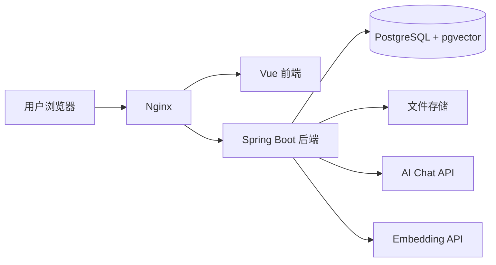

# Phase 4 Task List - 架构演进阶段

## 0. 文件用途

本文件用于拆解 Phase 4 的具体开发任务。

`docs/phase-4-architecture.md` 负责说明第四阶段的总体目标、范围、架构方向和退出标准。  
本文件负责说明 Phase 4 每个版本下具体怎么拆小任务、怎么验收、哪些内容不能提前做。

使用原则：

1. 每次只做一个小任务。
2. 当前正在开发的 v3.x 版本详细展开。
3. 已完成版本压缩成总结。
4. 未开始版本先保留任务大纲，进入对应版本前再继续细分。
5. 完成一个 v3.x 版本后，更新对应迭代日志。
6. 不允许跳过当前任务直接实现后续版本功能。
7. Phase 4 的重点是架构演进、稳定性、异步化、安全和部署准备，不是继续堆 AI 功能。
8. Phase 4 不做微服务拆分，除非后续已经有明确瓶颈和必要性。

前置边界状态：

- v2.11 已完成进入 Phase 4 前的主流程与边界收敛。
- Phase 4 默认沿用“简历资产 + 用户粘贴目标岗位 JD”的主线。
- 岗位优化报告只聚合已有结果，不作为新的 AI 生成功能。

---

## 1. Phase 4 总版本划分

| 版本 | 主题 | 状态 |
|---|---|---|
| v3.1 | 架构现状审查与领域边界收敛 | 已完成 |
| v3.2 | 面向领域的包结构整理 | 已完成 |
| v3.3 | 文件存储抽象与存储策略演进 | 已完成 |
| v3.4 | 长耗时任务异步化设计 | 已完成 |
| v3.5 | 解析与 AI 任务状态机落地 | 已完成 |
| v3.6 | 安全加固与敏感信息治理 | 已完成 |
| v3.7 | 可部署配置与环境隔离 | 已完成 |
| v3.8 | 运维文档、架构复盘与阶段收口 | 当前版本 |


---

## 2. Phase 4 总目标

将项目从“功能可用的应用”演进为“结构清晰、边界稳定、可维护、可部署、可排查”的系统。

Phase 4 完成后应满足：

- 核心模块具备稳定边界。
- 业务代码按领域职责组织，而不是随功能堆叠。
- 文件存储通过接口访问，便于本地存储和对象存储切换。
- 长耗时解析和 AI 任务具备明确执行模型。
- 解析、AI 分析、匹配、优化、改写、向量生成等任务具备状态追踪能力。
- 安全假设已经记录，并在代码中落实。
- 本地环境、开发环境和部署环境配置边界清晰。
- 敏感配置不硬编码、不提交。
- 运维和部署文档清晰。
- 不引入没有明确必要性的微服务和分布式复杂度。

---

## 3. Phase 4 禁止提前实现内容

在 Phase 4 中不允许提前实现：

- Spring Cloud 微服务拆分。
- Nacos 服务注册与发现。
- OpenFeign 服务间调用。
- Spring Cloud Gateway。
- Kubernetes。
- 复杂服务治理。
- 复杂多租户 SaaS。
- 商业化支付系统。
- 没有瓶颈依据的消息队列强行改造。
- 全量重写已有稳定功能。
- 为了“架构高级”而牺牲项目稳定性。

说明：

- Phase 4 可以为未来微服务预留边界。
- Phase 4 不直接拆微服务。
- 如果需要引入 RabbitMQ，也必须先证明同步任务已经影响体验或可靠性。
- 默认优先使用单体内异步任务，而不是上来就引入消息队列。

---

# v3.1 - 架构现状审查与领域边界收敛

状态：已完成

## v3.1 目标

在正式进行架构演进前，先审查当前项目的模块结构、包结构、领域边界、任务执行方式、存储方式、安全假设和部署配置，形成清晰的架构问题清单与后续调整优先级。

v3.1 不做大规模代码重构，不改数据库结构，不新增业务功能，主要完成架构现状审查和演进方案确认。

## v3.1 总结

v3.1 已完成架构现状审查与领域边界收敛：

- 已梳理后端 `common / config / security / infra / module` 顶层职责，确认业务代码集中在 `module/` 下。
- 已确认当前后端主要问题不是包结构错位，而是 `ResumeServiceImpl`、简历解析 / 展示相关 Service、`ResumeAnalysisController` 等类体量偏大。
- 已梳理前端页面、路由、API、Store 和组件结构，确认 `ResumeView.vue` 与 `AiJobMatchView.vue` 是后续前端组件化拆分重点。
- 已梳理简历解析、简历诊断、目标岗位解析、匹配分析、优化建议、局部改写和 Embedding 的执行方式。
- 已确认当前长耗时任务仍以同步请求内执行为主，后续优先采用单体内异步线程池 + 状态轮询，不直接引入 RabbitMQ。
- 已审查文件存储、上传限制、用户文件访问权限、JWT、AI Key、Embedding Key、数据库密码、日志脱敏、CORS 和部署配置。
- 已确认系统已有 `FileStorageService` 抽象、本地存储实现、基础上传限制、JWT 认证、BCrypt 和日志脱敏基础。
- 已记录后续高优先级问题：默认授权策略偏宽、生产部署配置不完整、CORS 未环境化、MinIO 配置与实现不一致、文件删除一致性需要优化。
- 已形成 Phase 4 后续调整顺序：v3.2 先做低风险结构整理，v3.3 完善存储，v3.4 / v3.5 处理异步任务和状态机，v3.6 进行安全加固，v3.7 / v3.8 完成部署与运维收口。
- 已明确 Phase 4 继续保持单体架构，不做微服务拆分。
- 详细审查结果已记录到 `docs/architecture-review.md`。
- 迭代日志已更新：`docs/iteration-log/v3.1-architecture-review.md`。

说明：

- v3.1 只做审查和边界确认。
- v3.1 不修改后端业务代码、前端代码或数据库结构。
- v3.1 不新增 AI 能力，不改接口路径，不做微服务拆分。

## v3.1 小任务完成情况

| 小任务 | 状态 |
|---|---|
| v3.1.1 当前后端模块结构审查 | 已完成 |
| v3.1.2 当前前端模块结构审查 | 已完成 |
| v3.1.3 长耗时任务现状审查 | 已完成 |
| v3.1.4 存储、安全与部署现状审查 | 已完成 |
| v3.1.5 v3.1 架构审查日志 | 已完成 |

---

# v3.2 - 面向领域的包结构整理

状态：已完成

## v3.2 目标

在不改变核心业务行为的前提下，整理后端代码包结构，使用户、简历、解析、岗位、AI、历史、存储、安全等职责边界更加清晰。

v3.2 是小步代码结构整理版本，不做功能重写，不改接口语义，不改数据库结构。

---

## v3.2 总结

v3.2 已完成面向领域的包结构整理：

- 已扫描当前后端包结构，确认 `common / config / security / infra / module` 顶层边界保持不变。
- 已确认业务模块继续集中在 `module/auth`、`module/user`、`module/resume`、`module/job`、`module/analysis`、`module/history`、`module/embedding`。
- 已将 AI 输出解析实现类按子领域移动到 `module/analysis/diagnosis`、`match`、`suggestion`、`rewrite` 下，接口和业务入口保持不变。
- 已新增 `AnalysisVoAssembler`，将分析模块 Entity / JSON 到 VO 的转换从 Controller 中移出。
- 已复用 `AnalysisVoAssembler` 消除局部改写采纳状态接口中的重复 VO 组装逻辑。
- 已将 Embedding Client 接口、配置和 OpenAI-compatible 实现从 `infra.ai` 移动到 `infra.embedding`。
- 已确认报告接口只聚合已有结果，不重新调用 AI。
- 已确认历史接口只查询已有结果，不触发新的 AI 生成。
- 已更新 `docs/project-structure.md`，补充 `infra.embedding` 的基础设施边界。
- 已完成相关单元测试和后端编译检查。
- 迭代日志已更新：`docs/iteration-log/v3.2-package-structure.md`。

说明：

- v3.2 不改接口路径。
- v3.2 不改数据库结构。
- v3.2 不新增 AI 能力。
- v3.2 不拆微服务。
- 本轮未修改前端页面、路由或 API 调用，前端主流程由用户手动验收。
- 高风险大类如 `ResumeServiceImpl`、简历解析 / 展示相关实现类仍保留原位，后续继续小步整理。

## v3.2 小任务完成情况

| 小任务 | 状态 |
|---|---|
| v3.2.1 目标包结构确认 | 已完成 |
| v3.2.2 领域模块边界整理 | 已完成 |
| v3.2.3 Controller / Service 职责整理 | 已完成 |
| v3.2.4 基础设施层职责整理 | 已完成 |
| v3.2.5 v3.2 联调、审查与日志 | 已完成 |

---

# v3.3 - 文件存储抽象与存储策略演进

状态：已完成

## v3.3 目标

完善文件存储抽象，使简历文件访问不依赖具体本地路径，便于后续从本地存储切换到 MinIO 或其他对象存储。

v3.3 不要求立刻正式接入 MinIO，也不迁移历史文件。本版本重点是把“文件怎么存、怎么读、怎么删除、怎么生成访问引用”抽象清楚，避免业务代码直接依赖本地磁盘路径。

---

## v3.3 总结

v3.3 已完成文件存储抽象与存储策略演进：

- 已审查简历上传、读取、解析、删除、配置、数据库字段和 MinIO 预留状态。
- 已将 `FileStorageService` 统一为 `StoreFileCommand` 输入、`storageKey` 语义、文件流读取、存在性判断、元信息读取和删除能力。
- 已保持数据库 `objectKey` 字段兼容历史数据，但业务语义收敛为内部 `storageKey`，不作为前端可见字段。
- 已拆出 `LocalStoragePathResolver` 和 `SafeFilenameGenerator`，本地实现集中处理路径生成、安全文件名和路径穿越防护。
- 已支持 `app.storage.type=local`、`app.storage.local.base-dir`、`APP_STORAGE_LOCAL_BASE_DIR`，并兼容旧的 `LOCAL_STORAGE_BASE_DIR`。
- 已预留 MinIO 配置属性和切换方案，当前不引入 MinIO SDK、不默认启用对象存储。
- 已移除上传响应中的内部 `objectKey`，前端不再接收服务器真实路径或内部存储引用。
- 已补充 PDF / DOC / DOCX 扩展名与 content-type 一致性校验。
- 已确认 Controller 不直接操作文件系统，简历解析通过 `FileStorageService.loadAsStream` 读取文件流。
- 已确认用户只能访问自己的简历，越权解析和越权删除不会读取或删除文件。
- 已修复删除链路遗漏的 AI 优化建议和局部改写建议清理问题，避免生成过建议的简历因外键引用删除失败。
- 已完成后端测试、后端编译、前端构建和用户手动验收。
- 已更新 `docs/phase-4-architecture.md` 和 `docs/iteration-log/v3.3-file-storage.md`。

说明：

- v3.3 不改接口路径。
- v3.3 不改数据库结构。
- v3.3 不新增 AI 能力。
- v3.3 不拆微服务。
- MinIO 当前只是配置和设计预留，不代表已经可用。
- 文件物理删除失败后的补偿清理仍保留为后续一致性任务。

## v3.3 小任务完成情况

| 小任务 | 状态 |
|---|---|
| v3.3.1 当前文件存储实现审查 | 已完成 |
| v3.3.2 FileStorageService 接口规范 | 已完成 |
| v3.3.3 本地文件存储实现整理 | 已完成 |
| v3.3.4 MinIO 预留配置与实现方案 | 已完成 |
| v3.3.5 文件访问安全校验 | 已完成 |
| v3.3.6 v3.3 联调、审查与日志 | 已完成 |

---

# v3.4 - 长耗时任务异步化设计

状态：已完成

## v3.4 总结

v3.4 已完成单体内异步任务基础设施建设，目标是为后续解析、AI 诊断、岗位解析、匹配分析、优化建议和 Embedding 等长耗时任务提供统一的“任务记录 + 状态查询 + 前端轮询 + 失败记录”基础能力。

本版本保持单体架构，不引入 MQ，不拆微服务，不改变已有 AI 输出语义，不删除旧同步接口。当前业务按钮仍保留同步流程，完整“提交任务 -> 返回 taskId -> 后台执行 -> 轮询状态 -> 拉取结果”的业务异步闭环进入 v3.5 落地。

已完成内容：

- 已梳理长耗时接口和异步化优先级，明确报告聚合、历史查询等只读接口不进入异步系统。
- 已新增单体内可配置线程池 `applicationTaskExecutor` 和 `app.async` 配置。
- 已新增 `async_tasks` 表和 `module/task`，支持任务创建、运行中、进度更新、成功、失败和按用户归属查询。
- 已新增 `GET /api/tasks/{taskId}`，并纳入登录后访问范围。
- 已新增前端任务状态 API、轮询工具和简历页任务状态面板。
- 已新增统一异步任务错误码和失败处理器，后端记录详细异常，前端只展示友好错误信息。
- 已完成后端测试、前端构建和手动验收收口。

当前不足：

- 旧同步接口仍会阻塞 Web 请求线程。
- 业务提交接口尚未返回 `taskId`，具体 worker 尚未接入线程池和失败处理器。
- 前端已有轮询工具和简历页面板，但还没有全局任务 Store。
- Embedding 已有 chunk 级状态，但缺少任务级聚合状态。

## v3.4 小任务完成情况

| 小任务 | 状态 |
|---|---|
| v3.4.1 长耗时任务异步化方案设计 | 已完成 |
| v3.4.2 单体内线程池配置 | 已完成 |
| v3.4.3 任务状态字段与状态流转设计 | 已完成 |
| v3.4.4 前端轮询策略设计 | 已完成 |
| v3.4.5 异步任务错误处理策略 | 已完成 |
| v3.4.6 v3.4 文档与验证 | 已完成 |

## v3.4 验证结果

- `./mvnw test -Dtest=AsyncTaskConfigTest`：1 个测试通过。
- `./mvnw test -Dtest=AsyncTaskServiceImplTest,AsyncTaskConfigTest`：7 个测试通过。
- `./mvnw test -Dtest=AsyncTaskFailureHandlerImplTest,AsyncTaskServiceImplTest,AsyncTaskConfigTest`：9 个测试通过。
- `./mvnw test -DskipTests`：后端主代码和测试代码编译通过。
- `npm run build`：前端类型检查和 Vite 构建通过。
- 手动验收已完成：现有同步上传、解析、诊断主流程不被破坏，任务状态查询和前端轮询基础能力可用。

---

# v3.5 - 解析与 AI 任务状态机落地

状态：已完成

## v3.5 总结

v3.5 已在 v3.4 异步任务基础设施之上完成首批业务异步闭环，将简历解析、简历诊断和简历向量生成接入“提交任务 -> 返回 taskId -> 后台执行 -> 前端轮询 -> 成功刷新 / 失败提示”的流程。

本版本继续保持单体架构，不引入 MQ，不拆微服务，不改变 AI 输出语义，并保留旧同步接口。前端优先在 `/resumes` 页面完成任务状态面板、轮询、平滑进度、失败原因展示和行级按钮禁用。

已完成内容：

- 已确认首批异步任务为 `RESUME_PARSE`、`RESUME_DIAGNOSIS`、`RESUME_EMBEDDING`。
- 已新增简历解析、简历诊断、简历向量生成三个异步提交接口。
- 已新增 `ResumeAsyncTaskService`，复用原解析、诊断和向量生成逻辑，通过 `applicationTaskExecutor` 后台执行。
- 已补齐同一用户、同一业务对象的运行中任务防重复提交策略。
- 已补充向量任务失败原因透传，Embedding 服务不可用、未解析、解析未成功等场景可显示明确原因。
- 已优化前端任务进度展示，运行中从 0 平滑递增，成功后再切到 100% 并刷新结果。
- 已完成后端测试、前端构建和手动验收收口。

当前不足：

- 目标岗位解析、匹配分析、岗位优化建议、岗位向量生成和局部改写仍保留同步流程。
- 前端任务展示先落在 `/resumes` 页面，尚未抽成全局任务中心。
- 单体内线程池任务不支持后端进程重启后的自动恢复。

## v3.5 小任务完成情况

| 小任务 | 状态 |
|---|---|
| v3.5.1 选择首批异步化任务 | 已完成 |
| v3.5.2 简历解析任务状态化 | 已完成 |
| v3.5.3 AI 分析任务状态化 | 已完成 |
| v3.5.4 向量生成任务状态化 | 已完成 |
| v3.5.5 前端任务状态展示 | 已完成 |
| v3.5.6 v3.5 联调、审查与日志 | 已完成 |

## v3.5 验证结果

- `./mvnw test -Dtest=ResumeAsyncTaskServiceImplTest,AsyncTaskServiceImplTest,AsyncTaskFailureHandlerImplTest,AsyncTaskConfigTest`：后端异步任务测试通过。
- `./mvnw test -Dtest=ResumeAsyncTaskServiceImplTest,AsyncTaskFailureHandlerImplTest,ResumeEmbeddingServiceImplTest,OpenAiCompatibleEmbeddingClientServiceTest`：向量任务失败原因测试通过。
- `./mvnw test -DskipTests`：后端主代码和测试代码编译通过。
- `./mvnw test -Dtest=Phase1ApiIntegrationTest`：Phase 1 API 集成测试通过。
- `npm run build`：前端类型检查和 Vite 构建通过。
- 手动验收已完成：简历解析、简历诊断、简历向量生成均可提交任务并展示状态，失败场景可显示原因。

---

# v3.6 - 安全加固与敏感信息治理

状态：已完成

## v3.6 总结

v3.6 已完成认证授权、用户数据访问、文件上传与访问、敏感配置、日志错误信息和 AI 输入输出隐私边界的安全收口。该版本不新增业务功能，不引入复杂权限系统，不改变 AI 输出语义，重点是把演示项目上线前容易暴露风险的边界补齐。

已完成内容：

- 已梳理安全风险清单，明确立即修复项和后续部署阶段处理项。
- 已将默认授权策略从 `anyRequest().permitAll()` 收敛为 `anyRequest().authenticated()`，仅保留注册、登录、Swagger 和预置岗位库公开访问。
- 已检查简历、目标岗位、匹配分析、优化建议、局部改写、报告、历史、异步任务和 Embedding 的用户归属校验。
- 已加固上传文件内容签名校验，PDF / DOC / DOCX 均需扩展名、MIME 和真实文件内容匹配。
- 已补齐 storageKey 反斜杠、空字节和路径穿越拦截，前端不暴露服务器真实路径或内部 `objectKey`。
- 已治理 `.env.example`、`docker-compose.yml` 和 README 中容易被照抄的本地默认密码，真实密钥保持通过环境变量或 `.env` 注入。
- 已扩展 `LogSanitizer`，覆盖 Token、API Key、secret、password、手机号、邮箱和本地路径脱敏。
- 已规范业务异常、异步任务失败原因和 AI / Embedding 错误日志，避免前端或日志暴露堆栈、本地路径和完整敏感信息。
- 已记录 AI / Embedding 输入输出边界，明确不会发送 Token、API Key、请求头、服务器路径、数据库密码或 MinIO Secret。
- 已完成后端测试、前端构建和手动安全验收收口。

当前不足：

- CORS、生产 Profile 和部署环境变量拆分留到 v3.7 处理。
- 前端 token 仍存储在 `localStorage`，适合当前展示项目，生产化需后续评估更严格方案。
- 历史已保存的错误信息未在本阶段回刷清洗。
- DOC/DOCX 深度恶意内容扫描、模型侧数据保留策略和用户数据保留期限属于后续上线专项。

## v3.6 小任务完成情况

| 小任务 | 状态 |
|---|---|
| v3.6.1 安全清单整理 | 已完成 |
| v3.6.2 用户数据访问控制检查 | 已完成 |
| v3.6.3 文件上传与文件访问安全加固 | 已完成 |
| v3.6.4 敏感配置治理 | 已完成 |
| v3.6.5 日志脱敏与错误信息规范 | 已完成 |
| v3.6.6 AI 输入输出隐私边界说明 | 已完成 |
| v3.6.7 v3.6 联调、审查与日志 | 已完成 |

## v3.6 验证结果

- `./mvnw test -Dtest=Phase1ApiIntegrationTest`：权限与主流程集成测试通过。
- `./mvnw test -Dtest=ResumeServiceImplTest,LocalFileStorageServiceTest`：文件上传、签名校验、越权访问和路径穿越测试通过。
- `./mvnw test -Dtest=LogSanitizerTest,Phase1ApiIntegrationTest,ResumeAiStructuredParserImplTest,ResumeAiSectionClassifierImplTest,ResumeEmbeddingServiceImplTest,JobDescriptionEmbeddingServiceImplTest,AsyncTaskFailureHandlerImplTest`：日志脱敏、AI 解析和任务失败处理测试通过。
- `./mvnw test -Dtest=Phase1ApiIntegrationTest,ResumeServiceImplTest,LogSanitizerTest`：v3.6 收口回归通过。
- `npm run build`：前端类型检查和 Vite 构建通过。
- `git diff --check`：通过。
- 手动验收已完成：认证授权、文件上传、配置、日志错误和 AI 隐私边界均通过。

---

# v3.7 - 可部署配置与环境隔离

状态：已完成

## v3.7 总结

v3.7 已完成本地、开发、生产环境配置边界整理，补齐环境变量模板、生产 Profile、依赖 Compose、Nginx 反向代理草案和部署检查清单。该版本不新增业务功能，不改核心业务逻辑，重点是把“本地能跑”和“服务器可部署”区分清楚，避免本地路径、本地默认密码、调试日志和开发 Profile 被带入生产环境。

已完成内容：

- 已将默认 Profile 收敛为 `local`，并补齐 `application-local.yaml`、`application-prod.yaml`。
- 已整理 `.env.example` 和 `web/.env.example`，覆盖数据库、JWT、AI、Embedding、异步任务、文件存储、MinIO、Redis、日志和前端 API 地址。
- 已将生产配置关键项改为通过环境变量注入，避免在 `application-prod.yaml` 中写入真实密钥或本机路径。
- 已补充 Redis 依赖服务到 `docker-compose.yml`，并明确当前 Compose 只编排 PostgreSQL、Redis、MinIO 等依赖，不包含后端 / 前端应用镜像。
- 已新增 `deploy/nginx/ai-resume.conf` 和 `deploy/nginx/README.md`，形成 Nginx 反向代理草案。
- 已新增 `docs/deployment.md`，整理服务器准备、环境变量、构建、启动、部署后验收、安全检查和回滚清单。
- 已同步 README、架构审查文档和 v3.7 迭代日志。
- 已完成后端生产 Profile 打包、前端构建、Compose 配置展开和 Nginx 草案内容检查。

当前不足：

- 未进行真实服务器部署，v3.7 只完成可部署配置准备。
- 当前环境未安装 `nginx`，未执行 `nginx -t`。
- 仓库暂无后端 / 前端应用 Dockerfile，Compose 仍只用于依赖服务。
- 应用容器镜像、systemd 服务、HTTPS、文件日志、MinIO 实现、Redis 实际接入和 CORS 配置化留到后续阶段。

## v3.7 小任务完成情况

| 小任务 | 状态 |
|---|---|
| v3.7.1 Profile 设计 | 已完成 |
| v3.7.2 环境变量清单整理 | 已完成 |
| v3.7.3 application-local / application-prod 配置整理 | 已完成 |
| v3.7.4 Docker Compose 部署配置整理 | 已完成 |
| v3.7.5 Nginx 反向代理配置草案 | 已完成 |
| v3.7.6 部署检查清单 | 已完成 |
| v3.7.7 v3.7 联调、审查与日志 | 已完成 |

## v3.7 验证结果

- `./mvnw test -DskipTests`：后端主代码和测试代码编译通过。
- `./mvnw test -Dtest=Phase1ApiIntegrationTest`：主流程集成测试通过。
- `SPRING_PROFILES_ACTIVE=prod ./mvnw -q -DskipTests package`：生产 Profile 打包通过。
- `npm run build`：前端类型检查和 Vite 构建通过。
- `docker compose config`：Compose 配置解析通过。
- `docker compose --env-file .env.example config`：示例环境变量下 Compose 配置解析通过。
- `rg -n "server_name|location /api/|proxy_pass|try_files|client_max_body_size" deploy/nginx/ai-resume.conf`：Nginx 草案关键配置存在。
- `git diff --check`：通过。

---

# v3.8 - 运维文档、架构复盘与阶段收口

状态：当前版本

## v3.8 目标

完成 Phase 4 的收口，整理架构演进成果、部署和运维文档、风险记录和后续 Phase 5 产品化优化准备。

v3.8 是第四阶段的最终整理版本，重点不是继续新增功能，而是把前面 v3.2 到 v3.7 的架构演进、配置治理、安全加固、异步任务、部署准备等内容系统化沉淀，形成后续上线、演示、面试讲解和 Phase 5 产品化优化的基础。

---

## v3.8 范围

### 范围内

- 整理 Phase 4 架构演进成果。
- 汇总包结构、存储抽象、异步任务、安全加固、部署配置等改动。
- 编写部署文档初版。
- 编写运维文档初版。
- 整理常见问题排查。
- 整理架构图、模块图、主流程图。
- 明确 Phase 5 进入条件。
- 形成 Phase 4 阶段日志和复盘总结。

### 范围外

- 不继续新增业务功能。
- 不做 UI/UX 深度重构。
- 不正式购买服务器、域名和 HTTPS 证书。
- 不做复杂 CI/CD。
- 不做 Kubernetes。
- 不拆微服务。
- 不做企业级监控平台。
- 不做复杂后台运维系统。
- 不重新设计产品主流程。

---

## v3.8 总原则

- 先收口，再进入 Phase 5。
- 文档要能指导后续部署和面试讲解。
- 架构复盘要说清楚“为什么这样设计”。
- 运维文档要能指导自己排查问题。
- 风险记录要真实，不夸大已完成能力。
- Phase 5 只在 Phase 4 主流程稳定后开始。
- 不为了写文档而虚构不存在的功能。
- 每一项总结都要和当前项目实际状态一致。

---

# v3.8.2 部署文档初版

状态：未开始

## 目标

整理一份可执行的部署文档，说明从环境准备、配置变量、构建、启动、验证到回滚的完整流程。

## 推荐文档路径

```text
docs/deployment.md
```

如果 v3.7 已创建该文档，则本任务负责补充和校对。

## 推荐文档结构

```md
# AI 简历优化与岗位匹配系统部署文档

## 1. 部署目标

## 2. 服务器环境要求

## 3. 必要软件

## 4. 环境变量配置

## 5. 数据库准备

## 6. 后端构建与启动

## 7. 前端构建与部署

## 8. Docker Compose 部署方式

## 9. Nginx 反向代理

## 10. 文件存储目录

## 11. AI / Embedding 服务配置

## 12. 部署后验证

## 13. 回滚方案

## 14. 常见问题
```

## 必须包含的内容

### 1. 环境准备

- Java 21。
- Node.js。
- PostgreSQL 16。
- Redis，可选。
- Docker / Podman。
- Docker Compose / Podman Compose。
- Nginx。
- Git。

### 2. 环境变量

必须说明：

- `SPRING_PROFILES_ACTIVE`
- `DATABASE_URL`
- `POSTGRES_USER`
- `POSTGRES_PASSWORD`
- `JWT_SECRET`
- `AI_BASE_URL`
- `AI_API_KEY`
- `AI_MODEL`
- `EMBEDDING_BASE_URL`
- `EMBEDDING_API_KEY`
- `EMBEDDING_MODEL`
- `APP_STORAGE_TYPE`
- `APP_STORAGE_LOCAL_BASE_DIR`

### 3. 构建命令

后端：

```bash
cd backend
./mvnw clean package -DskipTests
```

前端：

```bash
cd web
npm install
npm run build
```

### 4. 启动方式

本地：

```bash
SPRING_PROFILES_ACTIVE=local ./mvnw spring-boot:run
```

生产：

```bash
SPRING_PROFILES_ACTIVE=prod java -jar target/*.jar
```

Compose：

```bash
docker compose --env-file .env up -d
```

### 5. 部署后验证

- 后端健康检查。
- 前端访问。
- 登录注册。
- 简历上传。
- 简历解析。
- 目标岗位输入。
- 目标岗位解析。
- 匹配分析。
- 优化建议。
- AI 历史。

## 任务

- [ ] 检查当前是否已有 `docs/deployment.md`。
- [ ] 如果已有，补齐缺失内容。
- [ ] 如果没有，新增部署文档。
- [ ] 补充服务器环境要求。
- [ ] 补充环境变量说明。
- [ ] 补充后端构建命令。
- [ ] 补充前端构建命令。
- [ ] 补充 Docker Compose 方式。
- [ ] 补充 Nginx 配置说明。
- [ ] 补充部署后验证流程。
- [ ] 补充回滚方案。
- [ ] 更新迭代日志。

## 验收标准

- 部署文档存在。
- 部署步骤清晰。
- 环境变量说明完整。
- 构建和启动命令清楚。
- 有部署后验证流程。
- 有回滚说明。
- 不包含真实密钥。
- 不承诺尚未实现的部署能力。

---

# v3.8.3 运维文档初版

状态：未开始

## 目标

整理项目运行后的基础运维文档，说明日志查看、服务重启、数据备份、文件备份、配置修改和常见故障处理方式。

## 推荐文档路径

```text
docs/ops.md
```

## 推荐文档结构

```md
# AI 简历优化与岗位匹配系统运维文档

## 1. 运维目标

## 2. 服务组成

## 3. 日志查看

## 4. 服务启动与停止

## 5. 数据库备份与恢复

## 6. 上传文件备份

## 7. 配置修改

## 8. AI / Embedding 服务检查

## 9. 常见故障处理

## 10. 日常巡检清单
```

## 服务组成说明

需要说明：

- 后端 Spring Boot。
- 前端 Vue 静态页面。
- PostgreSQL。
- Redis，可选。
- 文件存储目录。
- AI Chat 服务。
- Embedding 服务。
- Nginx。

## 日志查看

如果使用 jar 运行：

```bash
tail -f logs/ai-resume-optimizer.log
```

如果使用 Docker：

```bash
docker compose logs -f backend
docker compose logs -f web
docker compose logs -f postgres
```

## 服务重启

```bash
docker compose restart backend
docker compose restart web
```

或：

```bash
systemctl restart ai-resume-backend
```

如果暂未使用 systemd，只写 Compose 方式和 jar 方式。

## 数据库备份

示例：

```bash
pg_dump -h localhost -U dawn -d ai_resume_optimizer > backup.sql
```

恢复：

```bash
psql -h localhost -U dawn -d ai_resume_optimizer < backup.sql
```

## 文件备份

本地存储：

```bash
tar -czf uploads-backup.tar.gz uploads/
```

MinIO 后续：

```text
使用 mc mirror 或对象存储控制台备份。
```

当前如果未正式接入 MinIO，必须标明“预留”。

## 日常巡检清单

- [ ] 后端是否正常启动。
- [ ] 前端是否可访问。
- [ ] 数据库连接是否正常。
- [ ] 文件上传目录是否存在。
- [ ] 磁盘空间是否充足。
- [ ] AI 服务是否可用。
- [ ] Embedding 服务是否可用。
- [ ] 日志是否有大量 ERROR。
- [ ] 数据库备份是否正常。
- [ ] 上传文件是否正常备份。

## 任务

- [ ] 新增 `docs/ops.md`。
- [ ] 说明服务组成。
- [ ] 说明日志查看方式。
- [ ] 说明服务启动 / 停止 / 重启方式。
- [ ] 说明数据库备份和恢复。
- [ ] 说明上传文件备份。
- [ ] 说明配置修改方式。
- [ ] 说明 AI / Embedding 服务检查方式。
- [ ] 整理日常巡检清单。
- [ ] 更新迭代日志。

## 验收标准

- 运维文档存在。
- 能指导查看日志。
- 能指导重启服务。
- 能指导备份数据库。
- 能指导备份上传文件。
- 能指导检查 AI 和 Embedding 服务。
- 不包含真实密钥。
- 不虚构未实现的监控能力。

---

# v3.8.4 常见问题排查

状态：未开始

## 目标

整理一份常见问题排查文档，覆盖启动失败、数据库连接失败、前端请求失败、文件上传失败、AI 调用失败、Embedding 服务失败、任务卡住等常见问题。

## 推荐文档路径

```text
docs/troubleshooting.md
```

## 推荐问题分类

### 1. 后端启动失败

可能原因：

- Java 版本不对。
- 环境变量缺失。
- 数据库连接失败。
- Flyway 迁移失败。
- 端口被占用。

排查命令：

```bash
java -version
echo $SPRING_PROFILES_ACTIVE
lsof -i :8080
```

### 2. 数据库连接失败

可能原因：

- PostgreSQL 未启动。
- 数据库名错误。
- 用户名或密码错误。
- pg_hba.conf 配置问题。
- Docker 网络问题。

排查命令：

```bash
psql -h localhost -U dawn -d ai_resume_optimizer
docker compose logs postgres
```

### 3. 前端请求失败

可能原因：

- `VITE_API_BASE_URL` 配置错误。
- 后端未启动。
- CORS 配置问题。
- Nginx 反代路径错误。
- Token 过期。

排查方法：

- 浏览器 Network。
- 后端日志。
- Nginx 日志。
- 检查 `/api` 代理。

### 4. 文件上传失败

可能原因：

- 文件类型不支持。
- 文件过大。
- 上传目录没有权限。
- storageKey 路径错误。
- Nginx `client_max_body_size` 太小。

排查：

```bash
ls -lah uploads
df -h
```

### 5. AI 调用失败

可能原因：

- API Key 缺失。
- Base URL 错误。
- 模型名错误。
- 网络超时。
- 返回格式不是 JSON。
- Prompt 过长。

排查：

- 检查环境变量。
- 检查后端日志。
- 用 curl 测试 AI 服务。
- 查看任务错误码。

### 6. Embedding 服务失败

可能原因：

- 本地模型未启动。
- vLLM 端口错误。
- 模型未下载。
- API Key 不匹配。
- 向量维度不一致。
- 服务器显存 / 内存不足。

排查：

```bash
curl http://localhost:8000/v1/models
curl http://localhost:8000/v1/embeddings
```

### 7. 异步任务卡住

可能原因：

- 后台线程异常未捕获。
- 线程池满。
- AI 调用长时间超时。
- 任务状态未正确更新。
- 数据库写入失败。

处理：

- 查看 task 状态。
- 查看后端 ERROR 日志。
- 检查线程池配置。
- 检查任务是否有 startedAt 但无 finishedAt。
- 后续可增加超时扫描任务。

## 任务

- [ ] 新增 `docs/troubleshooting.md`。
- [ ] 整理后端启动失败排查。
- [ ] 整理数据库连接失败排查。
- [ ] 整理前端请求失败排查。
- [ ] 整理文件上传失败排查。
- [ ] 整理 AI 调用失败排查。
- [ ] 整理 Embedding 服务失败排查。
- [ ] 整理异步任务卡住排查。
- [ ] 整理常用命令。
- [ ] 更新迭代日志。

## 验收标准

- 常见问题排查文档存在。
- 覆盖启动、数据库、前端、上传、AI、Embedding、异步任务。
- 排查步骤清楚。
- 命令可复制。
- 不包含真实密钥。
- 不虚构不存在的监控平台。

---

# v3.8.5 架构图和模块图整理

状态：未开始

## 目标

整理项目架构图、模块图、主流程图和部署图，用于 README、答辩、面试讲解和后续 Phase 5 项目包装。

## 推荐图表类型

### 1. 系统总体架构图

展示：

- 前端 Vue。
- 后端 Spring Boot。
- PostgreSQL。
- Redis。
- 文件存储。
- AI Chat 服务。
- Embedding 服务。
- pgvector。
- Nginx。

### 2. 后端模块图

展示：

- auth。
- user。
- resume。
- job。
- analysis。
- embedding。
- history。
- infra。
- common。

### 3. 主业务流程图

展示：

```text
上传简历
↓
简历解析
↓
简历诊断
↓
输入目标岗位 JD
↓
目标岗位解析
↓
匹配分析
↓
优化建议
↓
局部改写
↓
AI 历史回看
```

### 4. 异步任务流程图

展示：

```text
提交任务
↓
创建任务记录
↓
后台线程执行
↓
更新状态
↓
前端轮询
↓
展示结果或错误
```

### 5. 部署图

展示：

```text
浏览器
↓
Nginx
├── 前端静态资源
└── /api -> Spring Boot
    ├── PostgreSQL / pgvector
    ├── Redis
    ├── 文件存储
    ├── AI Chat API
    └── Embedding API
```

## 推荐格式

优先使用 Mermaid，便于放入 Markdown。

示例：



## 推荐文档路径

```text
docs/architecture/architecture-diagrams.md
```

## 任务

- [ ] 新增 `docs/architecture/architecture-diagrams.md`。
- [ ] 绘制系统总体架构图。
- [ ] 绘制后端模块图。
- [ ] 绘制主业务流程图。
- [ ] 绘制异步任务流程图。
- [ ] 绘制部署图。
- [ ] 确认图中组件与当前项目实际一致。
- [ ] 不画尚未实现的复杂能力。
- [ ] 更新 README 或后续记录为 Phase 5 项目包装任务。
- [ ] 更新迭代日志。

## 验收标准

- 架构图文档存在。
- 至少包含 4 张 Mermaid 图。
- 图中不虚构未实现能力。
- 能辅助后续 README 和面试讲解。
- 图和 Phase 4 架构总结一致。

---

# v3.8.6 Phase 5 进入条件确认

状态：未开始

## 目标

确认 Phase 4 是否已经达到进入 Phase 5 的条件，明确 Phase 5 的主要目标、前置条件和暂缓事项。

## Phase 5 定位

Phase 5 是：

```text
产品化优化、部署上线与项目包装阶段
```

重点不是继续堆功能，而是把已有系统打磨成：

- 更好看的项目。
- 更好用的产品。
- 更好部署的系统。
- 更好展示的作品。
- 更好讲解的实习项目。

## Phase 5 重点方向

- 产品体验复盘。
- 前端 UI/UX 深度优化。
- 核心页面视觉重构。
- 服务器正式部署。
- 域名和 HTTPS。
- 数据备份和运维。
- README、演示文档和项目截图。
- 简历包装与面试讲解材料。

## Phase 5 进入条件

| 条件 | 是否满足 |
|---|---|
| 主业务流程可跑通 |  |
| 简历上传和解析可用 |  |
| 目标岗位输入和解析可用 |  |
| 匹配分析可用 |  |
| 优化建议可用 |  |
| 局部改写可用 |  |
| AI 历史可回看 |  |
| 文件存储抽象已完成或有清晰方案 |  |
| 异步任务模型已完成或有清晰方案 |  |
| 安全清单已完成 |  |
| 部署配置文档已完成 |  |
| 运维文档初版已完成 |  |
| 主要遗留问题已记录 |  |

## 不建议进入 Phase 5 的情况

如果存在以下问题，建议先收口：

- 主流程跑不通。
- 解析结果完全不可用。
- 目标岗位 JD 流程不清晰。
- AI 功能边界严重混乱。
- 安全配置有明显密钥泄露。
- 上传文件无法稳定保存。
- 数据库迁移无法稳定执行。
- 后端无法构建。
- 前端无法构建。

## Phase 5 初步任务建议

```text
v5.1 产品体验复盘与信息架构优化
v5.2 前端 UI/UX 视觉重构
v5.3 核心页面布局重构
v5.4 正式服务器部署
v5.5 域名、HTTPS 与 Nginx 配置
v5.6 README、截图、演示文档整理
v5.7 项目简历包装与面试讲解稿
```

## 任务

- [ ] 检查 Phase 4 完成情况。
- [ ] 对照 Phase 5 进入条件打勾。
- [ ] 标记未满足条件。
- [ ] 判断是否允许进入 Phase 5。
- [ ] 如果不允许，列出必须先修复的问题。
- [ ] 如果允许，列出 Phase 5 第一批任务。
- [ ] 更新阶段总结文档。
- [ ] 更新迭代日志。

## 验收标准

- Phase 5 进入条件有明确判断。
- 未完成事项被真实记录。
- 后续任务方向清晰。
- 不带明显架构风险进入 Phase 5。
- 不虚假标记完成。

---

# v3.8.7 v3.8 阶段日志

状态：未开始

## 目标

完成 v3.8 阶段日志，记录 Phase 4 收口内容、验证结果、当前不足和下一阶段方向。

## 推荐日志路径

```text
docs/iteration-log/v3.8-phase-4-summary.md
```

## 推荐日志结构

```md
# v3.8 - 运维文档、架构复盘与阶段收口

## 目标

## 完成内容

## 验证结果

## 当前不足

## 遗留问题

## Phase 5 进入判断

## 下一步计划
```

## 完成内容建议记录

- 架构演进总结文档。
- 部署文档。
- 运维文档。
- 常见问题排查文档。
- 架构图和模块图。
- Phase 5 进入条件检查。
- Phase 4 遗留风险记录。

## 验证结果建议记录

- 后端构建结果。
- 前端构建结果。
- 主流程手动验证结果。
- 部署配置检查结果。
- 文档审查结果。

## 当前不足建议记录

- 尚未正式部署。
- 尚未配置域名和 HTTPS。
- 尚未做前端 UI/UX 深度优化。
- 尚未做完整 CI/CD。
- 尚未做生产级监控。
- 尚未做复杂数据备份自动化。
- 尚未做企业级权限体系。

## 任务

- [ ] 新增或更新 `docs/iteration-log/v3.8-phase-4-summary.md`。
- [ ] 汇总 v3.8 完成内容。
- [ ] 记录验证命令。
- [ ] 记录验证结果。
- [ ] 记录当前不足。
- [ ] 记录遗留问题。
- [ ] 记录 Phase 5 进入判断。
- [ ] 记录下一步计划。

## 验收标准

- v3.8 阶段日志存在。
- Phase 4 完成情况清楚。
- 遗留问题真实。
- Phase 5 进入判断明确。
- 下一步计划清楚。
- 文档不夸大项目能力。

---

# Phase 4 完成后的下一步

Phase 4 完成后，可以进入：

```text
Phase 5 - 产品化优化、部署上线与项目包装阶段
```

Phase 5 再开始重点处理：

- 产品体验复盘。
- 前端 UI/UX 深度优化。
- 核心页面视觉重构。
- 服务器正式部署。
- 域名和 HTTPS。
- 数据备份和运维。
- README、演示文档和项目截图。
- 简历包装与面试讲解材料。

---
